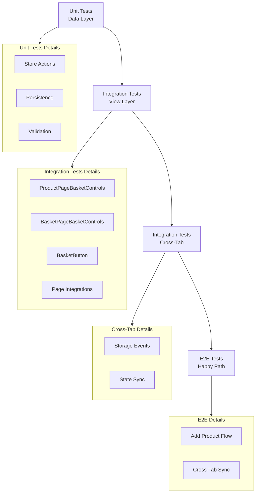

# Tests Plan: Non-Local Basket

## Intelligence Gathered
- PRD: 7 DoDs (add, increment, decrement, remove, refresh, cross-tab sync, navigation)
- Technical Design: Zustand store, persist middleware, Zod validation, fallback storage (localStorage → sessionStorage), hydration guard (hasHydrated flag), cross-tab sync via storage events
- Vertical Slices: 7 slices (Data Layer, BasketControls, BasketButton, Product Detail, Product Grid, Search, Cross-Tab Sync)
- ExecutionSpecs.todo: Test TODOs already written

## Test Strategy
**Unit Tests (Data Layer):**
- Store actions: addProduct, removeProduct, incrementQuantity, decrementQuantity
- Persistence: localStorage write/read, sessionStorage fallback, graceful degradation
- Validation: Zod schema validation, hydration validation
- Selectors: selectTotalItemsCount

**Integration Tests (View Layer):**
- ProductPageBasketControls: render, add/increment/decrement dispatch
- BasketPageBasketControls: render, increment/decrement/remove dispatch
- BasketButton: render, badge count display, navigation
- Page integrations: Product Detail, Product Grid, Search with ProductPageBasketControls

**Integration Tests (Cross-Tab):**
- Storage event handling
- Cross-tab state sync

**E2E Tests:**
- Happy path: add product from product detail, manage quantities, navigate to basket page
- Cross-tab basket synchronization

## Naming Convention
- Top-level: describe('Non-Local Basket System')
- Nested: describe('when [condition]')
- it blocks: present tense action, no "should" prefix

## Test Order
Slice 1 (Data Layer) → Slice 2 (ProductPageBasketControls) → Slice 3 (BasketPageBasketControls) → Slice 4 (BasketButton) → Slice 5-7 (Page Integrations) → Slice 8 (Basket Page Integration) → Slice 9 (Cross-Tab Sync) → E2E

## Gaps Fixed
- Covers all 7 PRD DoDs
- Tests all persistence edge cases (quota, disabled, corrupted)
- Tests hydration guard (hasHydrated flag)
- Tests cross-tab sync via storage events
- Tests graceful degradation fallback chain