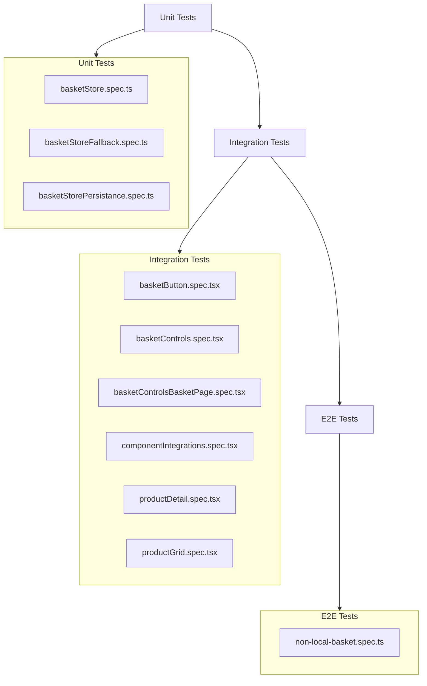

# Tests Plan: Non-Local Basket

## Test Files

### Unit Tests
- **/unit/basketStore.spec.ts** - Tests store actions (add, remove, increment, decrement) and selectTotalItemsCount selector
- **/unit/basketStoreFallback.spec.ts** - Tests fallback storage strategy (localStorage → sessionStorage → graceful degradation) and persist middleware
- **/unit/basketStorePersistance.spec.ts** - Tests persistence write/read operations and hydration validation

### Integration Tests
- **/integration/basketButton.spec.tsx** - Tests BasketButton component rendering, badge count display, and navigation link
- **/integration/basketControls.spec.tsx** - Tests BasketControls component on product page (add/increment/decrement/remove behavior)
- **/integration/basketControlsBasketPage.spec.tsx** - Tests BasketControls component on basket page (increment/decrement/remove with different rules)
- **/integration/componentIntegrations.spec.tsx** - Tests basket controls integration across app components (FeaturedCard, IemCard, DacCard, AccessoryCard, ProductCard, ProductInfo, search results, basket page)
- **/integration/productDetail.spec.tsx** - Tests ProductInfo component with BasketControls integration on product detail page
- **/integration/productGrid.spec.tsx** - Tests ProductCard with BasketControls integration on product grid and prevents navigation on control clicks

### E2E Tests
- **/e2e/non-local-basket.spec.ts** - Tests happy path user journey, cross-tab synchronization, page refresh persistence, stock limit, and remove on decrement to zero