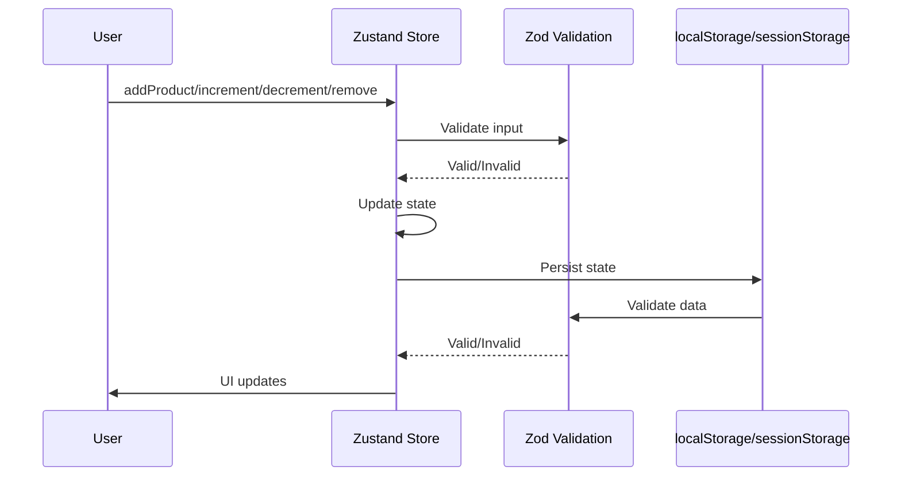

# Non-Local Basket

## Overview

The non-local basket provides persistent shopping cart functionality across page navigation. Users can add products from any page, see basket counts update in real-time, and have their items preserved across reloads. The implementation uses Zustand for state management with localStorage persistence.

## Architecture

## Key Components

- **basketStore.ts** (`store/basketStore.ts`) - Zustand store with persist middleware
- **Zod Schema** - Input validation for basket items (productId, quantity)
- **Fallback Storage** - localStorage → sessionStorage graceful degradation
- **Selectors** - Computed values (totalItems, hasItem, itemQuantity)

## Data Flow

1. User triggers action (add, increment, decrement, remove)
2. Zod schema validates input (productId string, positive integer quantity)
3. Store updates state atomically
4. Persist middleware writes to storage
5. Storage writes fallback: localStorage → sessionStorage → silent fail
6. UI updates reflect new state

## Validation Strategy

- **Input Validation:** Zod schema validates all user actions before state update
- **Read Validation:** Storage data validated on hydration, reset to empty on failure
- **Write Resilience:** localStorage → sessionStorage fallback with console warnings
- **Type Safety:** TypeScript types inferred from Zod schema

## Tech Stack

- **Zustand** - State management with persist middleware
- **Zod** - Runtime validation and type inference
- **TypeScript** - Type safety
- **localStorage/sessionStorage** - Browser storage APIs

## Related Documentation

- [PRD](./1. PRD.md) - Product requirements and definition of done
- [Technical Solution](./2. Minimal Viable Solution Design.md) - Detailed technical design
- [UI Plan](./3. UI Plan.md) - HTML structure for basket controls
