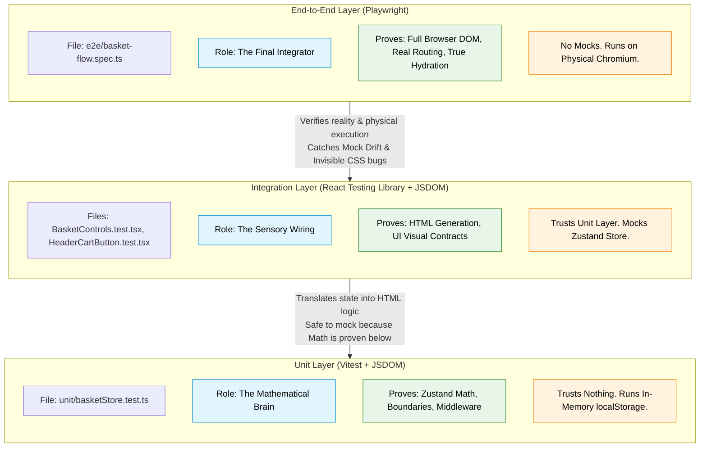

```mermaid
flowchart TD
    classDef container fill:transparent,stroke:#333,stroke-width:2px,stroke-dasharray: 5 5
    classDef role fill:#e1f5fe,stroke:#0288d1,stroke-width:1px,color:#000
    classDef scope fill:#e8f5e9,stroke:#388e3c,stroke-width:1px,color:#000
    classDef warning fill:#fff3e0,stroke:#f57c00,stroke-width:1px,color:#000

    subgraph E2E ["End-to-End Layer (Playwright)"]
        direction TB
        F1["File: e2e/basket-flow.spec.ts"]
        R1["Role: The Final Integrator"]:::role
        S1["Proves: Full Browser DOM, Real Routing, True Hydration"]:::scope
        W1["No Mocks. Runs on Physical Chromium."]:::warning
    end

    subgraph INT ["Integration Layer (React Testing Library + JSDOM)"]
        direction TB
        F2["Files: BasketControls.test.tsx, HeaderCartButton.test.tsx"]
        R2["Role: The Sensory Wiring"]:::role
        S2["Proves: HTML Generation, UI Visual Contracts"]:::scope
        W2["Trusts Unit Layer. Mocks Zustand Store."]:::warning
    end

    subgraph UNIT ["Unit Layer (Vitest + JSDOM)"]
        direction TB
        F3["File: unit/basketStore.test.ts"]
        R3["Role: The Mathematical Brain"]:::role
        S3["Proves: Zustand Math, Boundaries, Middleware"]:::scope
        W3["Trusts Nothing. Runs In-Memory localStorage."]:::warning
    end

    E2E -->|Verifies reality & physical execution<br/>Catches Mock Drift & Invisible CSS bugs| INT
    INT -->|Translates state into HTML logic<br/>Safe to mock because Math is proven below| UNIT
```