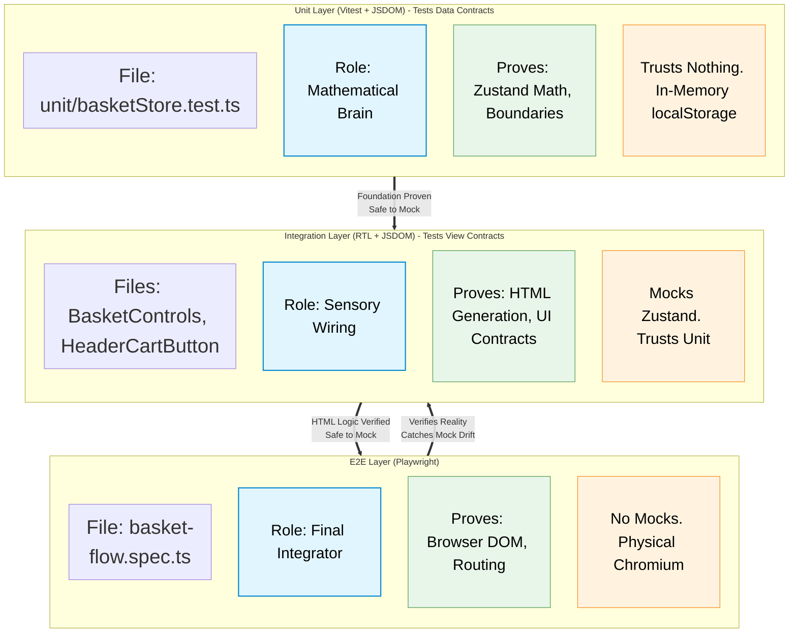

```mermaid
graph TD
    classDef container fill:transparent,stroke:#333,stroke-width:2px,stroke-dasharray: 5 5
    classDef role fill:#e1f5fe,stroke:#0288d1,stroke-width:2px,color:#000,font-size:28px,padding:20px
    classDef scope fill:#e8f5e9,stroke:#388e3c,stroke-width:1px,color:#000,font-size:28px,padding:20px
    classDef warning fill:#fff3e0,stroke:#f57c00,stroke-width:1px,color:#000,font-size:28px,padding:20px
    classDef default font-size:36px

    subgraph E2E["E2E Layer (Playwright)"]
        direction TB
        F3["File: basket-flow.spec.ts"]
        R3["Role: Final Integrator"]:::role
        S3["Proves: Browser DOM, Routing"]:::scope
        W3["No Mocks. Physical Chromium"]:::warning
    end

    subgraph INT["Integration Layer (RTL + JSDOM) - Tests View Contracts"]
        direction TB
        F2["Files: BasketControls, HeaderCartButton"]
        R2["Role: Sensory Wiring"]:::role
        S2["Proves: HTML Generation, UI Contracts"]:::scope
        W2["Mocks Zustand. Trusts Unit"]:::warning
    end

    subgraph Unit["Unit Layer (Vitest + JSDOM) - Tests Data Contracts"]
        direction TB
        F1["File: unit/basketStore.test.ts"]
        R1["Role: Mathematical Brain"]:::role
        S1["Proves: Zustand Math, Boundaries"]:::scope
        W1["Trusts Nothing. In-Memory localStorage"]:::warning
    end

    Unit -->|Foundation Proven<br/>Safe to Mock| INT
    INT -->|HTML Logic Verified<br/>Safe to Mock| E2E
    E2E -->|Verifies Reality<br/>Catches Mock Drift| INT

    linkStyle 0 stroke-width:4px,stroke:#333
    linkStyle 1 stroke-width:4px,stroke:#333
    linkStyle 2 stroke-width:4px,stroke:#333
```