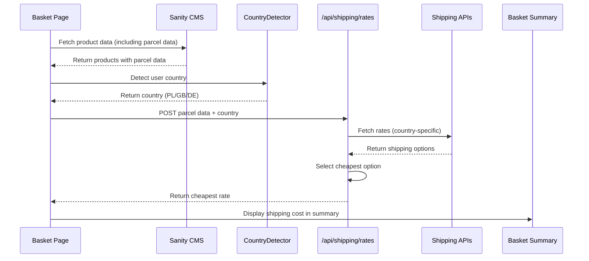

# Shipping Cost Display on Basket Page

## Overview

The basket page displays shipping costs upfront based on the user's detected origin country (PL/GB/DE). It uses parcel data already fetched from CMS during the initial basket page load, calls country-specific shipping APIs, selects the cheapest option, and includes it in the cart total to prevent abandonment from hidden fees. No basket reservation is involved in this flow.

## Architecture

## Key Components

- **CountryDetector** - Detects user origin country (PL/GB/DE)
- **BasketPage** - Fetches product data from CMS including parcel data
- **ShippingRatesAPI** - New API endpoint for basket page rate fetching
- **BasketSummary** - Updated to display shipping cost
- **SenderAddressConfig** - Environment variables for country-specific sender addresses

## Data Flow

1. Basket page loads
2. Basket page fetches product data from CMS (including parcel data for inventory display)
3. CountryDetector detects user origin country (PL/GB/DE)
4. Basket page calls shipping rate API with parcel data + country + default shipping address
5. API calls country-specific shipping API (AlleKurier for PL, others for GB/DE)
6. API selects cheapest shipping option
7. API returns cheapest rate to basket page
8. Basket summary displays: Subtotal + Shipping (cheapest) + Total

## Country Detection

- **PL**: AlleKurier API (preferred due to simpler auth and test mode)
- **GB**: Shipping API (TBD based on research)
- **DE**: Shipping API (TBD based on research)

## Sender Address Configuration

Environment variables follow pattern:
- `SENDER_ADDRESS_{COUNTRY}_NAME` (e.g., SENDER_ADDRESS_PL_NAME)
- `SENDER_ADDRESS_{COUNTRY}_STREET`
- `SENDER_ADDRESS_{COUNTRY}_CITY`
- `SENDER_ADDRESS_{COUNTRY}_STATE`
- `SENDER_ADDRESS_{COUNTRY}_ZIP`
- `SENDER_ADDRESS_{COUNTRY}_COUNTRY`
- `SENDER_ADDRESS_{COUNTRY}_PHONE`
- `SENDER_ADDRESS_{COUNTRY}_EMAIL`

Fallback to `SENDER_ADDRESS_DEFAULT_*` if country-specific not configured.

## Tech Stack

- **React 18** - UI framework
- **Next.js** - App router and server components
- **Sanity CMS** - Product and parcel data
- **AlleKurier API** - Polish shipping rates
- **TypeScript** - Type safety

## Related Documentation

- [PRD](./1. PRD.md) - Product requirements and definition of done
- [Technical Solution](./2. Minimal Viable Solution Design.md) - Detailed technical design
- [Technical Diagrams](./TECHNICAL DIAGRAM.md) - Sequence diagrams
