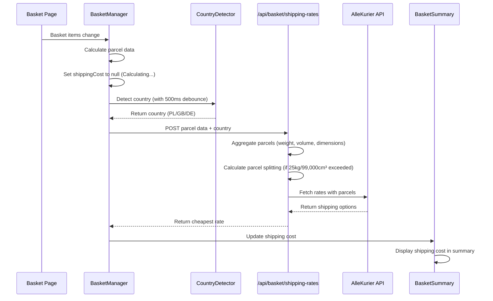

# Shipping Cost Display on Basket Page

## Overview

The basket page displays shipping costs for Poland (PL) domestic shipping. It aggregates parcel data from basket items, calculates parcel splitting for oversized carts, calls AlleKurier API for rates, and displays the cost in the basket summary.

## Architecture

## Key Components

- **BasketManager** - Manages basket state and shipping cost fetching with 500ms debouncing
- **CountryDetector** - Detects user origin country with 1-hour caching (ipapi.co → browser locale → default PL)
- **ShippingRatesAPI** - `/api/basket/shipping-rates` endpoint for rate fetching
- **BasketSummary** - Displays shipping cost, shows "Calculating..." during debounce
- **ParcelSplittingLogic** - Splits parcels when weight exceeds 25kg or volume exceeds 99,000 cm³

## Data Flow

1. Basket page loads with items
2. BasketManager calculates parcel data from basket items
3. User changes basket item quantity (triggers useEffect)
4. BasketManager sets `shippingCost` to null (shows "Calculating...")
5. After 500ms debounce, CountryDetector detects country
6. BasketManager calls `/api/basket/shipping-rates` with parcel data + country
7. API aggregates parcels (sums weights, uses max dimensions)
8. API calculates parcel splitting if limits exceeded
9. API calls AlleKurier with parcel data (converted to kg)
10. API returns cheapest rate to BasketManager
11. BasketManager updates `shippingCost` state
12. BasketSummary displays shipping cost

## Parcel Splitting Logic

**Courier Limits:**
- Max weight: 25kg (25,000g)
- Max volume: 99,000 cm³

**Calculation:**
- Total weight = sum of all item weights
- Total volume = sum of all item volumes (length × width × height)
- Parcels by weight = ceil(total weight / 25,000g)
- Parcels by volume = ceil(total volume / 99,000cm³)
- Total parcels = max(parcels by weight, parcels by volume, 1)

**Distribution:**
- Items distributed evenly across required number of parcels
- Each parcel aggregated (sum weights, max dimensions)
- Multiple parcels sent to AlleKurier API
- Total cost = sum of all parcel rates

## Country Detection

**Priority:**
1. IP geolocation (ipapi.co/json/) with 1-hour caching
2. Browser locale fallback
3. Default: Poland (PL)

**Supported Countries:**
- **PL**: AlleKurier API (implemented)
- **GB**: Not implemented (TODO)
- **DE**: Not implemented (TODO)

## Sender Address Configuration

Environment variables follow pattern:
- `SENDER_ADDRESS_{COUNTRY}_NAME` (e.g., SENDER_ADDRESS_PL_NAME)
- `SENDER_ADDRESS_{COUNTRY}_STREET`
- `SENDER_ADDRESS_{COUNTRY}_CITY`
- `SENDER_ADDRESS_{COUNTRY}_STATE`
- `SENDER_ADDRESS_{COUNTRY}_ZIP`
- `SENDER_ADDRESS_{COUNTRY}_COUNTRY`
- `SENDER_ADDRESS_{COUNTRY}_PHONE`
- `SENDER_ADDRESS_{COUNTRY}_EMAIL`

Fallback to `SENDER_ADDRESS_DEFAULT_*` if country-specific not configured.

## Tech Stack

- **React 18** - UI framework
- **Next.js** - App router and server components
- **AlleKurier API** - Polish shipping rates
- **TypeScript** - Type safety

## Related Documentation

- [PRD](./PRD.md) - Product requirements and definition of done
- [Technical Solution](./Minimal Viable Solution Design.md) - Detailed technical design
- [Technical Diagrams](./TECHNICAL DIAGRAM.md) - Sequence diagrams
