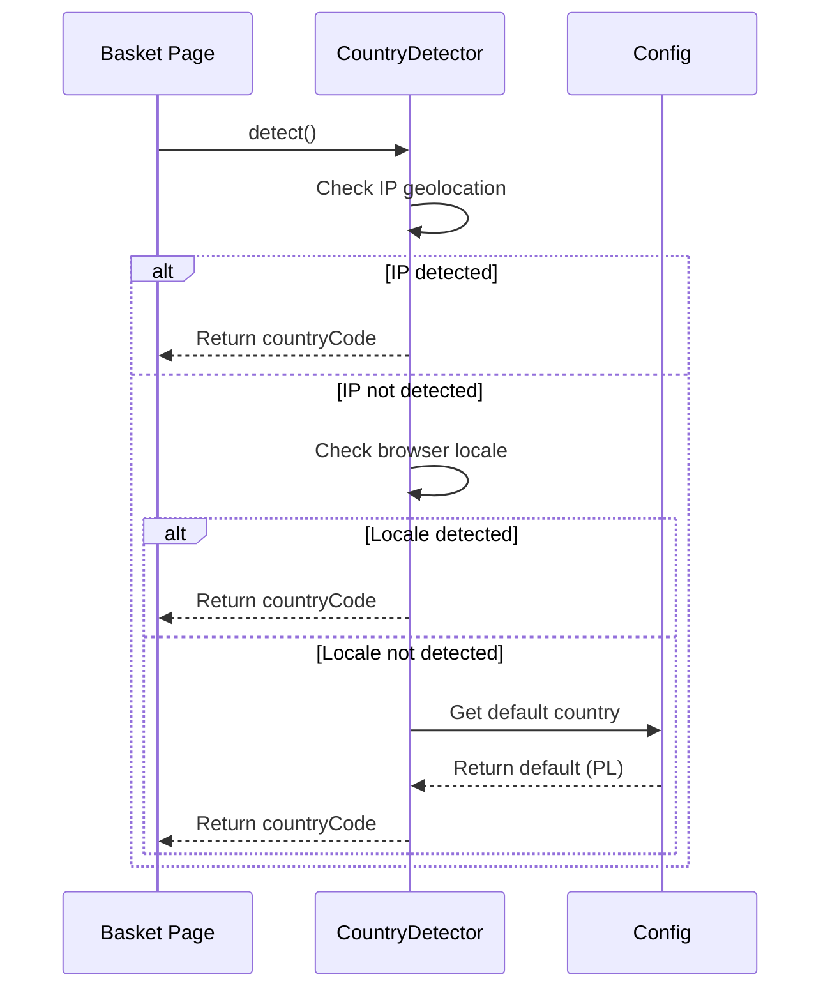
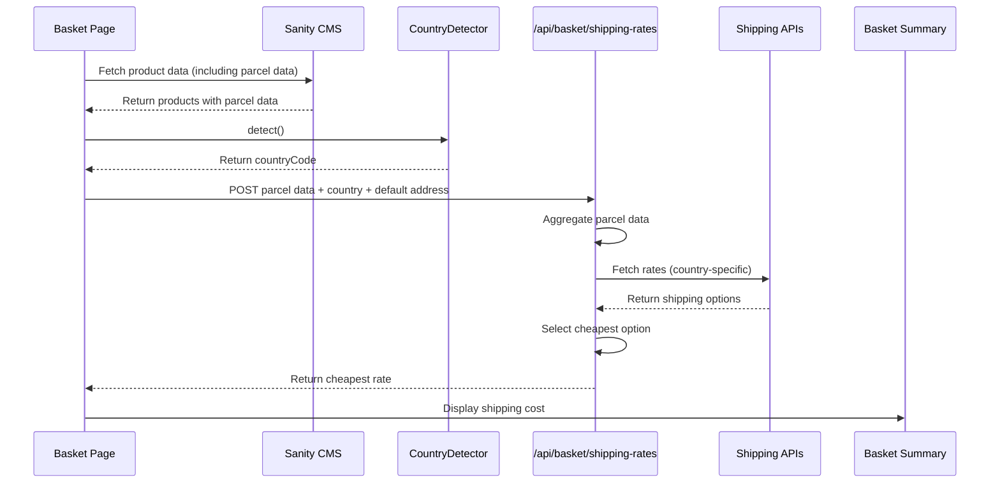
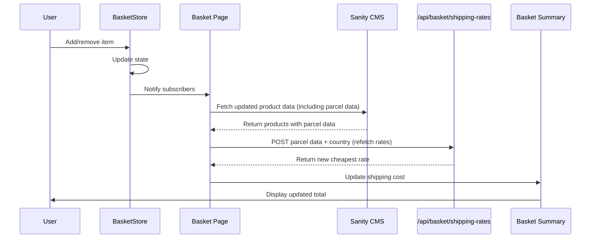

# Technical Diagrams: Shipping Cost Display

## Country Detection Flow

```mermaid
sequenceDiagram
    participant Page as Basket Page
    participant Detector as CountryDetector
    participant Config as Config

    Page->>Detector: detect()
    Detector->>Detector: Check IP geolocation
    alt IP detected
        Detector-->>Page: Return countryCode
    else IP not detected
        Detector->>Detector: Check browser locale
        alt Locale detected
            Detector-->>Page: Return countryCode
        else Locale not detected
            Detector->>Config: Get default country
            Config-->>Detector: Return default (PL)
            Detector-->>Page: Return countryCode
        end
    end
```

## Shipping Rate Fetching Flow (Basket Page)

```mermaid
sequenceDiagram
    participant Page as Basket Page
    participant CMS as Sanity CMS
    participant Detector as CountryDetector
    participant API as /api/basket/shipping-rates
    participant ShipAPI as Shipping APIs
    participant Summary as Basket Summary

    Page->>CMS: Fetch product data (including parcel data)
    CMS-->>Page: Return products with parcel data
    Page->>Detector: detect()
    Detector-->>Page: Return countryCode
    Page->>API: POST parcel data + country + default address
    API->>API: Aggregate parcel data
    API->>ShipAPI: Fetch rates (country-specific)
    ShipAPI-->>API: Return shipping options
    API->>API: Select cheapest option
    API-->>Page: Return cheapest rate
    Page->>Summary: Display shipping cost
```

## Basket Summary Update Flow

```mermaid
sequenceDiagram
    participant User as User
    participant Store as BasketStore
    participant Page as Basket Page
    participant CMS as Sanity CMS
    participant API as /api/basket/shipping-rates
    participant Summary as Basket Summary

    User->>Store: Add/remove item
    Store->>Store: Update state
    Store->>Page: Notify subscribers
    Page->>CMS: Fetch updated product data (including parcel data)
    CMS-->>Page: Return products with parcel data
    Page->>API: POST parcel data + country (refetch rates)
    API-->>Page: Return new cheapest rate
    Page->>Summary: Update shipping cost
    Summary->>User: Display updated total
```
