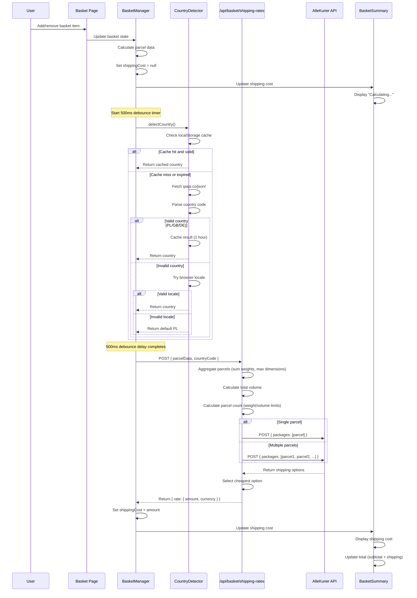
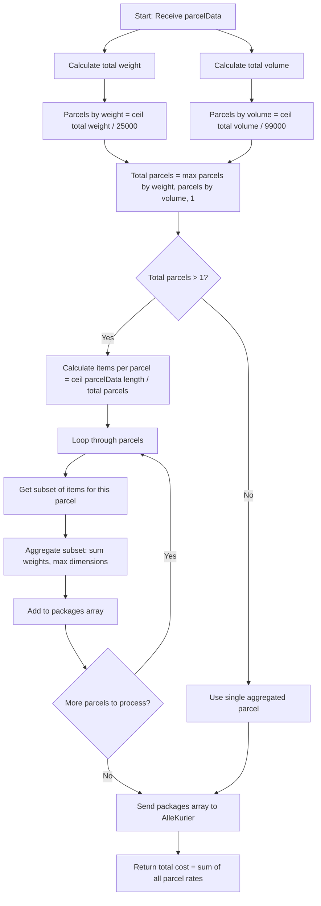
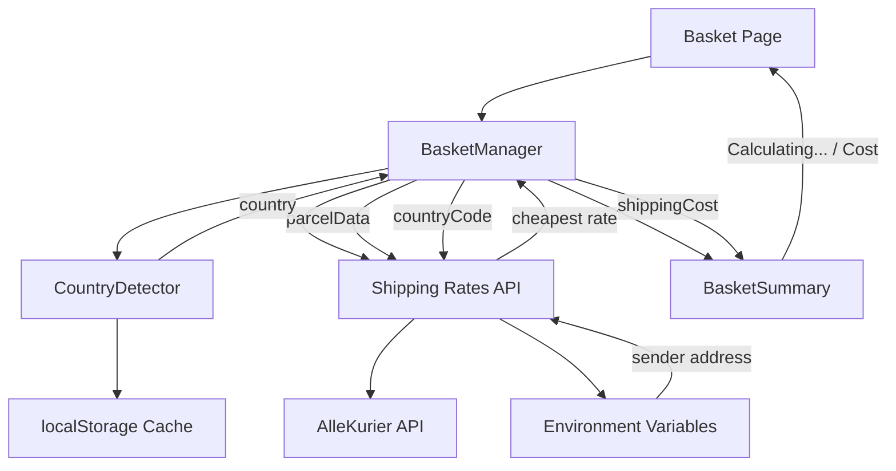
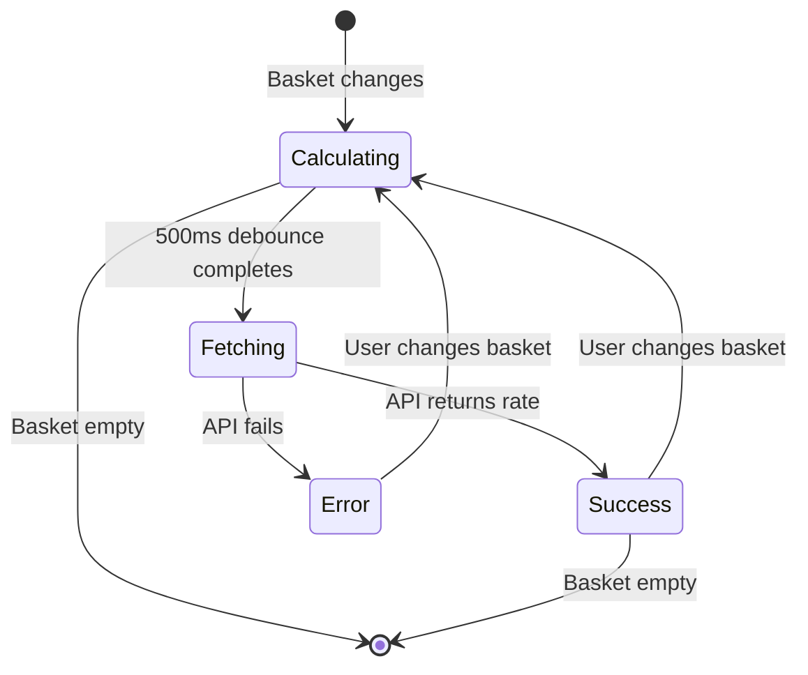
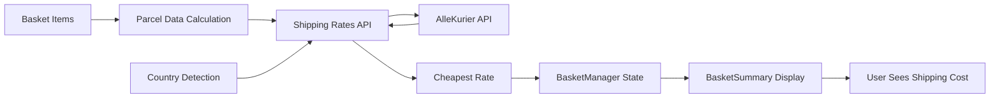

# Shipping Cost Display - Technical Diagrams

## Sequence Diagram: Basket Page Shipping Cost Flow

## Flowchart: Parcel Splitting Logic

## Component Architecture Diagram

## State Diagram: Shipping Cost State

## Data Flow Diagram

