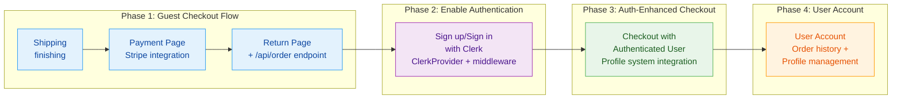

# Checkout Feature Sequencing Research

**Research Date:** May 12, 2026  
**Purpose:** Determine optimal development sequence for checkout-related features

---

## Executive Summary

**Recommended Sequence:**
1. **Finish Shipping** (in progress)
2. **Payment Page** (next)
3. **Return Page** (with `/api/order` implementation)
4. **Sign up/Sign in with Clerk** (enable existing integration)
5. **Checkout with Authenticated User** (enhance existing flow)
6. **User Account** (build on auth foundation)

**Rationale:** Complete the guest checkout flow first to validate core functionality, then layer authentication on top. This approach minimizes time-to-market, reduces complexity, and aligns with e-commerce best practices.

---

## Current State Assessment

### Completed
- Address page (Google API validation, address verification)
- Checkout queue (atomic FIFO reservation system)
- Basket reservation system (Sanity CMS)
- Infrastructure: Stripe, Shippo, Google APIs

### In Progress
- Shipping page (comprehensive docs exist, implementation in progress)

### Stub/Incomplete
- **Payment page:** Returns "page" placeholder only
- **Return page:** UI exists but `/api/order` endpoint is commented out
- **Clerk integration:** Installed but commented out in `middleware.ts` and `layout.tsx`
- **Auth components:** Exist (SignInBtn, Authentication, AuthenticatedView) but disabled
- **User account:** Minimal components exist (ProfileHeader, account components)

### Infrastructure Ready
- **Profile system:** userProfile schema in Sanity CMS, create/fetch/update functions exist
- **Order system:** `addOrder.ts` with comprehensive validation
- **Clerk package:** @clerk/nextjs ^6.16.0 installed
- **Stripe webhooks:** Implemented and handling checkout.completed events

---

## Dependency Map

### Critical Dependencies
- **Payment page** depends on: Shipping choice (from basket reservation), Stripe integration
- **Return page** depends on: Payment completion, `/api/order` endpoint
- **Sign up/sign in** depends on: Clerk provider setup, middleware configuration
- **Auth checkout** depends on: Clerk auth, profile system
- **User account** depends on: Clerk auth, profile system, order history

---

## Recommended Sequence with Rationale

### Phase 1: Complete Guest Checkout Flow (Features 1-3)

#### 1. Finish Shipping (current)
- **Status:** In progress with comprehensive documentation
- **Action:** Complete implementation per `docs/checkout/shipping/README.md`

#### 2. Payment Page (next priority)
- **Why next:** Critical path to revenue, depends only on shipping completion
- **Dependencies:** Shipping choice (from basket reservation), Stripe integration
- **Implementation:**
  - Implement Stripe Elements integration
  - Fetch basket reservation document
  - Display shipping choice summary
  - Handle billing address (reuse shipping address option)
  - Process payment via Stripe
  - On success: redirect to return page with session_id
- **Complexity:** Medium (Stripe integration is standard, patterns exist)

#### 3. Return Page + `/api/order` (after payment)
- **Why next:** Completes the checkout loop, validates end-to-end flow
- **Dependencies:** Payment completion, order creation
- **Implementation:**
  - Uncomment and implement `/api/order/route.ts` (currently stubbed)
  - Integrate with existing `addOrder.ts` function
  - Fetch order from Sanity CMS using session_id
  - Display order confirmation
  - Clear basket
- **Complexity:** Medium (order system exists, just needs wiring)

**Trade-off Analysis:** Completing guest checkout first validates the core revenue path without authentication complexity. If auth issues arise, you still have a working checkout.

---

### Phase 2: Enable Authentication (Feature 4)

#### 4. Sign up/Sign in with Clerk
- **Why now:** Guest checkout validated, auth can be layered on top
- **Why not earlier:** Auth adds complexity to checkout debugging; guest checkout is simpler to validate
- **Dependencies:** None (Clerk already installed, components exist)
- **Implementation:**
  - Uncomment ClerkProvider in `app/(store)/layout.tsx`
  - Uncomment clerkMiddleware in `middleware.ts`
  - Enable SignInBtn component (currently disabled with "Sign In (Disabled)")
  - Configure Clerk environment variables
  - Test sign-in/sign-out flows
- **Complexity:** Low (infrastructure exists, just needs enabling)
- **Risk:** Low (can be rolled back by commenting out again)

**Key Insight:** Clerk is already partially integrated. The checkout API (`app/api/checkout/route.ts` line 115) already uses `currentUser()` from Clerk, so the backend is auth-aware. This suggests the original architecture planned for auth from the start.

---

### Phase 3: Auth-Enhanced Checkout (Feature 5)

#### 5. Checkout with Authenticated User
- **Why now:** Auth infrastructure is live, can enhance checkout experience
- **Dependencies:** Clerk auth, profile system
- **Implementation:**
  - Pre-fill shipping address from user profile if available
  - Save shipping address to profile after successful checkout
  - Display "Welcome back, [name]" for authenticated users
  - Offer to save payment method (if supported by Stripe)
  - Link order to user profile (clerkUserId field exists in order schema)
- **Complexity:** Medium (profile system exists, needs integration)
- **Benefits:** Reduced friction for returning customers

**Best Practice:** Keep guest checkout as default. Auth should enhance, not block, checkout.

---

### Phase 4: User Account (Feature 6)

#### 6. User Account
- **Why last:** Depends on auth + order history + profile system
- **Dependencies:** Clerk auth, profile system, order history
- **Implementation:**
  - Build account dashboard page
  - Order history view (fetch orders by clerkUserId)
  - Profile management (edit addresses, preferences)
  - Saved payment methods (if applicable)
- **Complexity:** High (multiple subsystems to integrate)
- **Benefits:** Customer retention, reordering convenience

---

## Alternative Approaches Considered

### Alternative A: Enable Auth First
**Sequence:** Auth → Payment → Return → Auth checkout → User account

**Pros:**
- Auth foundation in place from start
- Can build auth-aware features immediately
- No retrofitting later

**Cons:**
- Delays core checkout functionality
- Adds complexity to initial checkout debugging
- If auth issues arise, checkout is blocked
- Violates "guest checkout first" best practice

**Verdict:** Not recommended. Guest checkout should be validated first.

### Alternative B: Parallel Development
**Sequence:** Work on auth and checkout simultaneously

**Pros:**
- Potentially faster overall timeline
- Early integration testing

**Cons:**
- Context switching reduces productivity
- Harder to isolate issues
- Increased cognitive load
- Risk of partial implementations blocking each other

**Verdict:** Not recommended for solo/small team. Sequential is more predictable.

---

## Best Practices Alignment

### From Web Research
- ✅ Guest checkout reduces cart abandonment
- ✅ Authentication should be optional during checkout
- ✅ Account creation can be nudged after payment
- ✅ Simplified checkout process reduces abandonment

### Recommended Pattern
1. Guest checkout as default (no account required)
2. "Continue as Guest" vs "Sign In" option on checkout button
3. Post-purchase: "Create an account to track your order" prompt
4. Account benefits: faster checkout, order history, saved addresses

---

## Risk Assessment

| Feature | Risk | Mitigation |
|---------|------|------------|
| Payment Page | Medium (Stripe integration) | Stripe is well-documented; patterns exist in codebase |
| Return Page | Low (order system exists) | addOrder.ts is comprehensive; just needs wiring |
| Clerk Auth | Low (infrastructure exists) | Can be rolled back by commenting out |
| Auth Checkout | Low (profile system exists) | Profile functions are implemented and tested |
| User Account | Medium (complex integration) | Build incrementally: order history → profile → payment methods |

**Highest Risk:** None critical. All infrastructure exists.

---

## Implementation Notes

### Payment Page Specifics
- Use Stripe Elements (already integrated in project)
- Fetch basket reservation by ID from session storage
- Display shipping choice summary (provider, service, price, ETA)
- Billing address: checkbox to reuse shipping address
- On payment success: redirect to `/checkout/return?session_id={CHECKOUT_SESSION_ID}`

### Return Page Specifics
- Uncomment `/api/order/route.ts`
- Integrate with existing `addOrder` function from `sanity-cms/lib/orders/addOrder.ts`
- Fetch order by session_id or orderNumber
- Display order confirmation with items, total, shipping details
- Clear basket (currently commented out in return page)

### Clerk Integration Specifics
- Environment variables: NEXT_PUBLIC_CLERK_PUBLISHABLE_KEY, CLERK_SECRET_KEY
- Uncomment lines 4, 45, 78 in `app/(store)/layout.tsx`
- Uncomment lines 1, 5-9 in `middleware.ts`
- Enable SignInBtn component (remove "Disabled" text and cursor-not-allowed)
- Test sign-in flow with Clerk dev instance

### Profile System Specifics
- userProfile schema already exists in Sanity CMS
- Functions exist: `createUserProfile`, `fetchProfileByClerkId`, `updateUserProfile`
- Use these to save/load shipping addresses for authenticated users

---

## Timeline Estimate (Assuming Solo Development)

| Phase | Feature | Estimate |
|-------|---------|----------|
| 1 | Finish Shipping | 2-3 days (in progress) |
| 1 | Payment Page | 3-5 days |
| 1 | Return Page + /api/order | 2-3 days |
| 2 | Clerk Auth | 1-2 days |
| 3 | Auth Checkout | 2-3 days |
| 4 | User Account | 5-7 days |
| **Total** | | **15-23 days** |

**Critical Path:** Shipping → Payment → Return (8-11 days to working guest checkout)

---

## Immediate Next Steps

1. **Complete shipping feature** (current task)
2. **Start payment page implementation** after shipping is complete
3. **Implement `/api/order` endpoint** concurrently with return page
4. **Enable Clerk auth** after guest checkout is validated
5. **Build user account** last (nice-to-have, not revenue-critical)

---

## Conclusion

The recommended sequence prioritizes **time-to-revenue** by completing the guest checkout flow first, then layering authentication on top. This approach:

- ✅ Validates core functionality without auth complexity
- ✅ Aligns with e-commerce best practices (guest checkout first)
- ✅ Minimizes risk (auth can be enabled/disabled easily)
- ✅ Leverages existing infrastructure (Clerk, profile system, order system)
- ✅ Provides clear milestones (working guest checkout → auth checkout → full account)

**Key Insight:** Authentication should enhance, not block, the checkout experience. By building guest checkout first, you ensure the revenue path works regardless of auth state.
