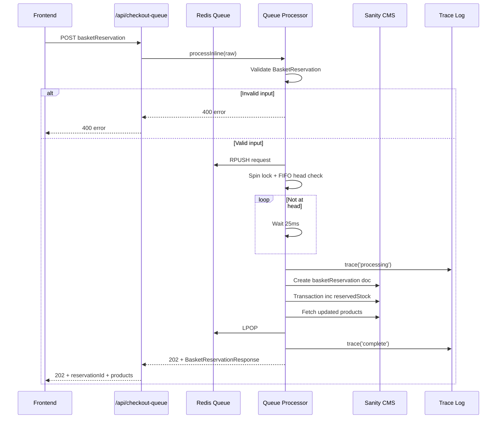

# Checkout Queue

## Overview

The checkout queue provides atomic FIFO (first-in-first-out) processing for basket reservation requests. It prevents race conditions during concurrent checkout attempts by serializing reservation writes to Sanity CMS, ensuring reservedStock increments are atomic and preventing double-reservation or stock mis-counting.

## Architecture

## Key Components

- **Queue Processor** (`lib/queue/processor.ts`) - Main queue processor with atomic FIFO logic
- **Type Guards** (`lib/queue/types.ts`) - Runtime validation for BasketReservation
- **Cleanup Infrastructure** (`lib/queue/cleanup.ts`) - TTL expiration handling
- **Redis Client** (`lib/queue/redis.ts`) - Singleton Upstash Redis client
- **Trace Logging** (`lib/queue/trace.ts`) - Event logging for debugging and test verification
- **Health Checks** (`lib/queue/health.ts`) - Redis connection health monitoring
- **API Endpoint** (`app/api/checkout-queue/route.ts`) - POST endpoint for reservation requests

## Data Flow

1. Frontend sends `POST /api/checkout-queue` with `BasketReservation` payload
2. Processor validates payload shape using runtime type guard (400 on mismatch)
3. Request enqueued to Redis FIFO list via `RPUSH`
4. Processor enters spin loop:
   - Attempt `SET NX` on lock key (atomic lock acquisition)
   - If lock acquired, check if request is at list head via `LINDEX`
   - If not at head, release lock and retry after 25ms
   - If at head, proceed to processing
5. Create Sanity `basketReservation` document with `_id = requestId` and `expiresAt`
6. Transaction increment `reservedStock` for each product atomically
7. Fetch updated products from CMS with current stock/reservedStock
8. Pop request from queue via `LPOP` and release lock
9. Return 202 with `BasketReservationResponse` (not 201 - reservation is async)

## Tech Stack

- **Redis** (Upstash) - Queue storage and lock management
- **Sanity CMS** - Reservation documents and product data
- **Node.js runtime** - Required for queue processing
- **TypeScript** - Type safety and runtime guards
- **Vitest** - Integration tests
- **Playwright** - E2E tests

## Why Node.js Runtime

The queue endpoint uses `export const runtime = 'nodejs'` because:

1. **Redis operations require Node.js** - Upstash REST client needs Node.js environment
2. **Atomic locking** - SET NX and list operations require synchronous Redis access
3. **Spin loop processing** - 25ms retry loop requires Node.js timing
4. **Health monitoring** - 60s health probe requires Node.js intervals

Edge runtime is not suitable for this use case.

## Related Documentation

- [MAJOR ADR](./MAJOR ADR.md) - Architecture Decision Records
- [Technical Diagrams](./TECHNICAL DIAGRAM.md) - Mermaid diagrams showing flows
- [Reservation TTL](./reservation-ttl/README.md) - TTL expiration and cleanup infrastructure
