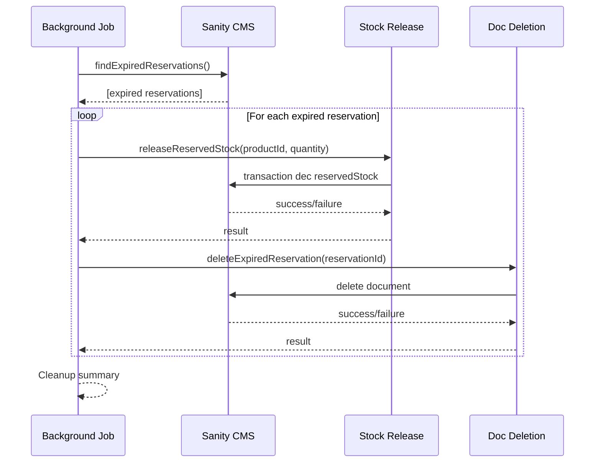

# Reservation TTL

## Overview

The reservation TTL (time-to-live) system provides automatic expiration of basket reservations. Reservations include a configurable TTL that defines how long they remain valid. A background cleanup job periodically finds expired reservations, releases reservedStock back to available stock, and deletes the expired documents from Sanity CMS.

## Architecture

## Key Components

- **releaseReservedStock()** (`lib/queue/cleanup.ts`) - Decrement reservedStock atomically on product
- **deleteExpiredReservation()** (`lib/queue/cleanup.ts`) - Delete expired basketReservation document from Sanity
- **findExpiredReservations()** (`lib/queue/cleanup.ts`) - GROQ query for expired docs (expiresAt < now)
- **backgroundCleanupJob()** (`lib/queue/cleanup.ts`) - Orchestrator that runs cleanup periodically

## Data Flow

1. Background job runs periodically (every 5 minutes by default)
2. Job calls `findExpiredReservations()` to query Sanity for expired docs
3. For each expired reservation:
   - Call `releaseReservedStock(productId, quantity)` to decrement reservedStock atomically
   - Call `deleteExpiredReservation(reservationId)` to delete the document from Sanity
4. Job outputs cleanup summary (processed count, errors)

## Error Handling

- Individual reservation failures should not stop entire cleanup
- Log errors for failed operations
- Continue processing remaining reservations
- Atomic transactions ensure partial failures don't corrupt data

## Tech Stack

- **Sanity CMS** - Reservation documents and product data
- **GROQ** - Query language for finding expired reservations
- **Sanity Transactions** - Atomic stock decrement operations

## Related Documentation

- [Cleanup Architecture](../../../_project/checkout-queue/reservation-ttl/cleanup-architecture.md) - Detailed cleanup infrastructure documentation
- [TTL Diagram](../../../_project/checkout-queue/reservation-ttl/diagram.md) - Visual flow of TTL expiration
