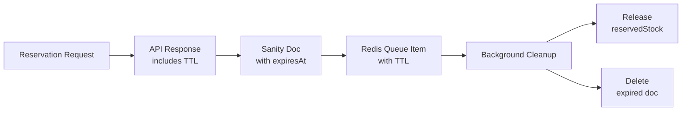

```mermaid
flowchart LR
    Request[Reservation Request] --> TTL[API Response<br/>includes TTL]
    TTL --> Sanity[Sanity Doc<br/>with expiresAt]
    Sanity --> Redis[Redis Queue Item<br/>with TTL]
    Redis --> Cleanup[Background Cleanup]
    Cleanup --> Stock[Release<br/>reservedStock]
    Cleanup --> Delete[Delete<br/>expired doc]
```
