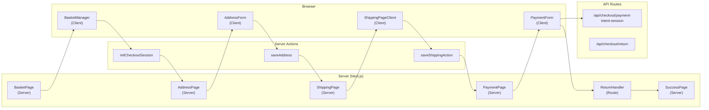
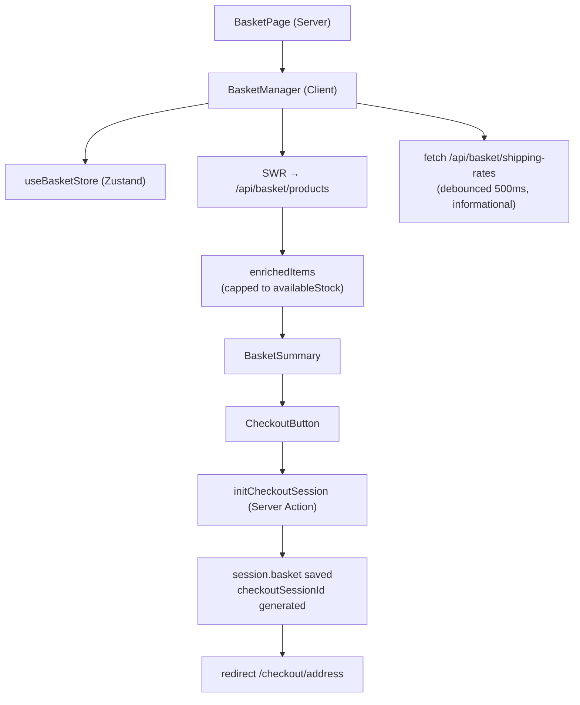
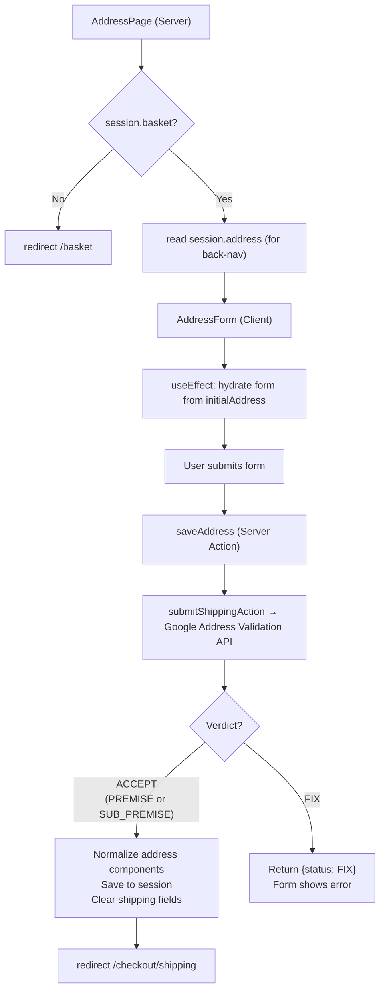
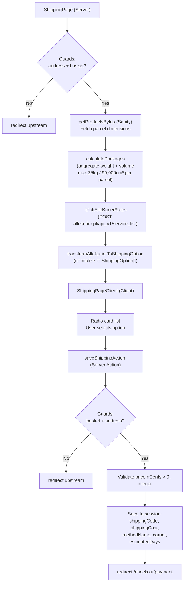
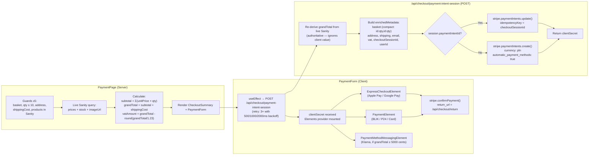
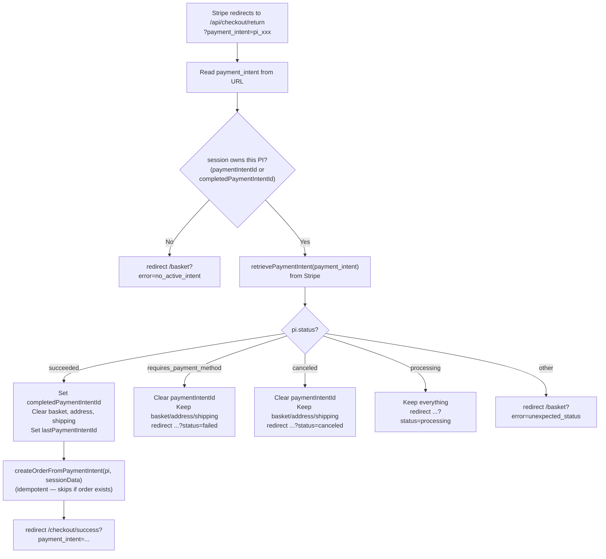
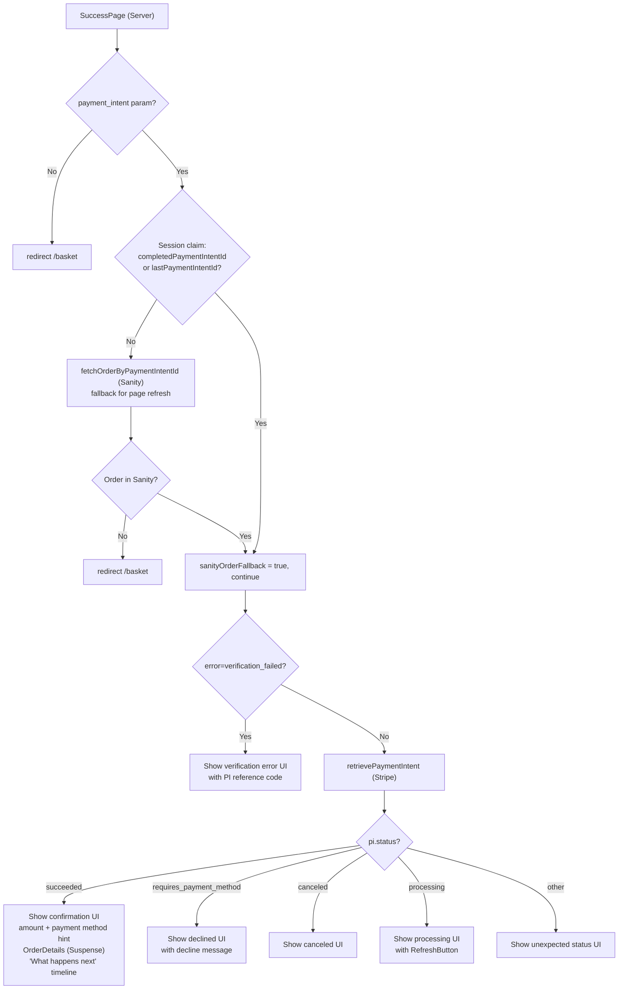
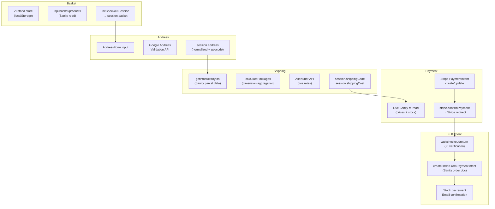

# Checkout System — Source Code Synopsis

> **Scope:** Complete tracing of the checkout funnel from basket to order confirmation.
> **Accuracy:** 100% source-derived. No assumptions.
> **Last traced:** Jun 2026

---

## 1. System Overview

### Funnel Steps

```
/basket → /checkout/address → /checkout/shipping → /checkout/payment → /api/checkout/return → /checkout/success
```

### Session State (iron-session, encrypted HTTP-only cookie, 1hr TTL)

| Field | Type | Set by | Cleared by |
|---|---|---|---|
| `basket` | `{productId, quantity}[]` | `initCheckoutSession` | Return handler (succeeded) |
| `address` | Address object + geocode | `saveAddress` | `saveAddress` (cascade on re-submit) |
| `email` | string | `saveEmailToSession` | — |
| `shippingCode` | string | `saveShippingAction` | `saveAddress` (cascade) |
| `shippingCost` | number (cents) | `saveShippingAction` | `saveAddress` (cascade) |
| `shippingMethodName` | string | `saveShippingAction` | `saveAddress` (cascade) |
| `shippingCarrier` | string | `saveShippingAction` | `saveAddress` (cascade) |
| `shippingEstimatedDays` | number | `saveShippingAction` | `saveAddress` (cascade) |
| `paymentIntentId` | string | Payment Intent route | Return handler |
| `completedPaymentIntentId` | string | Return handler (succeeded) | — |
| `lastPaymentIntentId` | string | Return handler (any path) | — |
| `checkoutSessionId` | string | `initCheckoutSession` | — |

**Cookie name:** `checkout_session` · **Max size:** 4KB · **Source:** `lib/session.ts`

### Session Guards (funnel jump prevention)

| Page | Requires | Missing → redirect |
|---|---|---|
| `/checkout/address` | `session.basket` non-empty | `/basket` |
| `/checkout/shipping` | `session.basket` + `session.address` | `/basket` or `/checkout/address` |
| `/checkout/payment` | basket + address + `shippingCost` + valid quantities | respective upstream page |
| `/checkout/success` | `payment_intent` param + session claim | `/basket` |

### Cascade Invalidation

Editing address clears all downstream shipping fields. On `saveAddress`, these are deleted:
`shippingCode`, `shippingCost`, `shippingMethodName`, `shippingCarrier`, `shippingEstimatedDays`

---

## 2. Funnel Diagram



---

## 3. Page-by-Page Tracing

### 3.1 Basket Page

**Route:** `/basket`
**Files:**
- `app/(store)/basket/page.tsx` — Server Component shell
- `app/components/features/basket/BasketManager.tsx` — Client Component (main logic)
- `app/components/features/basket/BasketSummary.tsx` — Client Component
- `app/components/features/checkout/reservation/CheckoutButton.tsx` — Client Component



**Key logic:**
- Zustand store hydrates basket from `localStorage`
- SWR key uses a `trackedIds` accumulator (never re-fetches on quantity changes, only new product IDs)
- `enrichedItems` caps quantity to `stock - reservedStock`
- Items sorted: in-stock first
- `CheckoutButton` generates `checkoutSessionId` (`chk_{timestamp}_{random}`) at first click
- `initCheckoutSession` saves `{productId, quantity}[]` to session cookie

---

### 3.2 Address Page

**Route:** `/checkout/address`
**Files:**
- `app/checkout/address/page.tsx` — Server Component
- `app/checkout/address/AddressForm.tsx` — Client Component
- `app/actions/checkout/index.ts` → `saveAddress`
- `app/actions/address/address.ts` → `submitShippingAction`



**Address validation details (`submitShippingAction`):**
- Endpoint: `POST https://addressvalidation.googleapis.com/v1:validateAddress`
- Acceptance rule: `addressComplete=true`, `inputGranularity` and `validationGranularity` both in `{PREMISE, SUB_PREMISE}`, no inferred components
- On ACCEPT: normalizes to `{street, streetNumber, city, postalCode, regionCode}` from Google's `addressComponents`
- Geocode and `placeId` saved to session for potential downstream use
- Countries supported: `PL`, `GB` (UK normalized to GB in API call)

**Cascade invalidation on save:** `shippingCode`, `shippingCost`, `shippingMethodName`, `shippingCarrier`, `shippingEstimatedDays` all set to `undefined`

---

### 3.3 Shipping Page

**Route:** `/checkout/shipping`
**Files:**
- `app/checkout/shipping/page.tsx` — Server Component
- `app/checkout/shipping/ShippingPageClient.tsx` — Client Component
- `app/actions/checkout/index.ts` → `saveShippingAction`
- `lib/shipping/allekurier-rates.ts`
- `lib/shipping/parcel-calculator.ts`
- `sanity-cms/lib/products/getProductsByIds`



**Parcel calculator:**
- Aggregates total weight (grams) and volume (cm³) across all basket items × quantities
- Fallback: `DEFAULT_PARCEL = {weight: 500g, 20×15×25cm}` for products missing parcel data
- Splits into multiple parcels if weight > 25kg or volume > 99,000cm³
- Returns `Package[] = {weight(kg), width, height, length}(cm)`

**AlleKurier API:**
- Auth: `ALLEKURIER_EMAIL` + `ALLEKURIER_PASSWORD` env vars (form-data POST)
- Returns `AlleKurierService[]` with carrier, service, gross price (PLN), delivery days
- Price stored in cents: `Math.round(gross * 100)`

**UI layout:** Scrollable list + sticky bottom CTA on mobile, inline CTA on desktop. Full `<label>` wrapping for accessible touch targets.

---

### 3.4 Payment Page

**Route:** `/checkout/payment`
**Files:**
- `app/checkout/payment/page.tsx` — Server Component
- `app/checkout/payment/PaymentForm.client.tsx` — Client Component
- `app/checkout/payment/_components/CheckoutSummary.tsx` — Server Component
- `app/api/checkout/payment-intent-session/route.ts` — Route Handler (POST)



**Payment methods rendered (in order):** Express (Apple/Google Pay) → BLIK → P24 → Card
**Stripe appearance:** Custom dark theme tokens from tailwind config (brand-400, surface.elevated, etc.)
**Billing details:** Pre-filled from `session.address` (street+number, postalCode, city, regionCode)
**Metadata size guard:** Keys checked against Stripe's 500-char limit before `paymentIntents.create`
**Cookie size guard:** Session serialized size warned at >3KB (hard limit: 4KB)

---

### 3.5 Return Handler

**Route:** `/api/checkout/return` (GET — Stripe redirect target)
**File:** `app/api/checkout/return/route.ts`



**Security:**
- PI from URL must match `session.paymentIntentId` or `session.completedPaymentIntentId`
- `lastPaymentIntentId` set for any PI processed (for audit), `completedPaymentIntentId` only on succeeded
- Session data captured before clear for order creation

---

### 3.6 Order Creation (`createOrderFromPaymentIntent`)

**File:** `lib/checkout/createOrderFromPaymentIntent.ts`

**Two data sources (fallback chain):**
1. `sessionData` (return handler path — passed directly, most reliable)
2. PI metadata (webhook path — parsed from `basket` compact string `id:qty,...` or legacy JSON)

**Steps:**
1. Idempotency check: skip if `order` document with this `paymentIntentId` already exists
2. Validate customer email (Zod)
3. Fetch product names + prices from Sanity
4. Build order items with subtotals
5. Build `shippingMethod` if `shippingMethodName` present
6. Map address to `shippingAddress` shape
7. Compute pricing (subtotal, shipping, VAT from metadata or recalculate at 23%)
8. Extract payment method from `pi.latest_charge.payment_method_details` (not `payment_method_types[]`)
9. Generate `orderNumber = ORD-{year}-{last6ofPI}` and `orderId = order_{uuid}`
10. Create `order` document in Sanity via `backendClient`
11. Send confirmation email (non-fatal — wrapped in try/catch)
12. Decrement stock: pre-check stock ≥ quantity, post-check no negative values

---

### 3.7 Success Page

**Route:** `/checkout/success`
**Files:**
- `app/checkout/success/page.tsx` — Server Component
- `app/checkout/success/OrderDetails.tsx` — Server Component (Suspense child)
- `app/checkout/success/RefreshButton.tsx` — Client Component
- `app/checkout/success/SuccessAnalytics.client.tsx` — Client Component



**Payment method display:** Derived from `pi.latest_charge.payment_method_details.type` (blik / p24 / card + wallet detection for Apple/Google Pay)
**`OrderDetails` component:** Fetches order from Sanity by PI ID via `fetchOrderByPaymentIntentId`. Shows: order number, date, email, items, pricing breakdown, shipping address, estimated delivery range. Falls back to skeleton + RefreshButton if order not yet written.
**Guest CTA:** If `order.isGuest = true`, shows "Create account" link pre-filled with email.
**`SuccessAnalytics`:** Fires GA4 purchase event (client-side, fire-and-forget).

---

## 4. Shared Infrastructure

### 4.1 Session (`lib/session.ts`)

```typescript
// Cookie: checkout_session | httpOnly | secure (prod) | sameSite: lax | maxAge: 3600s
interface CheckoutSession {
  basket: { productId: string; quantity: number }[]
  address?: { firstName, lastName, phone, regionCode, postalCode, street, streetNumber, city, geocode?, placeId? }
  email?: string
  shippingCode?: string; shippingCost?: number
  shippingMethodName?: string; shippingCarrier?: string; shippingEstimatedDays?: number
  paymentIntentId?: string
  completedPaymentIntentId?: string
  lastPaymentIntentId?: string
  checkoutSessionId?: string  // unified trace ID
}
```

### 4.2 Checkout Stepper (`app/checkout/_components/CheckoutStepper.tsx`)

Client component. Steps: Basket (0) → Address (1) → Shipping (2) → Payment (3).
Active step highlighted with `brand-400`. Passed steps: `brand-600`. Pending: `secondary-600`.

### 4.3 Checkout Layout (`app/checkout/layout.tsx`)

Separate root layout (own `<html>`). Minimal header: brand logo only. No main nav. `max-w-4xl` container. GA4 scripts conditionally loaded.

### 4.4 Event Logger (`lib/dev/event-logger.ts`)

Every significant step logs: `{correlationId: checkoutSessionId, slice, event, data, outcome}`. Used for tracing and debugging. Non-blocking.

### 4.5 Trace API (`/api/trace`)

Client-side fire-and-forget fetch for frontend events (address submit, shipping selection, payment submit). Never blocks UX.

### 4.6 Stripe Config (`lib/stripe.ts`)

Exports `stripe` (server-side Stripe SDK) and `retrievePaymentIntent`. Used in payment-intent-session route and return handler.

---

## 5. External Services

| Service | Used by | Auth | Purpose |
|---|---|---|---|
| Google Address Validation API | `app/actions/address/address.ts` | `GOOGLE_MAPS_API_KEY` | Validate + normalize address |
| AlleKurier API | `lib/shipping/allekurier-rates.ts` | `ALLEKURIER_EMAIL` + `ALLEKURIER_PASSWORD` | Fetch real shipping rates |
| Stripe | Payment page + return handler + success page | `STRIPE_SECRET_KEY` / `NEXT_PUBLIC_STRIPE_PUBLISHABLE_KEY` | PaymentIntent, Elements, retrieval |
| Sanity CMS | Basket, shipping, payment, order creation | `SANITY_STUDIO_READ_WRITE` | Product prices, stock, parcel data, orders |

---

## 6. Data Flow Summary



---

## 7. Key Architectural Decisions

| Decision | Implementation |
|---|---|
| **Price authority** | Server always re-derives total from live Sanity. Client display value is for UX only. |
| **Session integrity** | iron-session encrypted cookie. Client cannot tamper. |
| **Idempotency** | PaymentIntent reused via `checkoutSessionId` key. Order skipped if PI already has order. |
| **Order creation path** | Return handler (synchronous) + webhook (async safety net). Both use `createOrderFromPaymentIntent` with idempotency guard. |
| **Cascade validation** | Address edit clears all downstream shipping. No stale shipping rates after address change. |
| **Payment method extraction** | `pi.latest_charge.payment_method_details.type` — not `payment_method_types[]` (unreliable for wallets). |
| **Metadata size** | Basket stored as `id:qty,id:qty` compact string. All values checked against Stripe's 500-char limit. |
| **Funnel jumping** | Every page has session guards. Forward navigation only through the actions. Back is permissive. |
