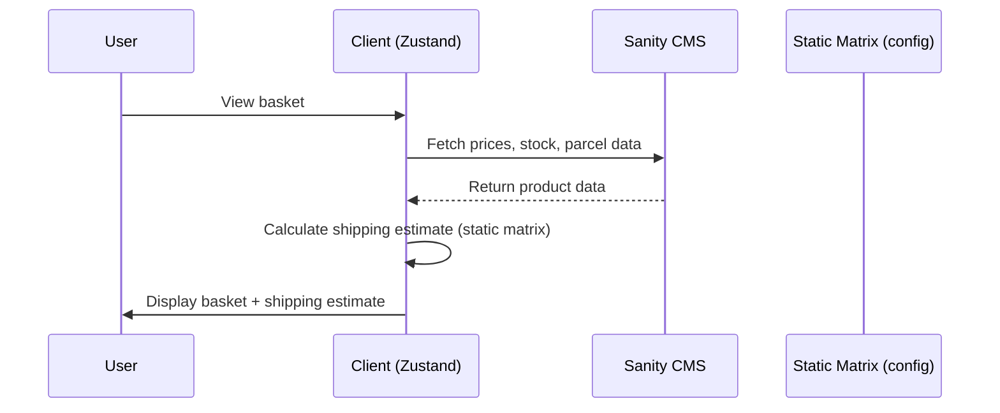
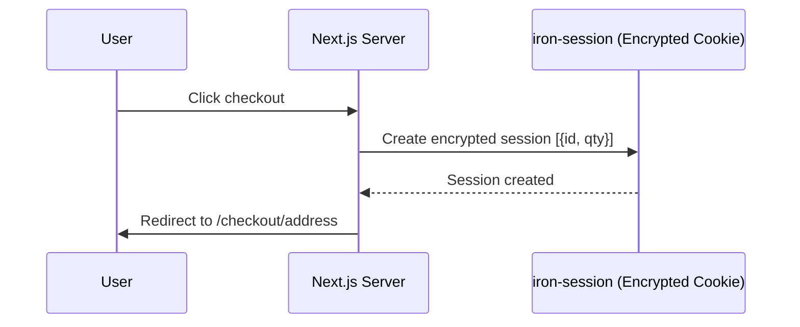
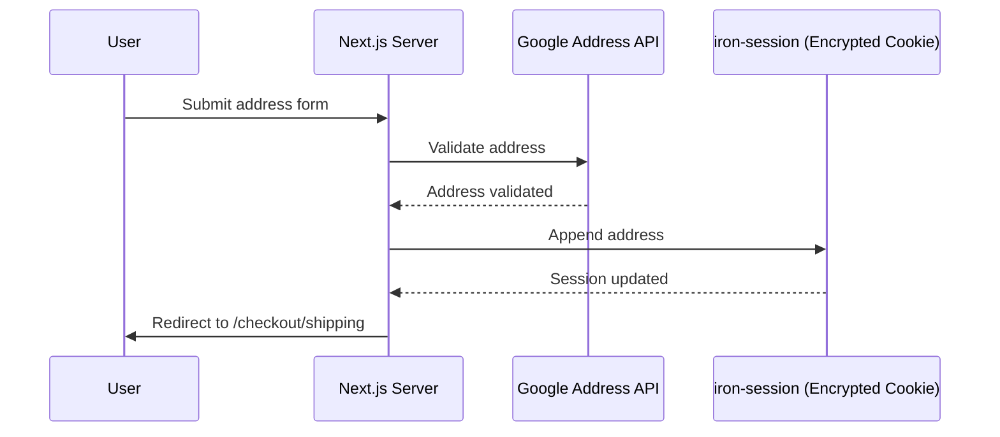
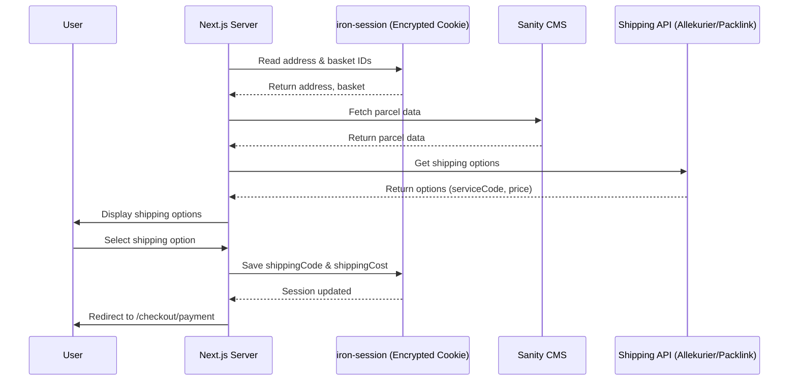
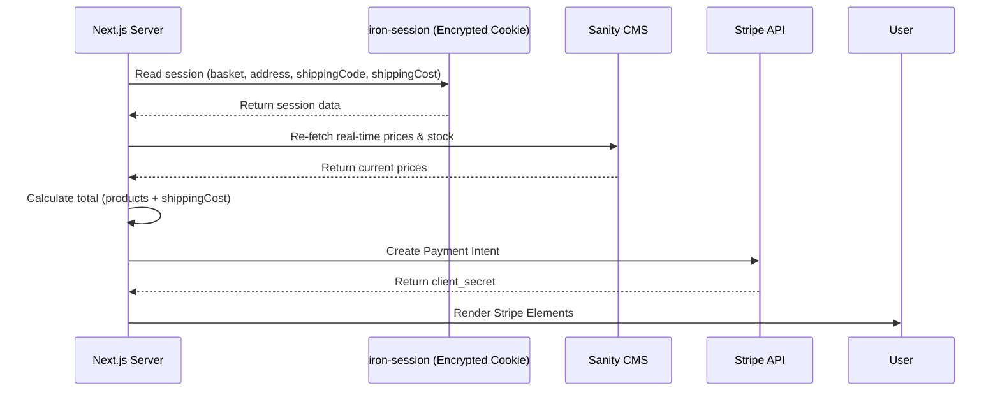
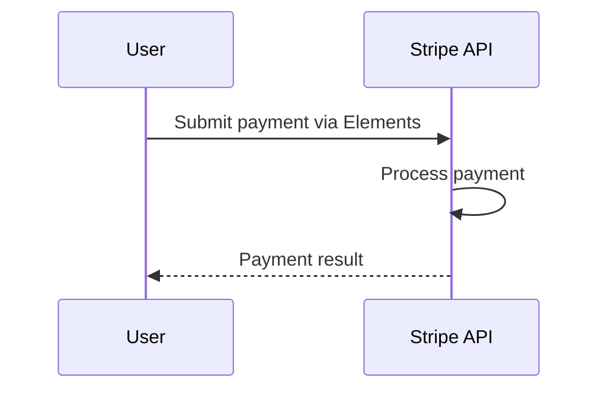
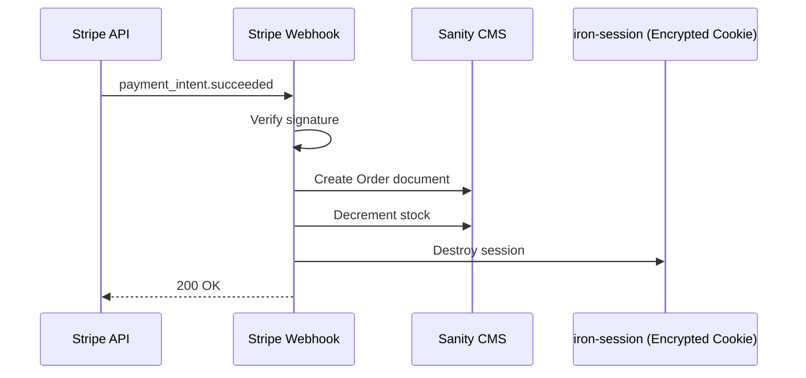
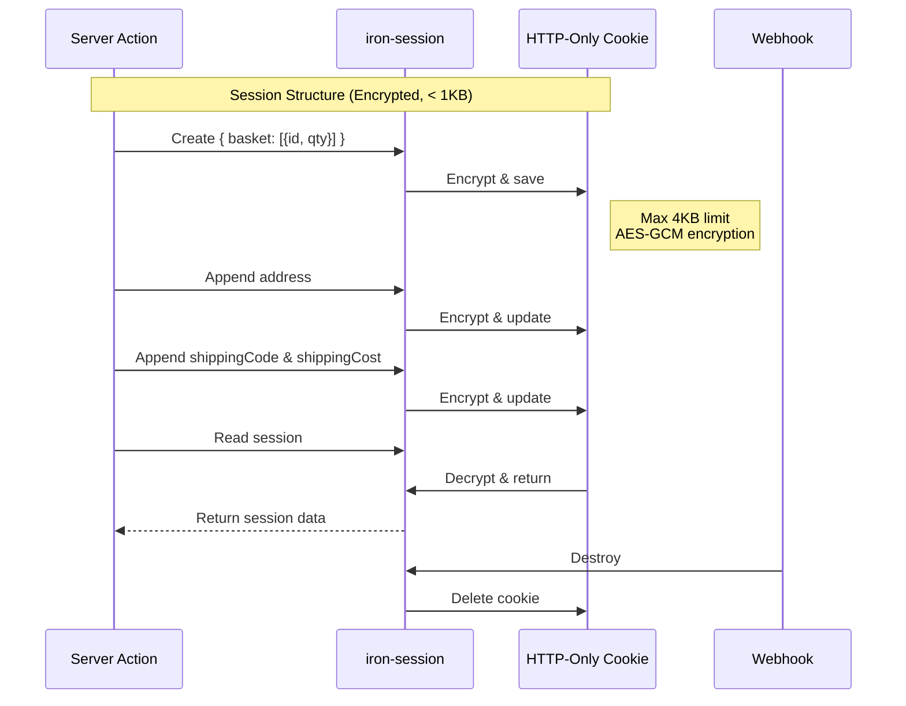
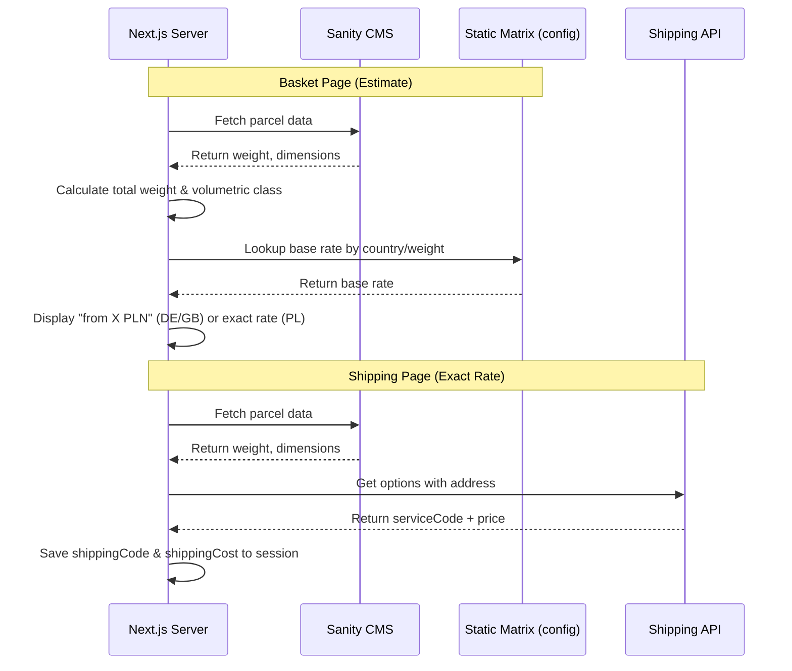
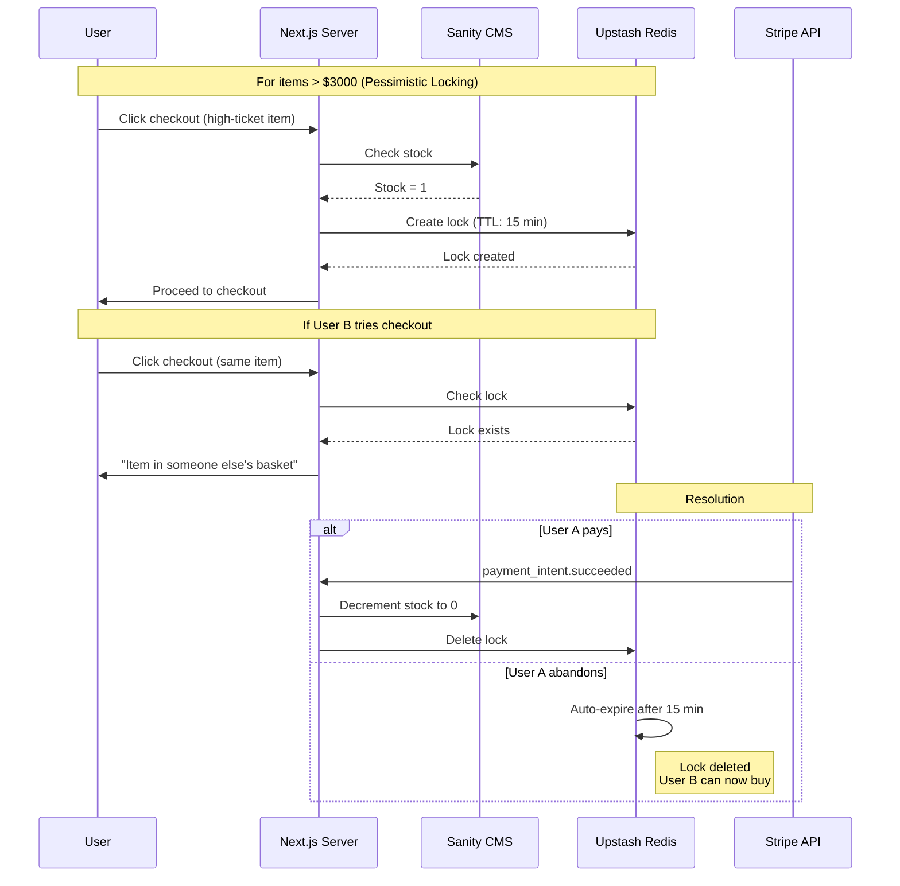

# Technical Diagrams: Checkout Feature

## Phase 1: Basket Page

## Phase 2: Initiate Checkout

## Phase 3: Address Page

## Phase 4: Shipping Page

## Phase 5: Payment Page (Security Checkpoint)

## Phase 6: Client Payment

## Phase 7: Webhook (Async)

## Session Data Flow

## Shipping Cost Calculation Flow

## High-Ticket Item Reservation Flow (Optional)

