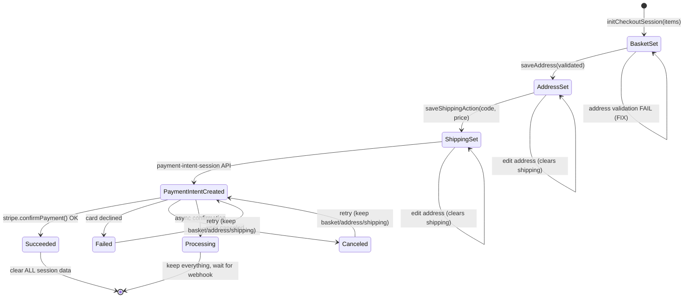
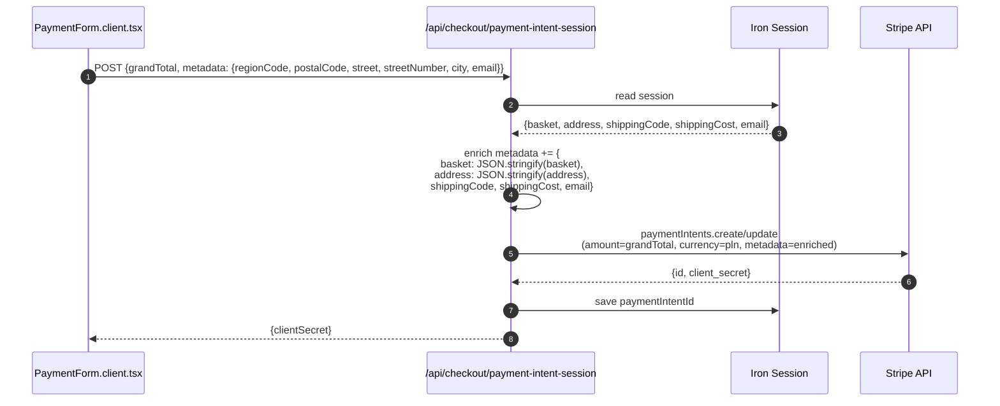
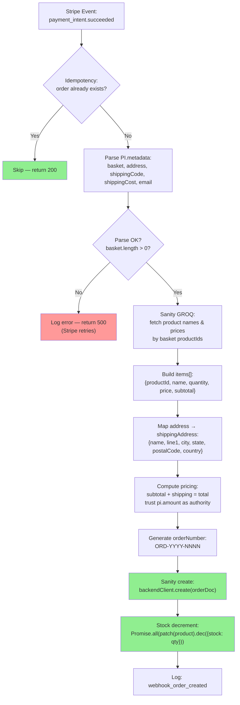
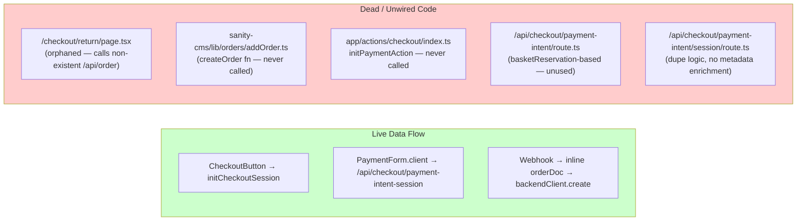
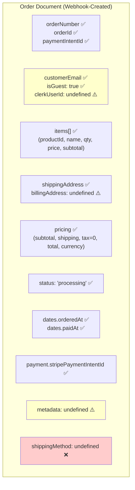
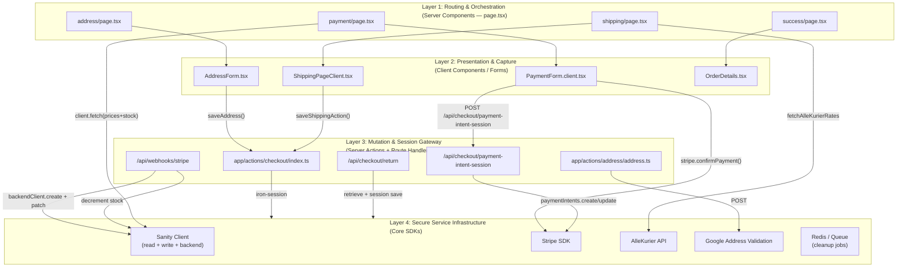
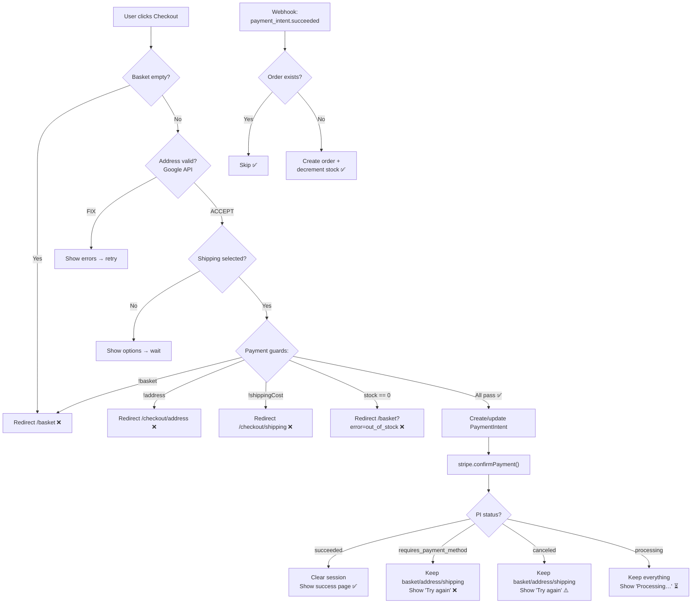

# Order Creation Preparedness — Visual Assessment

> Generated from source-code analysis of the checkout system.
> Green = verified working. Red = gap or dead code. Yellow = caution.

---

## 1. End-to-End Happy Path (The Working Chain)

```mermaid
flowchart LR
    subgraph BASKET["Basket Page"]
        B1["CheckoutButton.tsx"]
    end

    B1 -->|"Server Action: initCheckoutSession(items, traceId)"| ADDR

    subgraph ADDR["/checkout/address"]
        A1["AddressForm.tsx (Client)"]
        A2["saveAddress(address)"]
        A3["Google Address Validation API"]
    end

    A1 -->|"form submit"| A2
    A2 -->|"POST"| A3
    A3 -->|"ACCEPT / FIX"| A2
    A2 -->|"redirect"| SHIP

    subgraph SHIP["/checkout/shipping"]
        S1["shipping/page.tsx (Server)"]
        S2["AlleKurier API"]
        S3["ShippingPageClient.tsx (Client)"]
        S4["saveShippingAction(code, price)"]
    end

    S1 -->|"fetch products → calculate packages"| S2
    S2 -->|"rates[]"| S1
    S1 -->|"props"| S3
    S3 -->|"user selects → POST"| S4
    S4 -->|"redirect"| PAY

    subgraph PAY["/checkout/payment"]
        P1["payment/page.tsx (Server)"]
        P2["Sanity: prices + stock check"]
        P3["PaymentForm.client.tsx"]
        P4["/api/checkout/payment-intent-session"]
        P5["Stripe: PaymentIntent.create/update"]
    end

    P1 -->|"guards + GROQ query"| P2
    P2 -->|"products[]"| P1
    P1 -->|"grandTotal, metadata"| P3
    P3 -->|"POST {grandTotal, metadata}"| P4
    P4 -->|"enrich metadata with basket/address/shipping"| P5
    P5 -->|"clientSecret"| P4
    P4 -->|"JSON {clientSecret}"| P3
    P3 -->|"stripe.confirmPayment()"| RET

    subgraph RET["/api/checkout/return"]
        R1["GET route.ts"]
        R2["retrievePaymentIntent(id)"]
        R3["session save + redirect"]
    end

    RET -->|"redirect"| SUCCESS

    subgraph SUCCESS["/checkout/success"]
        U1["success/page.tsx (Server)"]
        U2["OrderDetails.tsx"]
        U3["Sanity: fetchOrderByPaymentIntentId"]
    end

    U1 -->|"verify PI status + privacy guard"| U2
    U2 -->|"Suspense: fetch order"| U3

    subgraph WH["Stripe Webhook"]
        W1["api/webhooks/stripe/route.ts"]
        W2["handlePaymentIntentSucceeded"]
        W3["Sanity: backendClient.create(orderDoc)"]
        W4["Sanity: patch(product).dec({stock})"]
    end

    P5 -.->|"async webhook: payment_intent.succeeded"| W1
    W1 -->|"idempotency check"| W2
    W2 -->|"build order from PI metadata"| W3
    W3 -->|"order created"| W4
```

---

## 2. Session State Machine (Iron-Session Cookie)

**Session keys:** `basket`, `address`, `email`, `shippingCode`, `shippingCost`, `paymentIntentId`, `completedPaymentIntentId`, `checkoutSessionId`

---

## 3. Data Flow — PaymentIntent Metadata Enrichment

> This metadata is the **sole data source** for the webhook when building the order.
> No dependency on `basketReservation` documents at order creation time.

---

## 4. Webhook Order Creation Pipeline

---

## 5. Gap Map — Dead Code & Unwired Paths

---

## 6. Field Coverage — What the Order Actually Contains

---

## 7. Architecture Overview (4-Layer)

---

## 8. Critical Path Decision Tree

---

## Summary Table

| Component | Status | File |
|-----------|--------|------|
| Basket → Session init | Ready | `app/actions/checkout/index.ts` |
| Address form + validation | Ready | `address/AddressForm.tsx` + `actions/address/address.ts` |
| Shipping rates (AlleKurier) | Ready | `shipping/page.tsx` |
| Shipping selection save | Ready | `actions/checkout/index.ts:saveShippingAction` |
| Payment page guards | Ready | `payment/page.tsx` |
| PaymentIntent create/update | Ready | `/api/checkout/payment-intent-session/route.ts` |
| Stripe confirmPayment | Ready | `PaymentForm.client.tsx` |
| Return handler (PI verify) | Ready | `/api/checkout/return/route.ts` |
| Success page (PI status) | Ready | `success/page.tsx` |
| Webhook order creation | Ready | `/api/webhooks/stripe/route.ts` |
| Stock decrement | Ready | Webhook `patch(product).dec({stock})` |
| Success page order lookup | Ready | `OrderDetails.tsx` + `fetchOrderByPaymentIntentId` |
| **Orphaned /checkout/return** | **Dead code** | `return/page.tsx` calls non-existent `/api/order` |
| **createOrder() utility** | **Dead code** | `sanity-cms/lib/orders/addOrder.ts` |
| **initPaymentAction()** | **Dead code** | `app/actions/checkout/index.ts` |
| **Basket store clear** | **Missing** | `basketStore.ts:clear()` never called post-payment |
| **Guest name/phone** | **Missing** | Address form does not collect firstName/lastName/phone |
| **shippingMethod on order** | **Missing** | Webhook orderDoc omits it |
