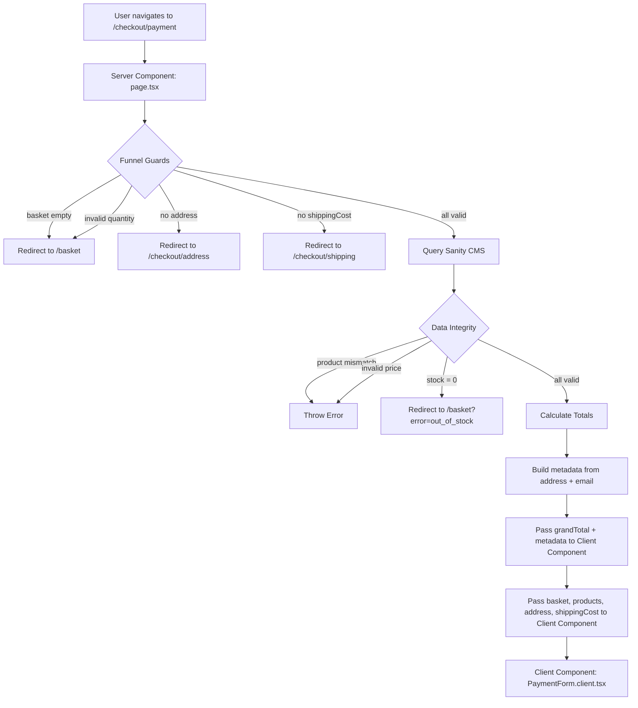

# Payment Server Component - Flow Diagram

```mermaid
flowchart TD
    A[User navigates to /checkout/payment] --> B[Server Component: page.tsx]
    B --> C{Funnel Guards}
    C -->|basket empty| D[Redirect to /basket]
    C -->|invalid quantity| D
    C -->|no address| E[Redirect to /checkout/address]
    C -->|no shippingCost| F[Redirect to /checkout/shipping]
    C -->|all valid| G[Query Sanity CMS]
    G --> H{Data Integrity}
    H -->|product mismatch| I[Throw Error]
    H -->|invalid price| I
    H -->|stock = 0| J[Redirect to /basket?error=out_of_stock]
    H -->|all valid| K[Calculate Totals]
    K --> L[Build metadata from address + email]
    L --> M[Pass grandTotal + metadata to Client Component]
    M --> N[Pass basket, products, address, shippingCost to Client Component]
    N --> O[Client Component: PaymentForm.client.tsx]
```
