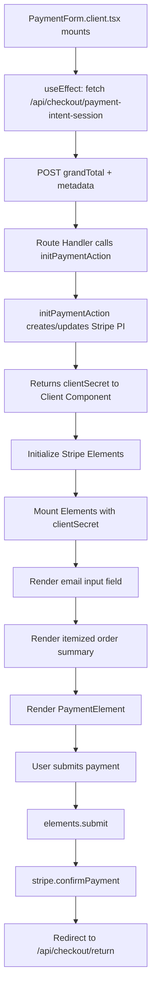

# Payment Client Form - Flow Diagram

```mermaid
flowchart TD
    A[PaymentForm.client.tsx mounts] --> B[useEffect: fetch /api/checkout/payment-intent-session]
    B --> C[POST grandTotal + metadata]
    C --> D[Route Handler calls initPaymentAction]
    D --> E[initPaymentAction creates/updates Stripe PI]
    E --> F[Returns clientSecret to Client Component]
    F --> G[Initialize Stripe Elements]
    G --> H[Mount Elements with clientSecret]
    H --> I[Render email input field]
    I --> J[Render itemized order summary]
    J --> K[Render PaymentElement]
    K --> L[User submits payment]
    L --> M[elements.submit]
    M --> N[stripe.confirmPayment]
    N --> O[Redirect to /api/checkout/return]
```
