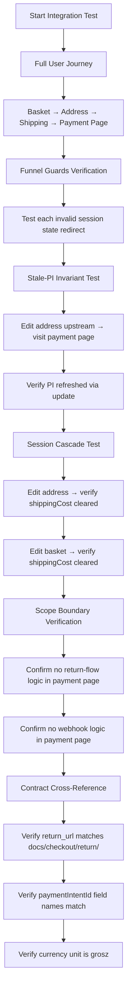

# Payment Integration - End-to-End Flow Diagram

```mermaid
flowchart TD
    A[Start Integration Test] --> B[Full User Journey]
    B --> C[Basket → Address → Shipping → Payment Page]
    C --> D[Funnel Guards Verification]
    D --> E[Test each invalid session state redirect]
    E --> F[Stale-PI Invariant Test]
    F --> G[Edit address upstream → visit payment page]
    G --> H[Verify PI refreshed via update]
    H --> I[Session Cascade Test]
    I --> J[Edit address → verify shippingCost cleared]
    J --> K[Edit basket → verify shippingCost cleared]
    K --> L[Scope Boundary Verification]
    L --> M[Confirm no return-flow logic in payment page]
    M --> N[Confirm no webhook logic in payment page]
    N --> O[Contract Cross-Reference]
    O --> P[Verify return_url matches docs/checkout/return/]
    P --> Q[Verify paymentIntentId field names match]
    Q --> R[Verify currency unit is grosz]
```
