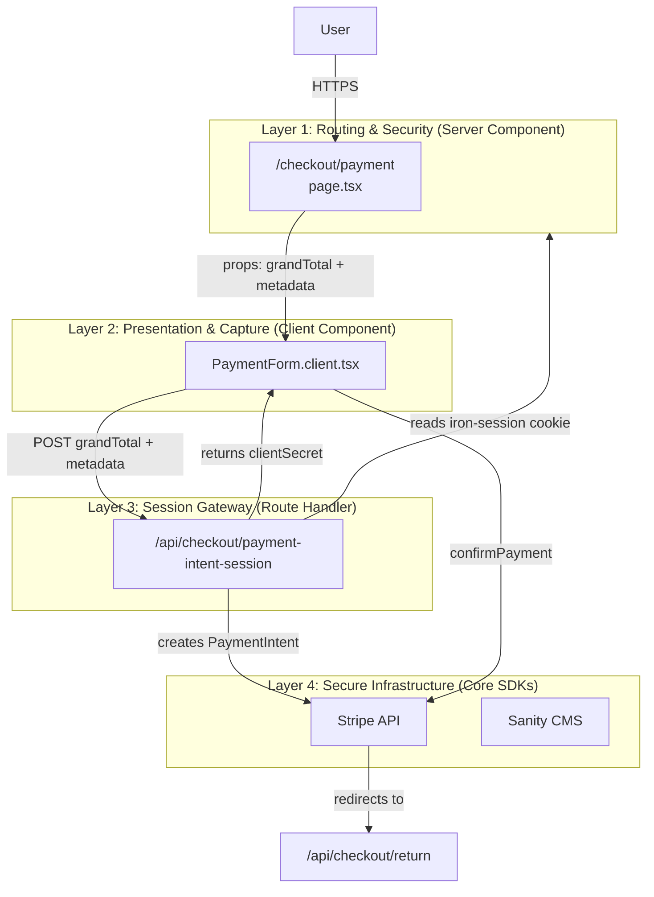

# 01 — The 4-Layer Trust Architecture

**Rule: Never trust the client with money.**

All price calculation happens server-side. The client only renders what the server tells it to.

**Why this shape?**

- **Layer 1** validates the user is allowed to be on this page (guards)
- **Layer 2** is purely presentation — it cannot create a Payment Intent, only display one
- **Layer 3** bridges browser → server — it has cookie access, the Client Component does not
- **Layer 4** is the hard boundary — Stripe and Sanity are the sources of truth
