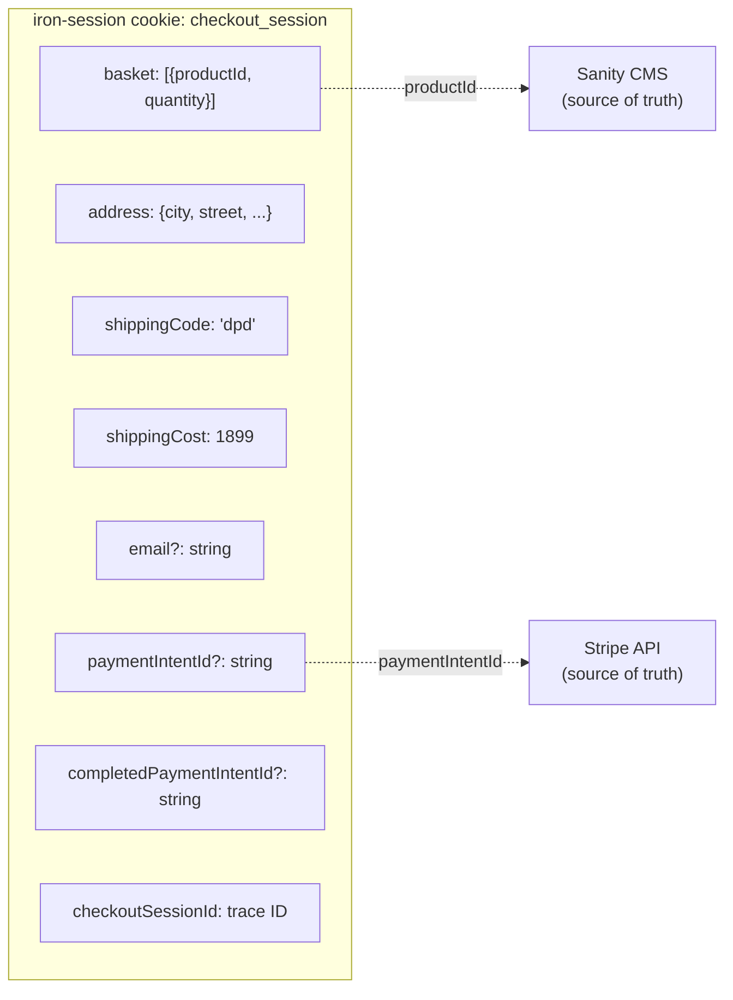

# 02 — What Lives in the iron-Session Cookie?

The cookie is an encrypted blob (max 4KB). It stores **identifiers only**, not full data. This is intentional — prices change, stock changes.

**Key fields:**

| Field | Example | Why |
|-------|---------|-----|
| `basket` | `[{productId: "abc", quantity: 2}]` | Only IDs + qty — prices fetched live from Sanity |
| `address` | `{city, street, postalCode...}` | Needed for billing_details in Stripe |
| `shippingCost` | `1899` | Integer grosz. `0` is valid (free shipping) |
| `paymentIntentId` | `pi_xxx` | Reused if user goes back/forward — idempotent PI updates |
| `completedPaymentIntentId` | `pi_xxx` | Set by return handler. Privacy guard for success page |

**Why no `basketReservation`?** The iron-session flow doesn't create a reservation document. Instead, the Route Handler embeds basket/address/shipping directly into the Payment Intent's `metadata`. This is the current workaround (and the source of the webhook gap).
