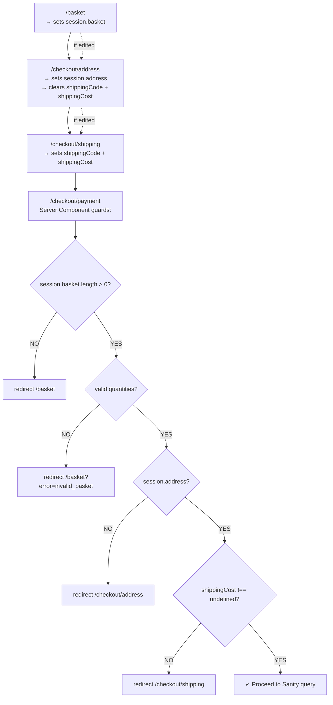

# 03 — Session Cascade Guards

If a user edits their address after reaching payment, they must re-select shipping. This is enforced by clearing downstream data on upstream changes.

**Critical detail:** `shippingCost: 0` is VALID. The guard uses `=== undefined || === null`, NOT truthiness. Free shipping must not bounce.

**The cascade principle:**
- Edit **basket** → clears address, shipping, paymentIntentId
- Edit **address** → clears shippingCode, shippingCost (keeps basket)
- This prevents stale totals — shipping depends on address
