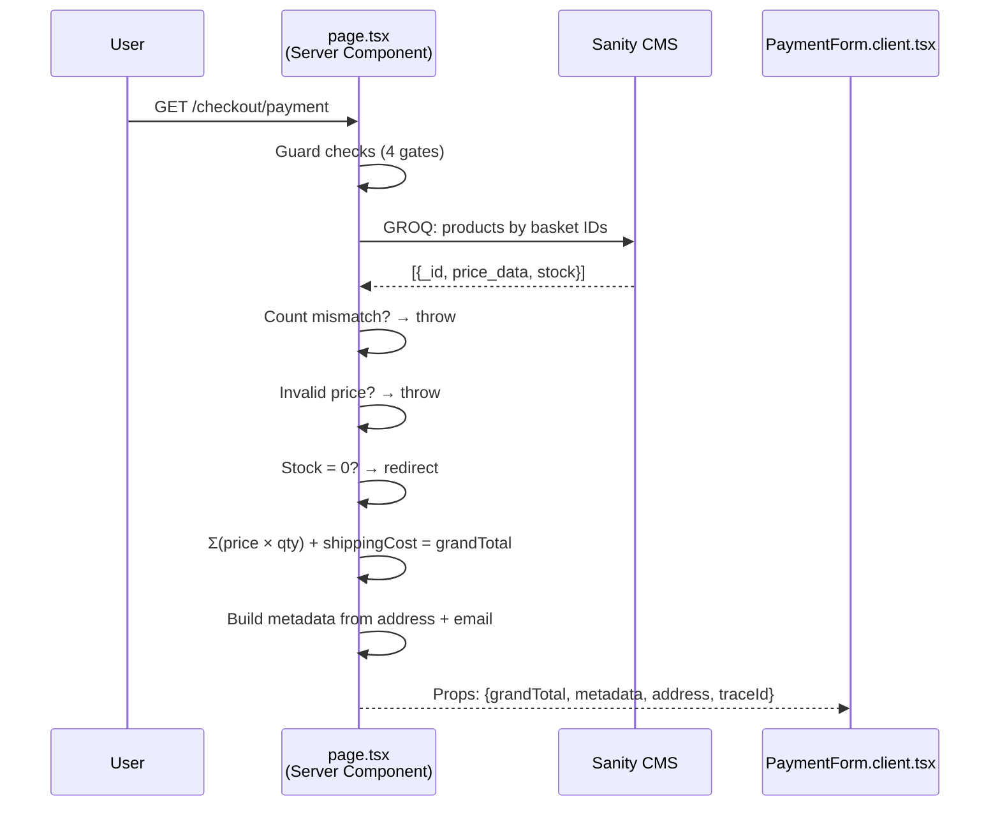

# 04 — Server Component Data Flow

After guards pass, the Server Component queries Sanity for live prices and stock, then calculates totals.

**Why throw vs redirect?**

| Scenario | Action | Why |
|----------|--------|-----|
| Count mismatch (basket has unknown product ID) | `throw new Error` | Data corruption — error boundary |
| Invalid price (not a number) | `throw new Error` | Data corruption — error boundary |
| Stock = 0 | `redirect /basket` | User recoverable — they can remove item |
| Grand total < 1 | `redirect /basket` | Edge case — prevents $0 charge |

**Amounts are integer grosz** (1 PLN = 100 grosz). `price_data.unit_amount` from Sanity is already in grosz. No floating-point math on money.
