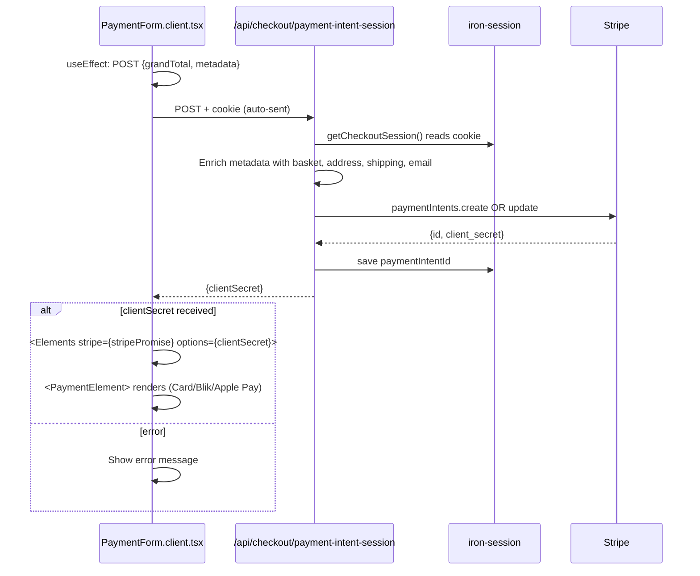

# 05 — Client Component Mount Sequence

The Client Component cannot call a Server Action directly during mount (it runs in the browser). Instead it fetches a Route Handler, which has cookie access.

**Idempotency:** If `session.paymentIntentId` already exists, `update` is called with the new `grandTotal` and `metadata`. This handles the "user went back to shipping, changed option, returned to payment" scenario.

**Why not call `initPaymentAction` directly?** Server Actions are callable from Client Components, but during the initial mount the component doesn't have the full context. The Route Handler pattern separates concerns cleanly: the Client Component passes computed data, the Route Handler handles the cookie + Stripe interaction.
