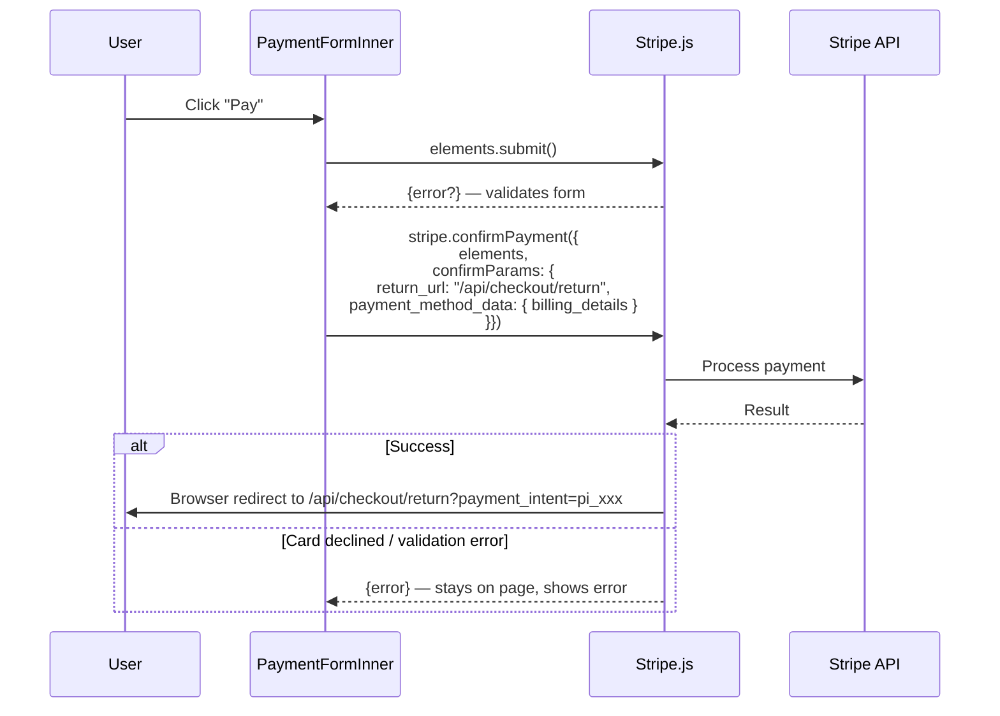

# 06 — The Pay Button: confirmPayment

When the user clicks Pay, Stripe validates the payment method, then redirects the browser.

**The `return_url` is a Route Handler, not a page.** Stripe needs an endpoint it can POST to. After handling, that endpoint redirects to `/checkout/success`.

**Billing address suppression:** `PaymentElement` renders with `fields: { billingDetails: { address: 'never' } }` — the user already typed their address on the address page. We pass it as `billing_details` in `confirmPayment` instead.

**On success, code below `confirmPayment` does NOT run.** The browser navigates away. Error handling only covers the failure path.
