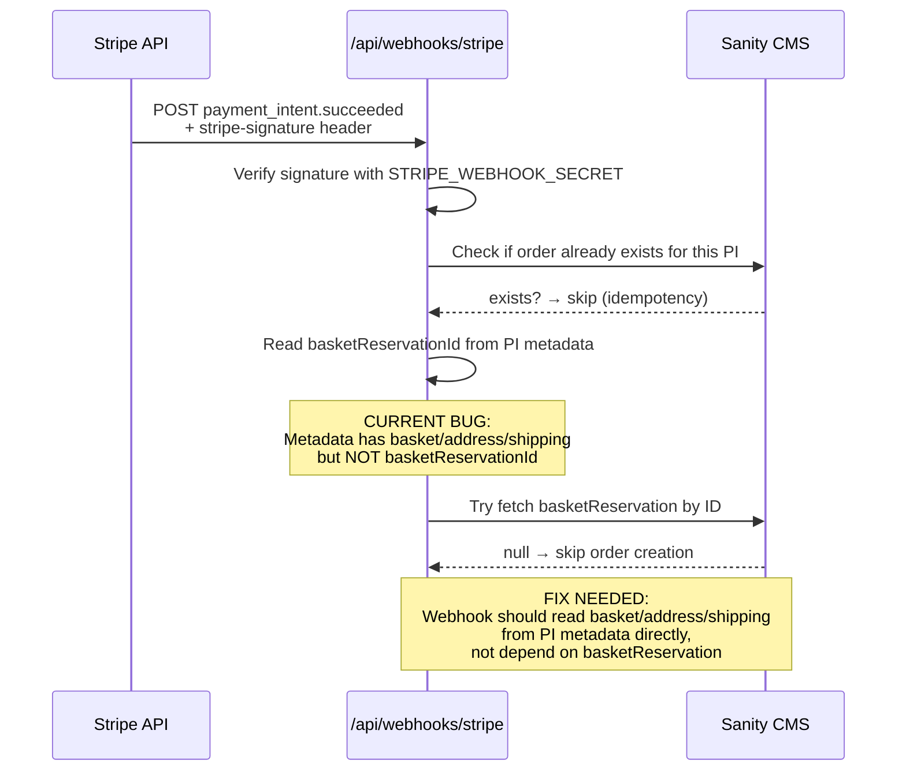

# 08 — Webhook: Order Creation (Active P0 Bug)

After Stripe confirms payment server-side, it sends a webhook. This is where the order should be persisted in Sanity.

**The mismatch:**

| What the Route Handler puts in metadata | What the webhook looks for |
|---|---|
| `basket` (JSON string) | `basketReservationId` |
| `address` (JSON string) | `basketReservation` document |
| `shippingCode`, `shippingCost` | `shippingChoice` subdocument |
| `email` | (not referenced) |

**Fix direction:** The webhook should build the order directly from `pi.metadata.basket`, `pi.metadata.address`, etc. — no `basketReservation` lookup needed. The metadata already contains everything required.
