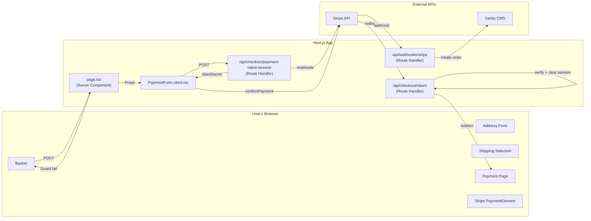

# 09 — Full End-to-End Flow

Every file and its layer in one map.

---

## File Reference

| File | Layer | Job |
|------|-------|-----|
| `lib/session.ts` | Foundation | Defines `CheckoutSession` shape + iron-session config |
| `app/(store)/checkout/payment/page.tsx` | Layer 1 | Guards → Sanity query → calculate → pass props |
| `PaymentForm.client.tsx` | Layer 2 | Fetch PI → mount Elements → render form → confirmPayment |
| `/api/checkout/payment-intent-session` | Layer 3 | Bridge: reads cookie, creates/updates PI, returns secret |
| `/api/checkout/return` | Layer 3 | Receives Stripe redirect, manages session lifecycle |
| `/api/webhooks/stripe` | Layer 3 | Receives async confirmation, creates order in Sanity |
| `lib/stripe.ts` | Layer 4 | Stripe SDK instance + `retrievePaymentIntent` helper |

---

## One-Line Summary

> The client renders the form. The server calculates the total. Stripe handles the money. The webhook creates the order.
