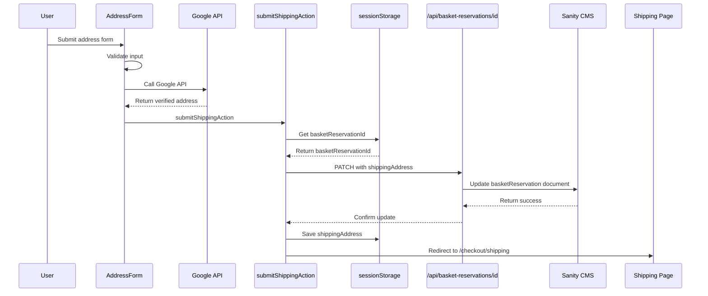
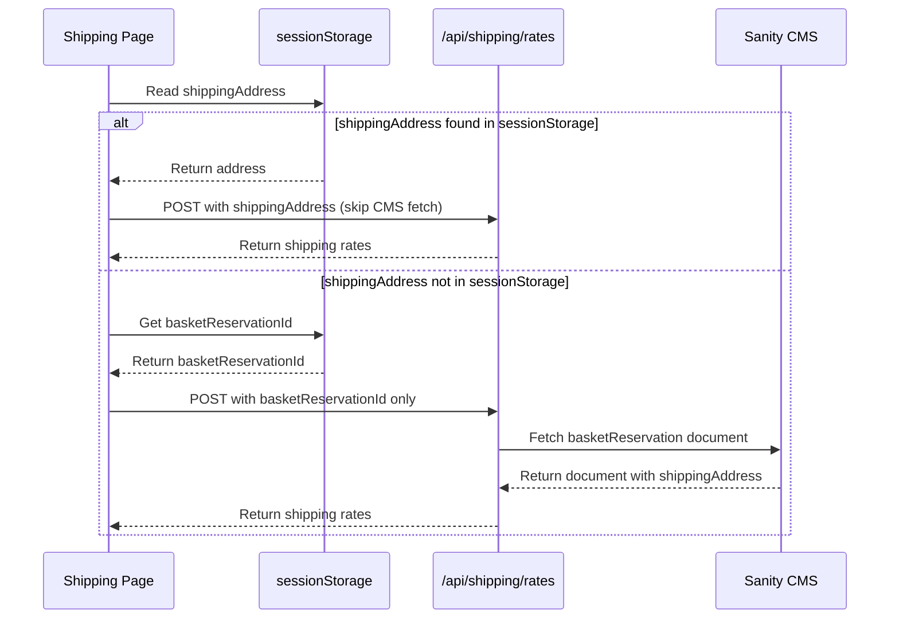

# Address Slice Flow

## Address Submission Flow

```mermaid
sequenceDiagram
    participant User as User
    participant Form as AddressForm
    participant Google as Google API
    participant Action as submitShippingAction
    participant SessionStorage as sessionStorage
    participant API as /api/basket-reservations/id
    participant CMS as Sanity CMS
    participant Shipping as Shipping Page

    User->>Form: Submit address form
    Form->>Form: Validate input
    Form->>Google: Call Google API
    Google-->>Form: Return verified address
    Form->>Action: submitShippingAction
    Action->>SessionStorage: Get basketReservationId
    SessionStorage-->>Action: Return basketReservationId
    Action->>API: PATCH with shippingAddress
    API->>CMS: Update basketReservation document
    CMS-->>API: Return success
    API-->>Action: Confirm update
    Action->>SessionStorage: Save shippingAddress
    Action->>Shipping: Redirect to /checkout/shipping
```

## Shipping Page: Address Retrieval Flow

```mermaid
sequenceDiagram
    participant Shipping as Shipping Page
    participant SessionStorage as sessionStorage
    participant API as /api/shipping/rates
    participant CMS as Sanity CMS

    Shipping->>SessionStorage: Read shippingAddress
    alt shippingAddress found in sessionStorage
        SessionStorage-->>Shipping: Return address
        Shipping->>API: POST with shippingAddress (skip CMS fetch)
        API-->>Shipping: Return shipping rates
    else shippingAddress not in sessionStorage
        Shipping->>SessionStorage: Get basketReservationId
        SessionStorage-->>Shipping: Return basketReservationId
        Shipping->>API: POST with basketReservationId only
        API->>CMS: Fetch basketReservation document
        CMS-->>API: Return document with shippingAddress
        API-->>Shipping: Return shipping rates
    end
```
