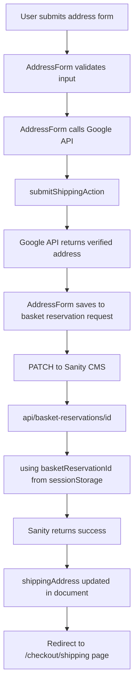

# Address Slice Flow

```mermaid
flowchart TD
    A[User submits address form] --> B[AddressForm validates input]
    B --> C[AddressForm calls Google API]
    C --> D[submitShippingAction]
    D --> E[Google API returns verified address]
    E --> F[AddressForm saves to basket reservation request]
    F --> G[PATCH to Sanity CMS]
    G --> H[api/basket-reservations/id]
    H --> I[using basketReservationId from sessionStorage]
    I --> J[Sanity returns success]
    J --> K[shippingAddress updated in document]
    K --> L[Redirect to /checkout/shipping page]
```
