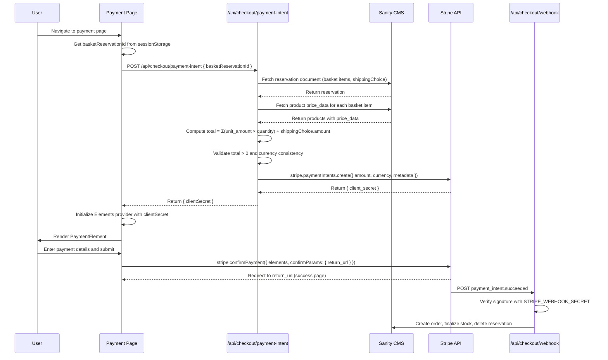

# Payment Slice

## Overview

The payment slice allows users to complete payment after their shipping option has been selected. It reads the basket reservation (which already contains the validated shipping address and selected shipping choice), computes the total amount server-side from Sanity CMS product prices and the shipping cost, creates a Stripe PaymentIntent, and renders the Stripe Payment Element for the user to enter payment details and confirm the payment.

## Pricing Model

**Sanity CMS is the single source of truth for product pricing.** Product prices are never sourced from Stripe's Product/Price object model. Each product in Sanity CMS has a `price_data` field:

```typescript
price_data: {
  currency: string,   // ISO 4217, lowercase (e.g., "usd")
  unit_amount: number  // integer, in smallest currency unit (e.g., 1999 = $19.99)
}
```

The payment intent amount is computed **server-side** by:

```
total = Σ (product.price_data.unit_amount × quantity) + shippingChoice.amount
```

This total, along with the currency, is passed directly to `stripe.paymentIntents.create()`. Stripe receives only a final integer amount — it has no knowledge of individual product prices or the product catalog.

## Environment Variables

Following the existing `.env` conventions:

| Variable | Scope | Purpose |
|---|---|---|
| `STRIPE_SECRET_KEY` | Server-only | Authenticates server-side Stripe API calls (`stripe.paymentIntents.create()`) |
| `NEXT_PUBLIC_STRIPE_PUBLISHABLE_KEY` | Client (public) | Initializes `loadStripe()` on the client to mount the Payment Element |
| `STRIPE_WEBHOOK_SECRET` | Server-only | Verifies Stripe webhook signature for `payment_intent.succeeded` events |

## Architecture



## Key Components

- **PaymentPage** (`app/(store)/checkout/payment/page.tsx`) — Route entry point that fetches the client secret, initializes the Stripe Elements provider, and renders the payment form
- **PaymentIntentAPI** (`app/api/checkout/payment-intent/route.ts`) — Server-side endpoint that fetches the reservation, computes the total from Sanity CMS prices, and creates a PaymentIntent via the Stripe API
- **WebhookHandler** (`app/api/checkout/webhook/route.ts`) — Receives `payment_intent.succeeded` events, verifies the webhook signature, creates the order, finalizes stock, and deletes the reservation

## Data Flow

1. User navigates to payment page after shipping selection
2. Page retrieves `basketReservationId` from sessionStorage
3. Page calls `POST /api/checkout/payment-intent` with `{ basketReservationId }`
4. API fetches the reservation document from Sanity CMS (contains `basketReservation[]`, `shippingAddress`, `shippingChoice`)
5. API fetches current `price_data` for each product in the basket from Sanity CMS
6. API computes total: `Σ(product.price_data.unit_amount × item.quantity) + shippingChoice.amount`
7. API validates currency consistency across all items and shipping choice
8. API calls `stripe.paymentIntents.create({ amount: total, currency, automatic_payment_methods: { enabled: true }, metadata: { basketReservationId } })`
9. Stripe returns a PaymentIntent object with `client_secret`
10. API returns `{ clientSecret }` to the page
11. Page initializes `Elements` provider from `@stripe/react-stripe-js` with `{ clientSecret }`
12. Page renders `PaymentElement` component inside the `Elements` provider
13. User enters payment details (card, etc.) in the Payment Element
14. User clicks pay button
15. Page calls `stripe.confirmPayment({ elements, confirmParams: { return_url } })`
16. Stripe handles 3D Secure / SCA authentication if required
17. On success, Stripe redirects user to `return_url` (success/return page)
18. Stripe sends `payment_intent.succeeded` webhook event
19. Webhook handler verifies signature, creates order in Sanity CMS, finalizes stock (converts `reservedStock` to `stock` deduction), and deletes the reservation document

## Resilience Features

- **Server-side amount computation**: The total is always computed server-side from Sanity CMS data — the client never dictates the amount
- **Currency validation**: API validates that all basket items and the shipping choice share the same currency before creating the PaymentIntent
- **Idempotency**: The `basketReservationId` is stored in PaymentIntent metadata to enable idempotent order creation in the webhook
- **Webhook signature verification**: All incoming webhook events are verified using `STRIPE_WEBHOOK_SECRET` via `stripe.webhooks.constructEvent()` before processing
- **3D Secure / SCA**: Handled automatically by the Payment Element and `stripe.confirmPayment()` — no custom code needed
- **Error classification**: Errors classified as VALIDATION (missing reservation data), COMPUTATION (price/currency mismatch), or STRIPE (Stripe API errors)

## Tech Stack

- **React 18** — UI framework
- **Next.js** — App router and server components
- **Stripe Payment Intents API** — Server-side payment creation via `stripe.paymentIntents.create()`
- **@stripe/react-stripe-js** — React components (`Elements`, `PaymentElement`) and hooks (`useStripe`, `useElements`)
- **@stripe/stripe-js** — Client-side Stripe initialization via `loadStripe()`
- **stripe** (Node.js) — Server-side Stripe SDK for PaymentIntent creation and webhook verification
- **Sanity CMS** — Basket reservation storage and product price source of truth
- **TypeScript** — Type safety
- **Environment Variables** — Stripe key configuration (`STRIPE_SECRET_KEY`, `NEXT_PUBLIC_STRIPE_PUBLISHABLE_KEY`, `STRIPE_WEBHOOK_SECRET`)

## Related Documentation

- [PRD](./1.%20PRD.md) — Product requirements and definition of done
- [Technical Solution](./2.%20Minimal%20Viable%20Solution%20Design.md) — Detailed technical design
- [Shipping Slice](../shipping/README.md) — Upstream dependency (shipping choice)
- [Address Slice](../address%20slice/PRD.md) — Upstream dependency (validated address)
- [Checkout Plan](../Checkout%20plan.md) — Overall checkout flow
