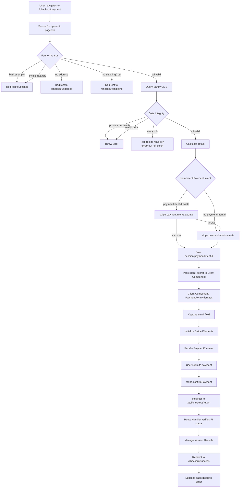

# Payment Page - Framed Objective

**Happy path tracer only.**

## Flow Diagram

- Implement payment page as part of checkout system using Stripe Payment Intents + Stripe Elements
- **Capture email field** for order confirmations and support (foundational requirement)
- **Display itemized order summary** before payment button (foundational requirement)
- Build Server Component (`/checkout/payment/page.tsx`) that:
  - Implements funnel guards (ORDER MATTERS — evaluated top-to-bottom, BEFORE any external call):
    1. `if (!session.basket?.length)` → redirect `/basket` (basket is the funnel entry point)
    2. `if (session.basket.some(item => !Number.isInteger(item.quantity) || item.quantity < 1))` → redirect `/basket?error=invalid_basket` *(input validation — must run before Sanity call so `quantity: 0` never triggers a network round trip; also: count-mismatch check cannot detect bad quantities since the item still exists)*
    3. `if (!session.address)` → redirect `/checkout/address`
    4. `if (session.shippingCost === undefined || session.shippingCost === null)` → redirect `/checkout/shipping`
       *(must NOT use truthiness — `shippingCost: 0` (free shipping) is a valid value)*
  - Queries Sanity CMS for live product prices and stock using `productId`s from `session.basket`; Sanity fields: `price_data.unit_amount` (integer grosz), `stock` (integer)
  - **Data integrity guard**: after Sanity query, `if (sanityProducts.length !== session.basket.length) throw new Error('Product mismatch — basket contains unknown product IDs')` — prevents silent under-charging when a `productId` does not match any Sanity `_id`
  - **Price validity guard**: for each Sanity product, `if (!Number.isFinite(product.price_data?.unit_amount)) throw new Error(\`Product ${product._id} has invalid price\`)` — Sanity fields are optional by default; a `null`/`undefined` `unit_amount` produces `NaN` in arithmetic, which silently passes `grandTotal < 1` (NaN comparisons are false) and only fails at Stripe with an opaque error.
  - If any item `stock = 0` → redirect `/basket?error=out_of_stock&id={productId}`
  - Calculates subtotal: `Σ(price_data.unit_amount × quantity)`; grand total: `Math.round(subtotal + session.shippingCost)` — must be integer for Stripe. If `grandTotal < 1` → `redirect('/basket?error=invalid_total')` (recoverable; never an unhandled throw in a Server Component).
  - Idempotent Payment Intent:
    - If `session.paymentIntentId` exists → try `stripe.paymentIntents.update()` with `{ amount, metadata: { ...flattenedAddressKeys } }`; if throws, clear `paymentIntentId` and fall through to create. **NOTE**: this catch-all swallows non-terminal errors too (network failure, rate limit, invalid key) and silently retries as `create()`. Acceptable for tracer; production should inspect `error.code` to distinguish `payment_intent_unexpected_state` (terminal — fall through) from transient errors (terminal — surface to user).
    - If no `paymentIntentId` → `stripe.paymentIntents.create({ amount, currency: 'pln', automatic_payment_methods: { enabled: true }, metadata: { ...flattenedAddressKeys } })`; store `paymentIntentId` in session
    - Flatten all address fields as individual string metadata keys: `firstName`, `lastName`, `phone`, `regionCode`, `postalCode`, `street`, `streetNumber`, `city`
    - Include `email` from session.email in metadata for order confirmation and support
    - **Address-field placement — known constraint**: Stripe exposes a first-class `shipping: { name, address: { line1, postal_code, city, state, country } }` parameter that is the correct destination for structured address (shows in Dashboard's Shipping section, used by Radar for fraud signals). `metadata` is a free-form, app-specific tracking surface and is the wrong tool for structured address. **However**, `shipping.name` is required by Stripe and `session.address` (see `lib/session.ts` `CheckoutSession`) currently has NO `name` field. Upstream blocker: the address page must collect a name (e.g. `firstName`, `lastName`) before this PI parameter can migrate. **Until then**, metadata flattening stays — but this is technical debt, not the target design. Add an issue: "Address page collects name → payment page migrates from `metadata` flattening to Stripe `shipping` parameter; metadata becomes app-specific keys only (e.g. `basketHash`)."
    - After both branches: `if (!client_secret) throw new Error('Stripe did not return client_secret')`; then `session.save()` unconditionally *(deliberate trade-off for simplicity — on the update path `paymentIntentId` is unchanged so this is a redundant cookie write; production may skip `save()` when no session field changed)*
  - Passes `client_secret` to Client Component
  - **Display itemized order summary** before payment button: render basket items with product names, quantities, prices, subtotal, shipping cost, and grand total for user verification before final payment
  - Note: Unhandled errors in Sanity or Stripe API calls propagate to Next.js error boundary. `app/checkout/error.tsx` is **mandatory** before this code ships — without it, any thrown error (product mismatch, Stripe API failure, missing `client_secret`) renders the global Next.js 500 page and loses all checkout context.
  - **Cross-cut — upstream invalidation**: this page assumes the address page and shipping page implement their session cascade (editing address clears `shippingCost`; editing basket clears `shippingCost`). `paymentIntentId` itself is NOT cleared on upstream edits — it is refreshed by `update()` on the next visit to `/checkout/payment` with the new amount + metadata. The PI is therefore never stale at the moment of confirmation, by induction from the funnel guards (no payment page render → no PI confirm) plus the idempotent update.
- **Cross-cut — order persistence is webhook-driven, NOT return-flow-driven**: neither `/api/checkout/return` (Route Handler) nor `/checkout/success` (Server Component) creates the order. Authoritative order creation and stock decrement MUST happen in a Stripe webhook handler (`payment_intent.succeeded` event → create order document in Sanity → decrement stock). A user who closes the browser between Stripe's redirect and `/api/checkout/return` is still successfully charged; without a webhook, that order is never recorded. `/checkout/success` only reads the resulting order. See `docs/checkout/return/` for the return-flow contract and the webhook handler spec (separate doc / handler at `app/api/webhooks/stripe/route.ts`, with idempotent `find-or-create` by `paymentIntentId` to tolerate Stripe's at-least-once delivery).
- Build Client Component (`PaymentForm.client.tsx`) that:
  - **Starts with `'use client'` as the first line of the file** — mandatory; without it `useState`, `useStripe`, `useElements` throw a server-context error. The `.client.tsx` filename is a human convention only; Next.js enforces the directive, not the filename.
  - **Capture email field** for order confirmations and support: render email input field, validate email format, save to session.email on form submission
  - Initializes outside component: `const stripePromise = loadStripe(process.env.NEXT_PUBLIC_STRIPE_PUBLISHABLE_KEY)`
  - Guards: `if (!clientSecret) return 
Loading payment form…
` before mounting `<Elements>`
  - Mounts: `<Elements stripe={stripePromise} options={{ clientSecret, currency: 'pln' }}>`
  - Renders Stripe's `PaymentElement` with **billing-address collection suppressed**: `<PaymentElement options={{ fields: { billingDetails: { address: 'never' } } }} />` — we already have a verified address in `session.address` from `/checkout/address`; collecting it again would force the user to type it twice and store a divergent copy on the Stripe PaymentMethod.
  - On submit: guards `if (!stripe || !elements) return` (hooks return null until Stripe.js loads)
  - Calls `const { error: submitError } = await elements.submit()`; if `submitError` then `setError(submitError.message ?? 'Please check your payment details.')` and `return` *(message is typed `string | undefined` — fallback prevents silent failure)*
  - Calls `stripe.confirmPayment({ elements, confirmParams: { return_url: \`${window.location.origin}/api/checkout/return\`, payment_method_data: { billing_details: { address: { line1: \`${a.street} ${a.streetNumber}\`, postal_code: a.postalCode, city: a.city, state: a.regionCode, country: 'PL' } } } } })` where `a` is the session address passed as a prop from the Server Component. **`return_url` MUST point at the Route Handler at `/api/checkout/return`** (not `/checkout/return` — that path no longer exists). The Route Handler verifies, clears session, and redirects to `/checkout/success`. *(destructure as `const { error } = ...` — type-safe; `confirmPayment` only returns on error)*
  - On error path: `setError(error?.message ?? 'Payment failed. Please try again.')` *(keep `?.` — SDK can return without `error` populated; never call `.message` on a possibly-undefined value)*
  - **Stripe Dashboard precondition**: payment methods (Card, Blik, optionally Apple Pay / Google Pay) must be enabled in Stripe Dashboard → Settings → Payment methods for currency `PLN`. With `automatic_payment_methods: { enabled: true }` and no enabled methods, `PaymentElement` renders an empty form with no client-side error. Verification of this Dashboard config is a hard precondition of this tracer.
  - Disables Pay button and shows loading state during submission; re-enables on error
- **Return path is a hard dependency — split into two endpoints**:
  - `/api/checkout/return` (Route Handler, `app/api/checkout/return/route.ts`) — the Stripe redirect target. Verifies PI status server-side, manages session lifecycle (see lifecycle below), redirects to `/checkout/success`.
  - `/checkout/success` (Server Component, `app/checkout/success/page.tsx`) — displays the result. Privacy-guarded: only renders if URL `payment_intent` matches `session.completedPaymentIntentId` set by the Route Handler. See `docs/checkout/return/` for the full contract.
- **paymentIntentId lifecycle (canonical, single source of truth across both scopes)**:
  1. *Created* in payment Server Component on first visit (`stripe.paymentIntents.create`) — written to `session.paymentIntentId`.
  2. *Updated* on every subsequent payment-page render (`stripe.paymentIntents.update` with fresh `amount` + metadata). Survives upstream session edits (address/basket/shipping); the funnel guards prevent payment-page render until the upstream slice is valid again, and `update()` always refreshes before any `confirmPayment` call — so the PI is **never stale at the moment of confirmation**.
  3. *Recovered* on terminal-state error (e.g. PI canceled): `update()` catch clears `session.paymentIntentId` and falls through to a fresh `create()`.
  4. *Cleared* by the Route Handler at `/api/checkout/return`. The Route Handler ALWAYS sets `session.completedPaymentIntentId = pi.id` first (this is the privacy-guard key for the success page; uniform across statuses so failed/canceled retries can also render `/checkout/success`). Then per-status partial-clear:

     | PI `status` | `completedPaymentIntentId` | `paymentIntentId` | `basket`/`address`/`shippingCode`/`shippingCost` | Redirect |
     |---|---|---|---|---|
     | `succeeded` | set to `pi.id` | clear | clear | `/checkout/success?payment_intent=...` |
     | `requires_payment_method` | set to `pi.id` | clear | **KEEP** — user can retry payment in one click | `/checkout/success?payment_intent=...&status=failed` |
     | `canceled` | set to `pi.id` | clear | **KEEP** | `/checkout/success?payment_intent=...&status=canceled` |
     | `processing` | set to `pi.id` | KEEP | KEEP | `/checkout/success?payment_intent=...&status=processing` |
     | any other | set to `pi.id` | clear | KEEP | `/basket?error=unexpected_status` |
- **Webhook ordering invariant (cross-cut)**: Stripe's `payment_intent.succeeded` event may land at the webhook **before, during, or after** the user's browser reaches `/checkout/success`. The success page MUST handle all three orderings idempotently — displaying the order if found, or a "processing" placeholder if not yet written. The order document is the webhook's responsibility; `/checkout/success` only reads it.
- Follow 4-layer architecture (Routing → Presentation → Mutation → Service Infrastructure)
- Use vertical slicing (tracer bullet approach) — build complete slice across all layers
- Ensure iron-session contains required data: `basket`, `address`, `shippingCode`, `shippingCost`, `paymentIntentId` (written/updated after PI create/update)
- Implement session cascade validation to prevent funnel jumping
