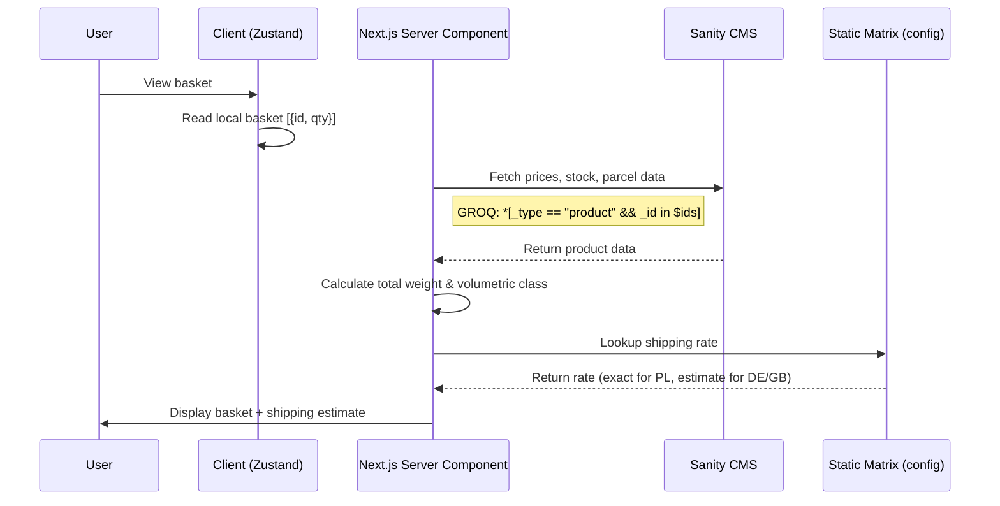
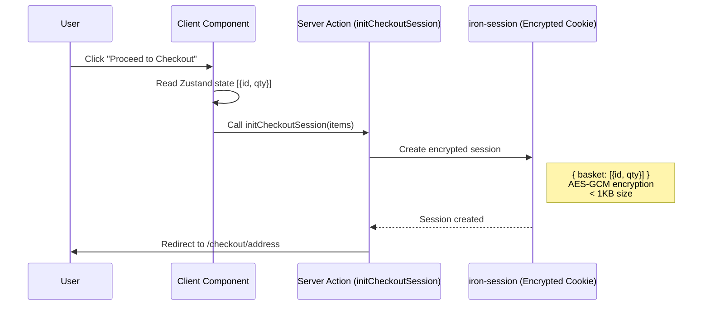
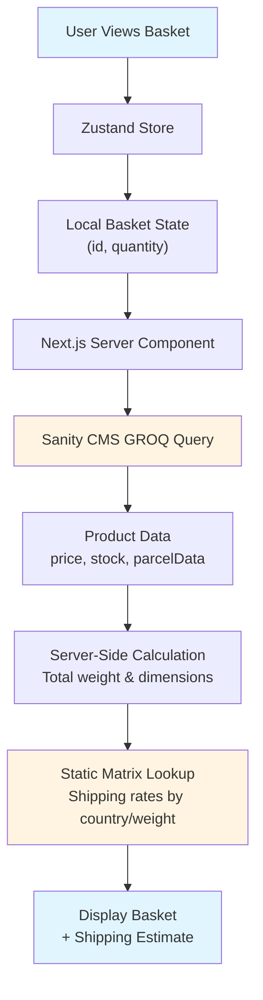
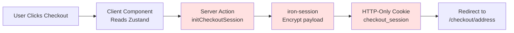

# Basket Page Integration in Checkout System

**Extracted from System-Level Architecture Q&A**

## Layer Position

The basket page operates across two layers:

- **Layer 1 (Routing & Orchestration):** `/basket/page.tsx` as the server-side security checkpoint
- **Layer 2 (Presentation & Capture):** Client-side basket display and checkout button

## Scope 1: The Transition (Basket → Address)

**Vertical Slice:**

- Wire the client-side Basket Checkout button (Layer 2)
- Write the `initCheckoutSession` Server Action (Layer 3)
- Assert the session writes the `[{ id, quantity }]` payload and redirects
- Create a blank `/checkout/address/page.tsx` (Layer 1) that successfully reads the session IDs and prints them to the server console

**Stop and Test.**

## Chunk 1: The Initiation Pipe (Tracer Chunk)

**The Chunk:** Wire a basic button that reads a hardcoded Zustand state `[{ id: "test_1", qty: 1 }]`. Pass it to a Server Action that encrypts it into iron-session and executes `redirect("/checkout/address")`.

**The Checkpoint:** You load `/checkout/address`. In your VS Code terminal (not the browser console), you see a `console.log(session.basket)` printing the exact array.

**Why (First Principles):** Proves the client-to-server boundary is crossed safely, the encryption secret is valid, and Next.js correctly sets the HTTP-Only cookie during a redirect.

## The Corrected Flow: Basket Page

**Client reads local basket (IDs, Qtys) → Next.js fetches current prices/stock from Sanity → Displays Basket + Estimated base shipping.**

## Initiate Checkout

**User clicks checkout → Server Action creates encrypted session containing ONLY `[{ id, qty }]` → Redirects to Address page.**

## Step 1: The Transition (Server Action)

The user clicks the checkout button on the client. Your component calls a Server Action, passing the bare Zustand data.

```typescript
// src/app/basket/CheckoutButton.tsx
"use client"
import { useBasketStore } from "@/store/basket";
import { initCheckoutSession } from "@/actions/checkout";

export function CheckoutButton() {
  const items = useBasketStore((state) => state.items); // [{ id, quantity }]

  return (
    <button onClick={async () => await initCheckoutSession(items)}>
      Proceed to Checkout
    </button>
  );
}
```

The corresponding Server Action processes this as a write:

```typescript
// src/actions/checkout.ts
"use server"
import { getCheckoutSession } from "@/lib/session";
import { redirect } from "next/navigation";

export async function initCheckoutSession(items: Array<{ id: string; quantity: number }>) {
  const session = await getCheckoutSession();

  // Save items directly to the secure iron-session cookie
  session.basket = items;
  await session.save();

  // Transition to the next page
  redirect("/checkout/address");
}
```

## The Final API Fetch Tally: Phase 1 - Basket Page

| Phase | Sanity CMS Calls | External API Calls | Data Mutated in iron-session Cookie |
|-------|------------------|-------------------|-----------------------------------|
| 1. Basket Page | 1 Read (Fetch price, stock, parcel data) | 0 (Use flat-rate utility for PL, text estimate for DE/GB) | Create `{ basket: [{id, qty}] }` |

## Key Integration Points

- **Data Source:** Client-side Zustand store holds `[{ id, quantity }]`
- **Sanity Fetch:** Server Component fetches price, stock, parcel data in single GROQ query
- **Shipping Display:** Static matrix for Poland (exact rate), text estimate for DE/GB ("from X PLN")
- **Checkout Trigger:** Server Action encrypts minimal payload into iron-session cookie
- **Transition:** Redirect to `/checkout/address` with session persistence
- **Session Content:** ONLY `[{ id, quantity }]` - no prices, no parcel data (to avoid 4KB cookie overflow)

---

# Technical Diagrams: Basket Page

## Phase 1: Basket Page Display



## Phase 2: Initiate Checkout



## Basket Page Data Flow



## Session Creation Flow



---

# Q & A - CRITICAL Q'S ONLY INTELLIGENCE GATHERING - Basket Page


## Shipping Estimates: Poland vs DE/GB

**Question:** Poland can fetch parcel data and calculate initial shipping costs; DE/GB can't, only estimate - but how estimate work with 0 parcel data? Should I not fetch parcel data to give real estimate? What is the 2026 Next.js/React/Sanity CMS e-commerce standard for shipping estimate on basket page and fetching parcel data on basket page?

### The Falsification (What NOT to do)

**False Assumption:** You should delay fetching parcel data from Sanity until the shipping page because you cannot calculate an exact international rate yet.

**Correction:** You must fetch parcel data (weight, dimensions) on the basket page. In a headless Sanity architecture, adding weight, length, width, height to your existing GROQ query (which is already fetching the price and stock) costs absolutely zero extra performance or latency.

**False Assumption:** You should call the Packlink API on the basket page to get an estimate for DE/GB.

**Correction:** Calling third-party dynamic APIs (like Packlink) on the basket page without a destination postal code is an architectural anti-pattern. It causes slow page loads, wastes API quotas, and often returns errors.

In 2026, headless Next.js/Sanity apps handle the basket page shipping estimation using a "Fetch All, Call None (Yet)" pattern.

### The Unified Sanity Fetch

When the Next.js Server Component (or API route) reads the client's `{ id, quantity }` basket, it fires a single, highly cacheable GROQ query to Sanity.

This query retrieves everything needed to validate the cart physically and financially:

```groq
*[_type == "product" && _id in $ids] {
  _id,
  price,
  stock,
  parcelData { weight, length, width, height }
}
```

### The Server-Side Accumulation

Next.js calculates the total weight and the bounding box of the physical items using a simple server-side utility function. Now, the server knows exactly how big and heavy the package is.

### Handling Poland (The Flat-Rate Reality)

Because Polish domestic shipping is flat-rate based entirely on dimensions and weight (independent of distance or postal code), the exact calculation happens instantly on your server.

**How:** Your Next.js server holds a small, static configuration file matching the AlleKurier pricing brackets (e.g., InPost Gabaryt A = 16.99 PLN).

**Result:** The basket page immediately displays an accurate, guaranteed domestic rate without calling any external shipping API.

### Handling DE/GB (The International Estimate)

For international shipments where distance and postal codes matter, Next.js handles the UI in one of two industry-standard ways on the basket page:

**Standard (The Baseline Fallback):** The server uses a static fallback matrix based solely on the accumulated weight. It displays a text label like: "International shipping to DE/GB from 65.00 PLN". No API is called. The true cost is deferred to the Shipping Page after the address is provided.
---


## Basket Page Shipping Calculation (LOGICAL)

**Question:** How should estimate be calculated, exactly? What are 2026 e-commerce Next.js/React/Sanity CMS standards?

### The Falsification (What NOT to do)

**False Assumption:** You should call the Packlink API on the basket page using a default postal code (like the capital city) just to get a number to show the user.

**Correction:** This is an anti-pattern. If you estimate using a Berlin postal code, but the user lives in a remote Bavarian village or a UK offshore island (which have heavy courier surcharges), the price shock on the Payment page will cause instant cart abandonment.

---

### The 2026 Standard: The "Static Volumetric Matrix"

Because you cannot call Packlink without an address, the Next.js 15 standard is to bypass external APIs entirely on the basket page. Instead, you use a Server-Side Static Volumetric Matrix.

You create a JSON configuration file inside your Next.js project that acts as an offline, instant shipping calculator based only on the variables you know: Country, Weight, and Dimensions.

#### Step 1: The Sanity Fetch & Consolidation

When the Basket page loads, the Next.js Server Component fetches the parcelData from Sanity. You run a utility function to consolidate the cart into a single physical package footprint.

**Input:**
```javascript
[{ weight: 1.5, length: 30, width: 20, height: 10, qty: 2 }]
```

**Output:**
```
Total Weight: 3.0kg, Volumetric Class: Medium
```

#### Step 2: The Local Matrix File (`config/shipping-rates.json`)

You maintain a small JSON file in your codebase that represents the base rates for your zones. You update this file maybe once every 6 months when courier rates change.

```json
{
  "PL": {
    "type": "exact",
    "tiers": [
      { "maxWeightKg": 5, "maxVolumetric": "small", "cost": 18.99, "carrier": "InPost / DPD" },
      { "maxWeightKg": 31, "maxVolumetric": "large", "cost": 24.99, "carrier": "DPD" }
    ]
  },
  "DE": {
    "type": "estimate",
    "tiers": [
      { "maxWeightKg": 2, "cost": 65.00, "label": "Packlink International" },
      { "maxWeightKg": 10, "cost": 85.00, "label": "Packlink International" }
    ]
  },
  "GB": {
    "type": "estimate",
    "tiers": [
      { "maxWeightKg": 2, "cost": 95.00, "label": "Packlink International" },
      { "maxWeightKg": 10, "cost": 120.00, "label": "Packlink International" }
    ]
  }
}
```

#### Step 3: The Calculation & Display Logic

Your Next.js server component passes the Total Weight into this matrix.

**For Poland (The Exact Rate):**
Because Polish shipping is flat-rate, your matrix perfectly matches the Allekurier reality.

**UI Display:** "Shipping to Poland: 18.99 PLN" (This is presented as a firm fact).

**For DE / GB (The Base Estimate):**
You read the base cost from the matrix for that weight bucket. Because you know UK/DE rates fluctuate by postal code, you use the `type: "estimate"` flag to alter the UI.

**UI Display:** "Shipping to Germany: from 65.00 PLN" (The word "from" is legally and architecturally critical).

---

## The "Bus Stop" Trace: The Checkout Funnel

What happens at each "bus stop" of checkout? Here is the exact technical execution of how data is persisted across your specific scope.

### Stop 1: The Basket Page → Initiating Checkout

**Action:** The user reviews the basket, the client checks inventory, and the user clicks "Proceed to Checkout".

**How Data Moves:** A Next.js Server Action is called, passing the minimal Zustand payload: `[{ productId, quantity }]`.

**Persistence:** The Server Action encrypts this payload and creates the `checkout_session` HTTP-Only cookie. The user is redirected to `/checkout/address`.

**State:** Cookie now holds: `{ basket }`

---
