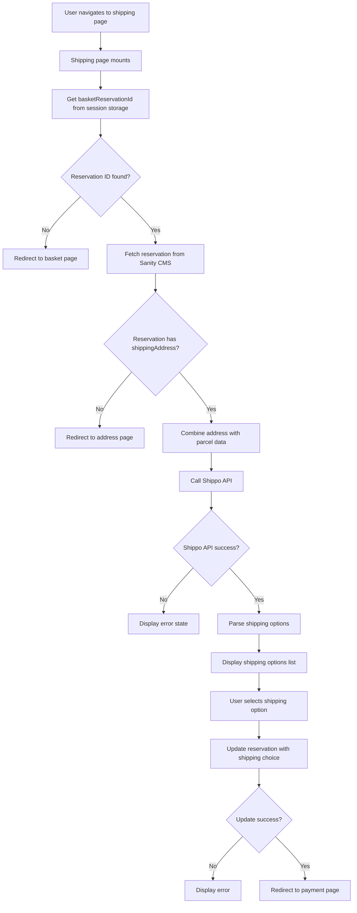

# Shipping Slice Flow

```mermaid
flowchart TD
    A[User navigates to shipping page] --> B[Shipping page mounts]
    B --> C[Get basketReservationId from session storage]
    C --> D{Reservation ID found?}
    D -->|No| E[Redirect to basket page]
    D -->|Yes| F[Fetch reservation from Sanity CMS]
    F --> G{Reservation has shippingAddress?}
    G -->|No| H[Redirect to address page]
    G -->|Yes| I[Combine address with parcel data]
    I --> J[Call Shippo API]
    J --> K{Shippo API success?}
    K -->|No| L[Display error state]
    K -->|Yes| M[Parse shipping options]
    M --> N[Display shipping options list]
    N --> O[User selects shipping option]
    O --> P[Update reservation with shipping choice]
    P --> Q{Update success?}
    Q -->|No| R[Display error]
    Q -->|Yes| S[Redirect to payment page]
```
