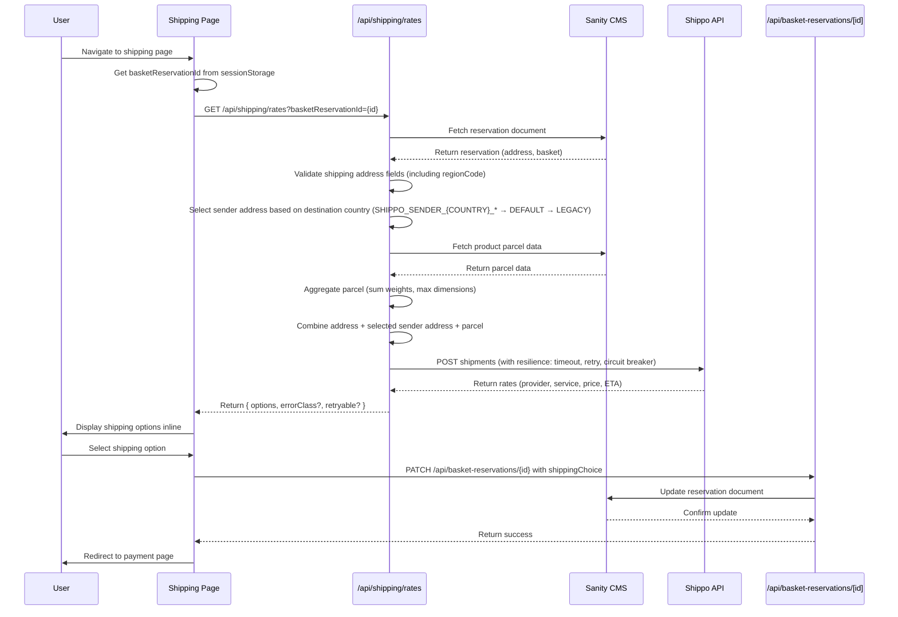

# Shipping Slice

## Overview

The shipping slice allows users to select shipping options and rates after their address has been validated. It combines the verified address with company and parcel data, calls the Shippo API to fetch available shipping options, displays the options to the user, and saves their selection to the basket reservation document.

## CMS Pre-Requirements

Products in Sanity CMS must include parcel data for shipping calculations. The product schema requires a `parcel` object field with Shippo API-compliant format:

```typescript
parcel: {
  length: number,      // cm
  width: number,       // cm
  height: number,      // cm
  weight: number,      // grams
  distance_unit: 'cm', // fixed
  mass_unit: 'g'       // fixed
}
```

**Migration Pattern:** Use the incremental phase approach (Discovery → Mapping → Transformation → Schema Update → Migration Script) to add parcel data to existing products. Reference: `_project/patterns/migration/incremental-phase-pattern.md`

## Sender Address Configuration

The shipping rates API supports destination-based sender address selection to handle multiple shipping origins (e.g., Poland warehouse, US warehouse). The API automatically selects the appropriate sender address based on the destination country.

### Environment Variable Convention

**Priority Order (first match wins):**
1. **Country-specific**: `SHIPPO_SENDER_{COUNTRY}_*` (e.g., `SHIPPO_SENDER_PL_NAME`, `SHIPPO_SENDER_US_NAME`)
2. **Default fallback**: `SHIPPO_SENDER_DEFAULT_*`
3. **Legacy backward compatibility**: `SHIPPO_SENDER_*` (no country suffix)

**Required fields for each sender address:**
- `NAME` - Company name
- `STREET` - Street address
- `CITY` - City
- `ZIP` - Postal code
- `COUNTRY` - 2-letter ISO country code

**Optional fields:**
- `STATE` - State/province
- `PHONE` - Phone number
- `EMAIL` - Email address

### Example Configuration

```bash
# Default sender address (fallback for all countries)
SHIPPO_SENDER_DEFAULT_NAME=Sang Logium
SHIPPO_SENDER_DEFAULT_STREET=123 Main St
SHIPPO_SENDER_DEFAULT_CITY=Warsaw
SHIPPO_SENDER_DEFAULT_STATE=MZ
SHIPPO_SENDER_DEFAULT_ZIP=00-001
SHIPPO_SENDER_DEFAULT_COUNTRY=PL
SHIPPO_SENDER_DEFAULT_PHONE=+48123456789
SHIPPO_SENDER_DEFAULT_EMAIL=sender@example.com

# Country-specific: Poland (PL)
SHIPPO_SENDER_PL_NAME=Sang Logium PL
SHIPPO_SENDER_PL_STREET=456 Warsaw St
SHIPPO_SENDER_PL_CITY=Warsaw
SHIPPO_SENDER_PL_STATE=MZ
SHIPPO_SENDER_PL_ZIP=00-001
SHIPPO_SENDER_PL_COUNTRY=PL
SHIPPO_SENDER_PL_PHONE=+48123456789
SHIPPO_SENDER_PL_EMAIL=sender-pl@example.com

# Country-specific: United States (US)
SHIPPO_SENDER_US_NAME=Sang Logium US
SHIPPO_SENDER_US_STREET=789 New York Ave
SHIPPO_SENDER_US_CITY=New York
SHIPPO_SENDER_US_STATE=NY
SHIPPO_SENDER_US_ZIP=10001
SHIPPO_SENDER_US_COUNTRY=US
SHIPPO_SENDER_US_PHONE=+11234567890
SHIPPO_SENDER_US_EMAIL=sender-us@example.com
```

### Selection Logic

The API reads the destination country from `shippingAddress.regionCode` (validated as 2-letter ISO code) and:
1. Checks for country-specific sender address (`SHIPPO_SENDER_{REGIONCODE}_*`)
2. Falls back to default sender address (`SHIPPO_SENDER_DEFAULT_*`)
3. Falls back to legacy sender address (`SHIPPO_SENDER_*`) for backward compatibility
4. Returns CONFIGURATION error if no sender address is configured

### Error Handling

If no sender address is configured for the destination country and no default exists, the API returns:
```json
{
  "error": "Sender address not configured for destination country",
  "errorClass": "CONFIGURATION",
  "retryable": false
}
```

## Architecture



## Key Components

- **ShippingPage** (`app/(store)/checkout/shipping/page.tsx`) - Route entry point that displays shipping options and handles selection inline
- **ShippingRatesAPI** (`app/api/shipping/rates/route.ts`) - API endpoint that fetches reservation, validates address, derives parcel data from products, and calls Shippo API

## Data Flow

1. User navigates to shipping page after address validation
2. Page retrieves basket reservation ID from session storage
3. Page calls `/api/shipping/rates?basketReservationId={id}`
4. API endpoint fetches reservation document from Sanity CMS
5. API validates shipping address fields (regionCode, postalCode, street, city)
6. API fetches product parcel data from Sanity CMS
7. API aggregates parcel data (sums weights, uses max dimensions)
8. API combines address with sender address (from env vars) and aggregated parcel data
9. API calls Shippo API with resilience (timeout 15s, retry 2x, circuit breaker)
10. Shippo returns rates (provider, service level, price, estimated delivery)
11. API returns shipping options to page with error classification (VALIDATION, CONFIGURATION, NETWORK, PROVIDER)
12. Page displays shipping options to user inline
13. User selects preferred shipping option
14. Page calls PATCH `/api/basket-reservations/{id}` to save shipping choice
15. Page redirects user to payment page

## Resilience Features

The shipping rates API implements resilience patterns to handle external dependencies:

- **Timeout**: 15-second timeout for Shippo API calls
- **Retry**: Automatic retry with exponential backoff (500ms, 1500ms) for 5xx errors
- **Circuit Breaker**: Opens circuit after 5 consecutive failures within 60 seconds, blocks requests for 30 seconds
- **Error Classification**: Errors classified as VALIDATION (user input), CONFIGURATION (env vars), NETWORK (connectivity), or PROVIDER (Shippo API)
- **Retryable Flag**: Frontend displays retry button for retryable errors (NETWORK, PROVIDER)

## Tech Stack

- **React 18** - UI framework
- **Next.js** - App router and server components
- **Shippo API** - Shipping rates and label generation with resilience (timeout, retry, circuit breaker)
- **Sanity CMS** - Basket reservation storage and product parcel data
- **TypeScript** - Type safety
- **Environment Variables** - Sender address configuration (SHIPPO_SENDER_*)

## Related Documentation

- [PRD](./1. PRD.md) - Product requirements and definition of done
- [Technical Solution](./2. Minimal Viable Solution Design.md) - Detailed technical design
- [Flow Diagram](./shipping-slice.md) - Visual flow of shipping slice
