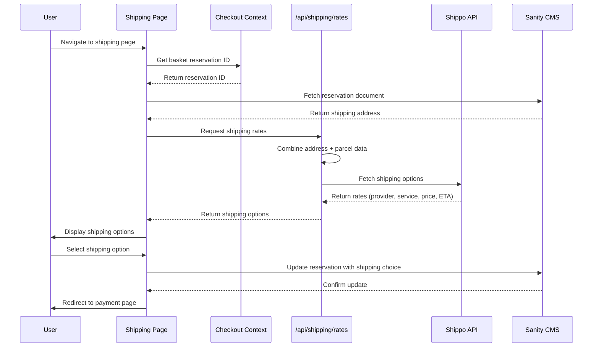

# Shipping Slice

## Overview

The shipping slice allows users to select shipping options and rates after their address has been validated. It combines the verified address with company and parcel data, calls the Shippo API to fetch available shipping options, displays the options to the user, and saves their selection to the basket reservation document.

## Architecture

## Key Components

- **ShippingPage** (`app/(store)/checkout/shipping/page.tsx`) - Route entry point that displays shipping options
- **ShippingOptionsList** - Displays available shipping rates with provider, service level, price, and delivery estimate
- **ShippingSelection** - Handles user selection of shipping option
- **CheckoutContext** - Provides basket reservation ID and state management

## Data Flow

1. User navigates to shipping page after address validation
2. Page retrieves basket reservation ID from session storage
3. Page fetches reservation document from Sanity CMS to get verified shipping address
4. Page calls `/api/shipping/rates` with address and parcel data
5. API endpoint combines address with company/parcel configuration
6. API calls Shippo API to fetch available shipping options
7. Shippo returns rates (provider, service level, price, estimated delivery)
8. Page displays shipping options to user
9. User selects preferred shipping option
10. Page updates reservation document with selected shipping option
11. Page redirects user to payment page

## Tech Stack

- **React 18** - UI framework
- **Next.js** - App router and server components
- **Shippo API** - Shipping rates and label generation
- **Sanity CMS** - Basket reservation storage
- **TypeScript** - Type safety

## Related Documentation

- [PRD](./1. PRD.md) - Product requirements and definition of done
- [Technical Solution](./2. Minimal Viable Solution Design.md) - Detailed technical design
- [Flow Diagram](./shipping-slice.md) - Visual flow of shipping slice
