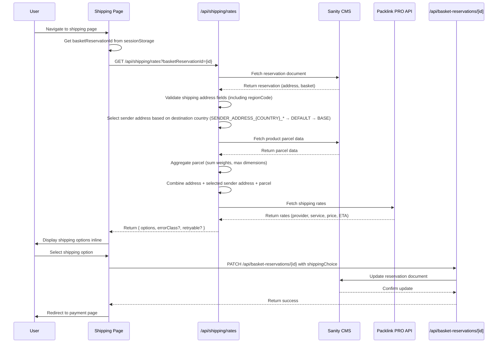

# Shipping Slice

## Overview

The shipping slice allows users to select shipping options and rates after their address has been validated. It combines the verified address with company and parcel data, calls country-specific shipping APIs (AlleKurier for PL domestic, Packlink PRO for international) to fetch available shipping options, displays the options to the user, and saves their selection to the basket reservation document.

## CMS Pre-Requirements

Products in Sanity CMS must include parcel data for shipping calculations. The product schema requires a `parcel` object field with shipping API-compliant format:

```typescript
parcel: {
  length: number,      // cm
  width: number,       // cm
  height: number,      // cm
  weight: number,      // grams
  distance_unit: 'cm', // fixed
  mass_unit: 'g'       // fixed
}
```

**Migration Pattern:** Use the incremental phase approach (Discovery → Mapping → Transformation → Schema Update → Migration Script) to add parcel data to existing products. Reference: `_project/patterns/migration/incremental-phase-pattern.md`

## Sender Address Configuration

The shipping rates API supports destination-based sender address selection to handle multiple shipping origins (e.g., Poland warehouse, Germany warehouse, UK warehouse). The API automatically selects the appropriate sender address based on the destination country.

### Environment Variable Convention

**Priority Order (first match wins):**
1. **Country-specific**: `SENDER_ADDRESS_{COUNTRY}_*` (e.g., `SENDER_ADDRESS_PL_NAME`, `SENDER_ADDRESS_US_NAME`)
2. **Default fallback**: `SENDER_ADDRESS_DEFAULT_*`
3. **Base fallback**: `SENDER_ADDRESS_*` (no country suffix)

**Required fields for each sender address:**
- `NAME` - Company name
- `STREET` - Street address
- `CITY` - City
- `ZIP` - Postal code
- `COUNTRY` - 2-letter ISO country code

**Optional fields:**
- `STATE` - State/province
- `PHONE` - Phone number
- `EMAIL` - Email address

### Example Configuration

```bash
# Default sender address (fallback for all countries)
# Currently not configured - using country-specific addresses only

# Country-specific: Poland (PL)
SENDER_ADDRESS_PL_NAME=Sang Logium PL
SENDER_ADDRESS_PL_STREET=Mokotowska 63
SENDER_ADDRESS_PL_CITY=Warszawa
SENDER_ADDRESS_PL_STATE=MZ
SENDER_ADDRESS_PL_ZIP=00-533
SENDER_ADDRESS_PL_COUNTRY=PL
SENDER_ADDRESS_PL_PHONE=+48123456789
SENDER_ADDRESS_PL_EMAIL=pl@sanglogium.com

# Country-specific: Germany (DE)
SENDER_ADDRESS_DE_NAME=Sang Logium DE
SENDER_ADDRESS_DE_STREET=Residenzstraße 18
SENDER_ADDRESS_DE_CITY=München
SENDER_ADDRESS_DE_STATE=BY
SENDER_ADDRESS_DE_ZIP=80333
SENDER_ADDRESS_DE_COUNTRY=DE
SENDER_ADDRESS_DE_PHONE=+49123456789
SENDER_ADDRESS_DE_EMAIL=de@sanglogium.com

# Country-specific: United Kingdom (GB)
SENDER_ADDRESS_GB_NAME=Sang Logium GB
SENDER_ADDRESS_GB_STREET=17 Kensington Church Street
SENDER_ADDRESS_GB_CITY=London
SENDER_ADDRESS_GB_STATE=ENG
SENDER_ADDRESS_GB_ZIP=W8 4LF
SENDER_ADDRESS_GB_COUNTRY=GB
SENDER_ADDRESS_GB_PHONE=+44123456789
SENDER_ADDRESS_GB_EMAIL=gb@sanglogium.com
```

### Selection Logic

The API reads the destination country from `shippingAddress.regionCode` (validated as 2-letter ISO code) and:
1. Checks for country-specific sender address (`SENDER_ADDRESS_{REGIONCODE}_*`)
2. Falls back to default sender address (`SENDER_ADDRESS_DEFAULT_*`)
3. Falls back to base sender address (`SENDER_ADDRESS_*`)
4. Returns CONFIGURATION error if no sender address is configured

### Error Handling

If no sender address is configured for the destination country and no default exists, the API returns:
```json
{
  "error": "Sender address not configured for destination country",
  "errorClass": "CONFIGURATION",
  "retryable": false
}
```

## Architecture



## Key Components

- **ShippingPage** (`app/(store)/checkout/shipping/page.tsx`) - Route entry point that displays shipping options and handles selection inline
- **ShippingRatesAPI** (`app/api/shipping/rates/route.ts`) - API endpoint that fetches reservation, validates address, derives parcel data from products, and calls Packlink PRO API

## Data Flow

1. User navigates to shipping page after address validation
2. Page retrieves basket reservation ID from session storage
3. Page calls `/api/shipping/rates?basketReservationId={id}`
4. API endpoint fetches reservation document from Sanity CMS
5. API validates shipping address fields (regionCode, postalCode, street, city)
6. API fetches product parcel data from Sanity CMS
7. API aggregates parcel data (sums weights, uses max dimensions)
8. API combines address with sender address (from env vars) and aggregated parcel data
9. API calls country-specific shipping API (AlleKurier for PL domestic, Packlink PRO for international/fallback)
10. Shipping API returns rates (provider, service level, price, estimated delivery)
11. API returns shipping options to page with error classification (VALIDATION, CONFIGURATION, NETWORK, PROVIDER)
12. Page displays shipping options to user inline
13. User selects preferred shipping option
14. Page calls PATCH `/api/basket-reservations/{id}` to save shipping choice
15. Page redirects user to payment page

## Resilience Features

The shipping rates API implements a country-specific API strategy:

- **Poland (PL)**: AlleKurier API for domestic shipping rates
- **International**: Packlink PRO API for cross-border shipping (fallback for PL if AlleKurier fails)
- **Error Classification**: Errors classified as VALIDATION (user input), CONFIGURATION (env vars), NETWORK (connectivity), or PROVIDER (shipping API)
- **Retryable Flag**: Frontend displays retry button for retryable errors (NETWORK, PROVIDER)

## Tech Stack

- **React 18** - UI framework
- **Next.js** - App router and server components
- **AlleKurier API** - Polish domestic shipping rates
- **Packlink PRO API** - International shipping rates and label generation (fallback for PL)
- **Sanity CMS** - Basket reservation storage and product parcel data
- **TypeScript** - Type safety
- **Environment Variables** - Sender address configuration (SENDER_ADDRESS_*) and AlleKurier credentials (ALLEKURIER_EMAIL, ALLEKURIER_PASSWORD)

## Related Documentation

- [PRD](./1. PRD.md) - Product requirements and definition of done
- [Technical Solution](./2. Minimal Viable Solution Design.md) - Detailed technical design
- [Flow Diagram](./shipping-slice.md) - Visual flow of shipping slice
- [Sanglogium Sender Addresses](./SanglogiumSenderAddresses.md) - Verified sender address configurations
