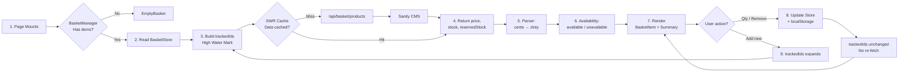

# Basket Data Flow

## Steps

1. **Page Mounts** — Route entry point (`app/(store)/basket/page.tsx`) mounts.
2. **Read BasketStore** — `BasketManager` reads product IDs and quantities from the Zustand store.
3. **Build trackedIds** — High Water Mark pattern: `useState` only ever adds IDs, never subtracts.
4. **Return product data** — SWR fetches from `/api/basket/products` (cache miss) or returns cached data (cache hit).
5. **Parser** — Converts CMS price from cents to display currency.
6. **Availability** — Splits items into available vs. unavailable based on live stock.
7. **Render** — `BasketItem` and `BasketSummary` components render with live CMS data.
8. **Update Store** — Quantity changes or removals update Zustand + `localStorage`. `trackedIds` stays unchanged, so **no re-fetch** occurs.
9. **trackedIds expands** — Adding a new product grows `trackedIds` during render phase. SWR key changes, triggering a re-fetch.
