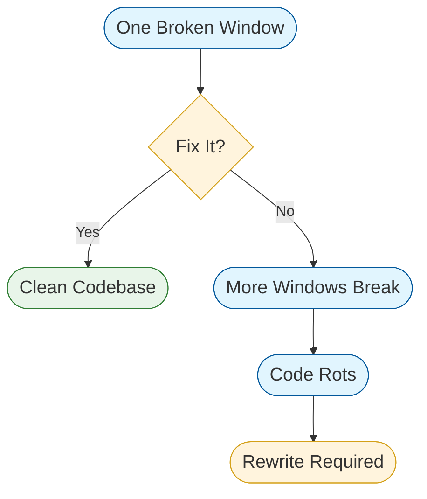

# Broken Windows Theory

```mermaid
graph TD
    classDef large font-size:20px,padding:15px,stroke-width:2px;
    classDef logic fill:#fff4dd,stroke:#d4a017,font-size:20px;
    classDef state fill:#e1f5fe,stroke:#01579b,font-size:20px;
    classDef action fill:#e8f5e9,stroke:#2e7d32,font-size:20px;

    A([One Broken Window]):::state --> B{Fix It?}:::logic
    B -->|Yes| C([Clean Codebase]):::action
    B -->|No| D([More Windows Break]):::state
    D --> E([Code Rots]):::state
    E --> F([Rewrite Required]):::logic
```
