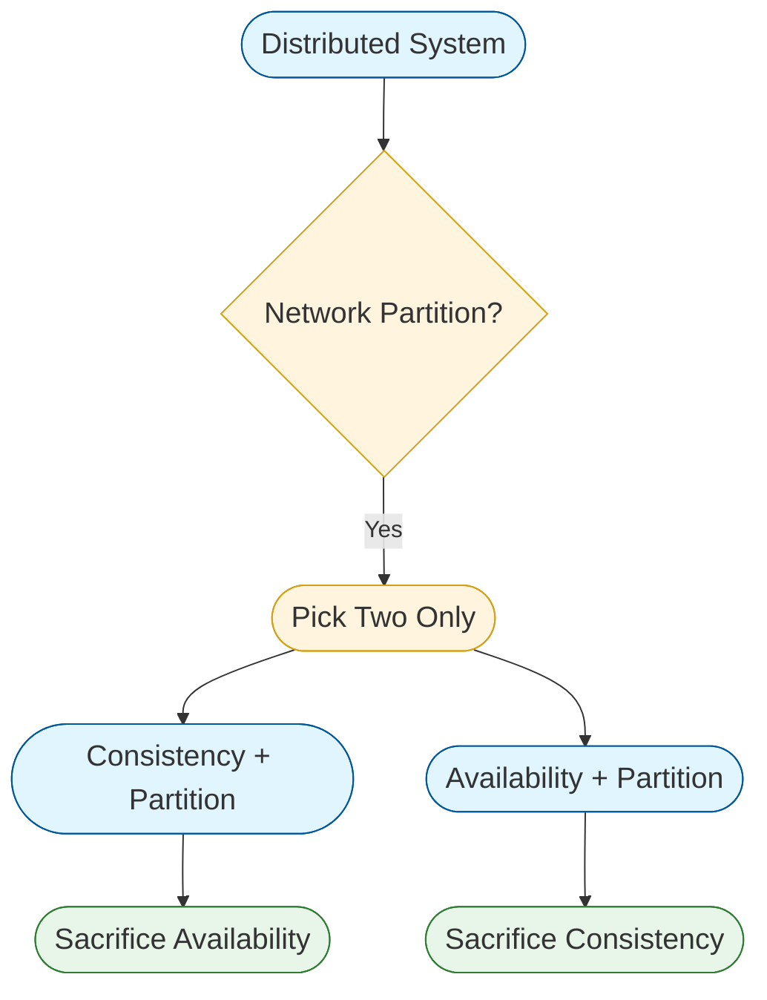

# CAP Theorem Tradeoffs

```mermaid
graph TD
    classDef large font-size:20px,padding:15px,stroke-width:2px;
    classDef logic fill:#fff4dd,stroke:#d4a017,font-size:20px;
    classDef state fill:#e1f5fe,stroke:#01579b,font-size:20px;
    classDef action fill:#e8f5e9,stroke:#2e7d32,font-size:20px;

    A([Distributed System]):::state --> B{Network Partition?}:::logic
    B -->|Yes| C([Pick Two Only]):::logic
    C --> D([Consistency + Partition]):::state
    C --> E([Availability + Partition]):::state
    D --> F([Sacrifice Availability]):::action
    E --> G([Sacrifice Consistency]):::action
```
