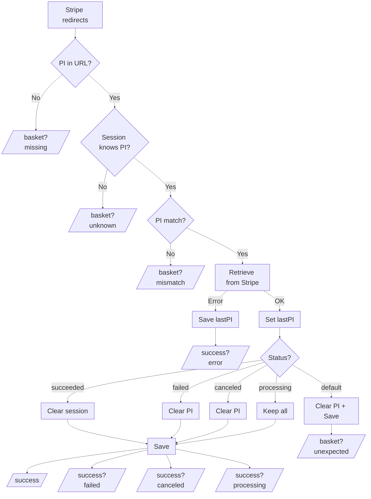

```mermaid
%%{init: {'themeVariables': {'fontSize': '32px'}}}%%
flowchart TD
    classDef default stroke-width:2px

    A[Stripe redirects] --> B{PI in URL?}
    B -->|No| E1[/basket?missing/]
    B -->|Yes| C{Session knows PI?}
    C -->|No| E2[/basket?unknown/]
    C -->|Yes| D{PI match?}
    D -->|No| E3[/basket?mismatch/]
    D -->|Yes| F[Retrieve from Stripe]

    F -->|Error| G[Save lastPI] --> R_err[/success?error/]
    F -->|OK| H[Set lastPI] --> I{Status?}

    I -->|succeeded| J[Clear session] --> S[Save]
    I -->|failed| K[Clear PI] --> S
    I -->|canceled| L[Clear PI] --> S
    I -->|processing| M[Keep all] --> S
    I -->|default| N[Clear PI + Save] --> R_unexp[/basket?unexpected/]

    S --> R_ok[/success/]
    S --> R_fail[/success?failed/]
    S --> R_cancel[/success?canceled/]
    S --> R_proc[/success?processing/]
```
