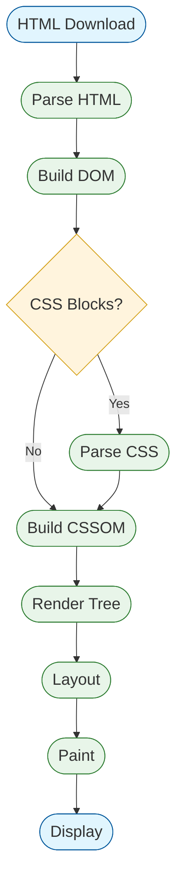

# Critical Rendering Path

```mermaid
graph TD
    classDef large font-size:20px,padding:15px,stroke-width:2px;
    classDef logic fill:#fff4dd,stroke:#d4a017,font-size:20px;
    classDef state fill:#e1f5fe,stroke:#01579b,font-size:20px;
    classDef action fill:#e8f5e9,stroke:#2e7d32,font-size:20px;

    A([HTML Download]):::state --> B([Parse HTML]):::action
    B --> C([Build DOM]):::action
    C --> D{CSS Blocks?}:::logic
    D -->|Yes| E([Parse CSS]):::action
    D -->|No| F([Build CSSOM]):::action
    E --> F
    F --> G([Render Tree]):::action
    G --> H([Layout]):::action
    H --> I([Paint]):::action
    I --> J([Display]):::state
```
