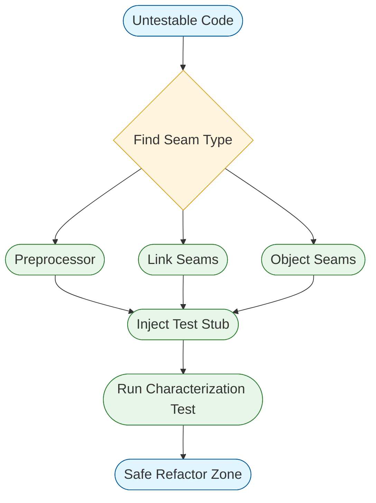

# Finding Seams Legacy

```mermaid
graph TD
    classDef large font-size:20px,padding:15px,stroke-width:2px;
    classDef logic fill:#fff4dd,stroke:#d4a017,font-size:20px;
    classDef state fill:#e1f5fe,stroke:#01579b,font-size:20px;
    classDef action fill:#e8f5e9,stroke:#2e7d32,font-size:20px;

    A([Untestable Code]):::state --> B{Find Seam Type}:::logic
    B --> C([Preprocessor]):::action
    B --> D([Link Seams]):::action
    B --> E([Object Seams]):::action
    C --> F([Inject Test Stub]):::action
    D --> F
    E --> F
    F --> G([Run Characterization Test]):::action
    G --> H([Safe Refactor Zone]):::state
```
