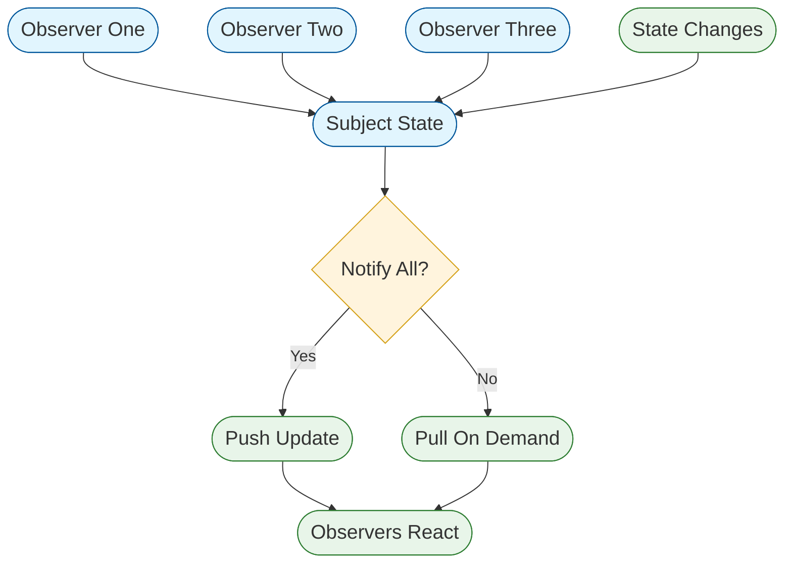

# Observer Pattern Flow

```mermaid
graph TD
    classDef large font-size:20px,padding:15px,stroke-width:2px;
    classDef logic fill:#fff4dd,stroke:#d4a017,font-size:20px;
    classDef state fill:#e1f5fe,stroke:#01579b,font-size:20px;
    classDef action fill:#e8f5e9,stroke:#2e7d32,font-size:20px;

    A([Observer One]):::state --> B([Subject State]):::state
    C([Observer Two]):::state --> B
    D([Observer Three]):::state --> B
    E([State Changes]):::action --> B
    B --> F{Notify All?}:::logic
    F -->|Yes| G([Push Update]):::action
    F -->|No| H([Pull On Demand]):::action
    G --> I([Observers React]):::action
    H --> I
```
