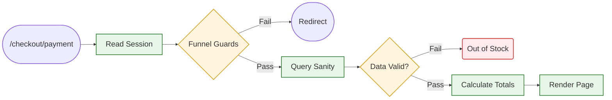
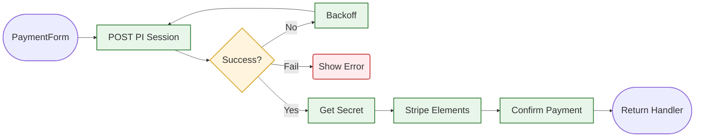

```mermaid
%%{init: {'themeVariables': {'fontSize': '24px'}}}%%
flowchart LR
    classDef default stroke-width:2px
    classDef large padding:12px,stroke-width:2px;
    classDef logic fill:#fff4dd,stroke:#d4a017;
    classDef action fill:#e8f5e9,stroke:#2e7d32;
    classDef error fill:#ffebee,stroke:#c62828;

    Start(["/checkout/payment"]) --> Read[Read Session]
    Read --> Guards{Funnel Guards}
    Guards -->|Fail| Exit(["Redirect"])
    Guards -->|Pass| Sanity[Query Sanity]
    Sanity --> Valid{Data Valid?}
    Valid -->|Fail| OOS(Out of Stock)
    Valid -->|Pass| Calc[Calculate Totals]
    Calc --> Render[Render Page]

    class Start,Exit large
    class Guards,Valid logic
    class Read,Sanity,Calc,Render action
    class OOS error
```

```mermaid
%%{init: {'themeVariables': {'fontSize': '24px'}}}%%
flowchart LR
    classDef default stroke-width:2px
    classDef large padding:12px,stroke-width:2px;
    classDef logic fill:#fff4dd,stroke:#d4a017;
    classDef action fill:#e8f5e9,stroke:#2e7d32;
    classDef error fill:#ffebee,stroke:#c62828;

    Mount(["PaymentForm"]) --> Post[POST PI Session]
    Post --> Retry{Success?}
    Retry -->|No| Backoff[Backoff]
    Backoff --> Post
    Retry -->|Fail| Err(Show Error)
    Retry -->|Yes| Secret[Get Secret]
    Secret --> Elements[Stripe Elements]
    Elements --> Confirm[Confirm Payment]
    Confirm --> Return(["Return Handler"])

    class Mount,Return large
    class Retry logic
    class Post,Backoff,Secret,Elements,Confirm action
    class Err error
```
