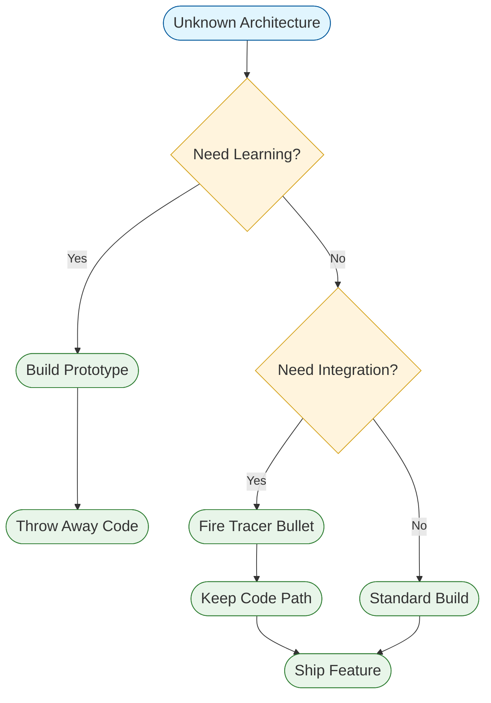

# Tracer Bullets Prototypes

```mermaid
graph TD
    classDef large font-size:20px,padding:15px,stroke-width:2px;
    classDef logic fill:#fff4dd,stroke:#d4a017,font-size:20px;
    classDef state fill:#e1f5fe,stroke:#01579b,font-size:20px;
    classDef action fill:#e8f5e9,stroke:#2e7d32,font-size:20px;

    A([Unknown Architecture]):::state --> B{Need Learning?}:::logic
    B -->|Yes| C([Build Prototype]):::action
    B -->|No| D{Need Integration?}:::logic
    D -->|Yes| E([Fire Tracer Bullet]):::action
    D -->|No| F([Standard Build]):::action
    C --> G([Throw Away Code]):::action
    E --> H([Keep Code Path]):::action
    F --> I([Ship Feature]):::action
    H --> I
```
