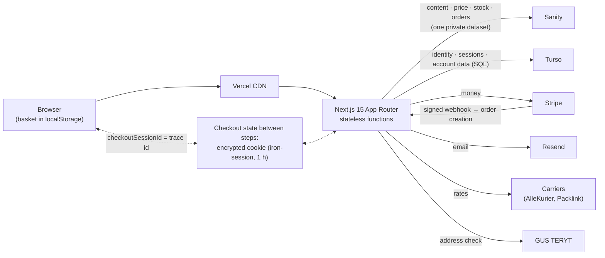
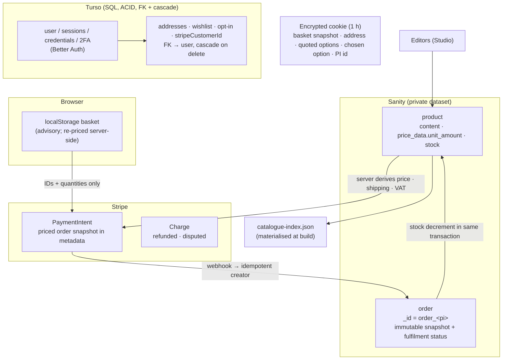
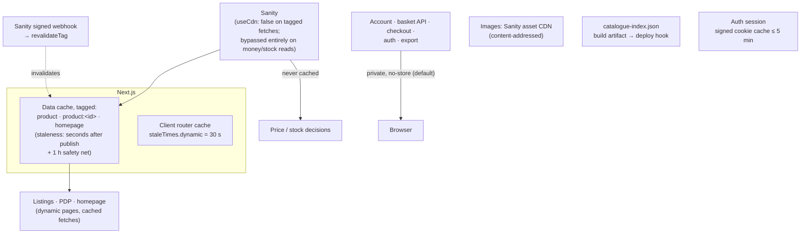
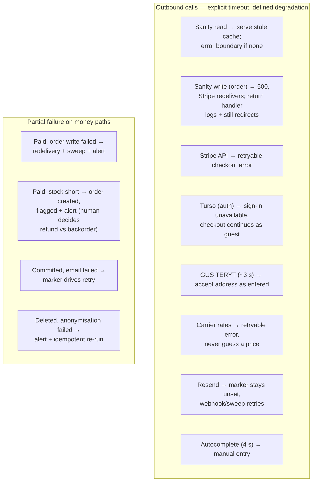
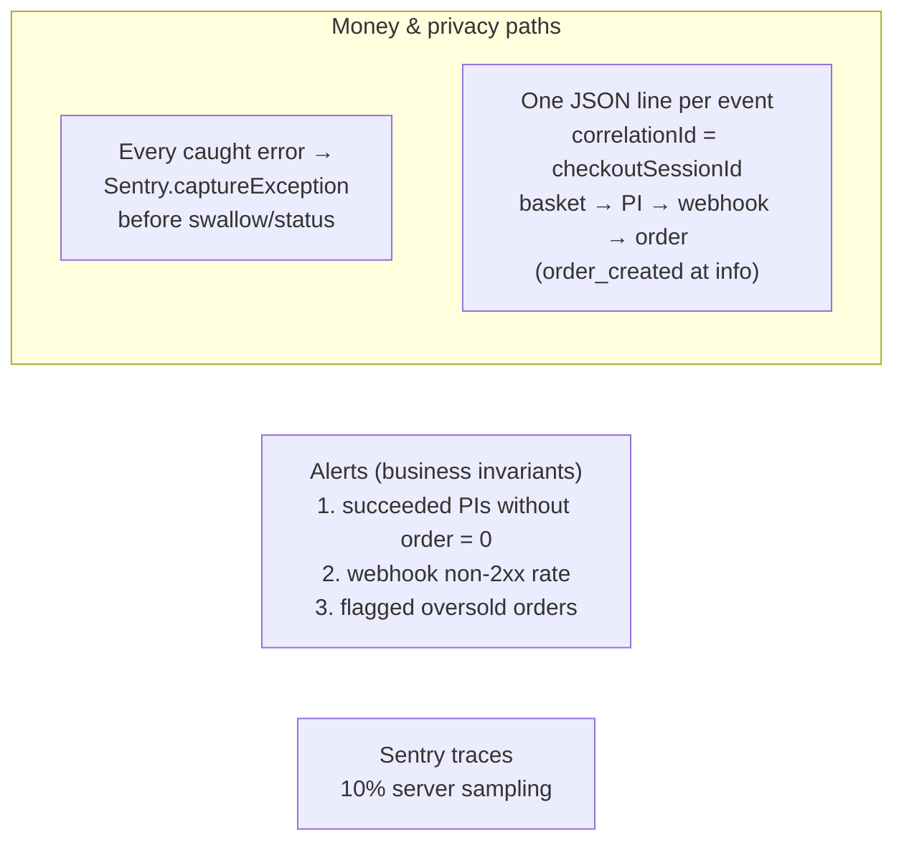

# System Design — Target State (Diagrams)

Mermaid renderings of the North Star design only. Every diagram shows what the system
*should* be; none of the "Now:" gaps are drawn. Source of truth: `docs/design-system.md`.

---

## 1. Shape — runtime context



---

## 2. Data ownership — one writer of record per datum



---

## 3. Checkout — trust boundary & payment sequence

Every action validates input with zod, authorises with `requireSession`, and never accepts a money value from the client.

```mermaid
sequenceDiagram
    participant B as Browser
    participant A as Server Actions / Routes
    participant C as Checkout Cookie
    participant S as Sanity
    participant St as Stripe

    B->>A: initCheckoutSession(items)
    A->>A: zod: integer qty 1..max, ≤ max lines
    A->>C: basket snapshot

    B->>A: address step (autocomplete / TERYT)
    A->>C: validated address

    B->>A: saveShippingAction(optionId)
    A->>A: quote rates server-side (carriers)
    A->>C: quoted options + chosen optionId

    B->>A: create PaymentIntent
    A->>S: uncached read (useCdn=false):<br/>prices · stock check
    A->>A: derive total; stock short →<br/>reject lines / flag
    A->>St: create PI (idempotency key,<br/>priced snapshot in metadata lines_0..n)
    St-->>A: clientSecret
    A-->>B: render payment

    B->>St: confirm payment
    St->>A: payment_intent.succeeded (signed webhook)
    A->>S: ONE transaction:<br/>create order_&lt;pi&gt; + decrement<br/>each product (ifRevisionID)
    S-->>A: committed
    A->>A: send confirmation email<br/>(marker confirmationSentAt +<br/>Resend idempotency key)
```

---

## 4. Async work — Stripe is the queue

```mermaid
flowchart LR
    Stripe["Stripe<br/>(redelivers on non-2xx, up to 3 days)"]

    subgraph Webhook["Signed webhook handler"]
        PIS["payment_intent.succeeded"]
        CR["charge.refunded"]
        CD["charge.dispute.created"]
    end

    subgraph Sanity["Sanity"]
        Tx["order_&lt;pi&gt; create +<br/>stock decrements<br/>(atomic, idempotent)"]
        OrderDoc["order<br/>status · confirmationSentAt"]
    end

    Email["Confirmation email<br/>(marker + provider idempotency key)"]
    Sweep["Daily Vercel cron<br/>(CRON_SECRET): succeeded PIs last 7 days<br/>→ ensure order + email"]
    ReturnH["Return handler<br/>(fast path → same idempotent creator)"]

    Stripe --> PIS --> Tx --> OrderDoc
    Stripe --> CR --> OrderDoc
    Stripe --> CD --> OrderDoc
    ReturnH --> Tx
    Tx --> Email
    Sweep --> Tx
    Sweep --> Email

    SanityHook["Sanity signed webhook"] --> Rev["revalidateTag"]
    SanityPub["Sanity publish<br/>(catalogue docs)"] --> Deploy["Deploy hook →<br/>rebuild catalogue-index.json"]
```



Dedup assumptions: duplicate delivery is assumed everywhere; ordering is assumed nowhere.
A refund event arriving before its order returns 500 so Stripe redelivers.

---

## 5. Caching — one layer owns freshness per path



---

## 6. Failure & degradation



---

## 7. Observability — the minimal set



---

## 8. Scale limits & invariants

- Invariants (I1–I6): one order per succeeded PI; server-derived charge; atomic stock decrement; deny-by-default privacy; one writer per datum; no silent money/privacy failure.
- Real limits, in order: Sanity metered requests → tagged data cache; Sanity document cap → revisit trigger for moving orders+stock to Turso together; cookie 4 KB → explicit line cap; Stripe metadata → chunked keys; public `/api/*` abuse → WAF rate limits.
- Stateless functions; Better Auth rate limits use `storage: "database"`.
