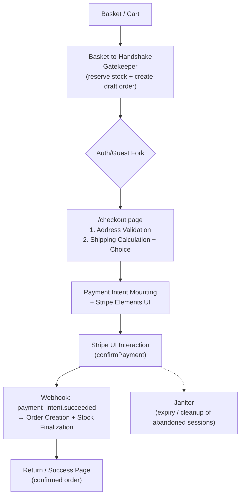

# Global User Checkout Flow Specifications

**Retrieval Date:** 2026-04-05
**Researcher:** AI-audited professional specification (Next.js 15 App Router + React 18 + Sanity v3 + Stripe Elements)
**Decay Risk:** Medium (Stripe API + Next.js patterns evolve; re-verify on major Stripe/Next.js releases)
**Next Review:** 2026-10-05
**File purpose (per workflow):** This is the single source-of-truth high-level global flow document. Use it only to validate each small user-flow chunk (e.g. basket-to-handshake, payment-intent-mounting, webhook-order-creation) against the end-to-end picture. Do not expand individual chunks here — that belongs in their own `SPECS.md` + Mermaid files.

---

## Research Scope Contract

**Topic:** Professional, production-grade global user checkout flow for a Next.js 15 + Stripe Elements + Sanity v3 e-commerce app (Sang Logium).

**First Principles:**
* Never trust the client for order creation, stock deduction, or fulfillment (webhook-only).
* Idempotency & atomicity at every state transition (Inngest-style or Stripe idempotency keys).
* Maximize conversion while maintaining PCI compliance and fraud protection (guest checkout + progressive disclosure + early cost visibility).

**Fundamentals to verify in every chunk:** Server-first PaymentIntent creation, Elements mounting, webhook-driven fulfillment, auth/guest fork, stock reservation handshake.

**Scope Boundary:**
* **IN:** High-level sequence, handshakes between chunks, success/failure paths, security invariants.
* **OUT:** UI/UX details per step, component code, Tailwind classes, individual chunk implementations, error-copy, A/B tests.

**Target Audience:** Solo developer Munrhalls and AI agent implementing/testing individual chunks and regression-checking against the global flow.
**Decay Risk:** Medium — tied to Stripe Elements + Payment Intents API stability.

---

## Executive Summary

1.  **Basket → Checkout Handshake** reserves stock (authorize-first pattern) before any payment UI appears.
2.  **Progressive multi-step checkout** on `/checkout` (address → shipping → payment) with guest/auth fork.
3.  **Stripe Payment Elements** (custom UI via `@stripe/react-stripe-js`) mounted via server-created PaymentIntent.
4.  **Webhook-only fulfillment:** `payment_intent.succeeded` → order creation in Sanity + final stock lock.
5.  **Success page** shows confirmed order; cleanup “Janitor” expires abandoned sessions/carts.
6.  All steps are **idempotent, PCI-compliant, and work for both guests and logged-in users**.

*This flow aligns with 2026 Stripe + Next.js 15 best practices (Payment Intents + Elements for full control, webhooks for fulfillment, Server Actions/Route Handlers).*

---

## First Principles Analysis

### Core Problem Being Solved
Deliver a secure, high-conversion checkout that never loses money on stock or exposes sensitive data, while supporting global users (guest + auth) in a Sanity-backed catalog.

### Underlying Constraints
* **PCI-DSS:** Card data never touches your server (Elements + Stripe handles it).
* **Next.js 15 App Router:** Server Components/Actions preferred; client-only for Elements.
* **Sanity v3:** Orders and stock are documents → mutations must be atomic and webhook-driven.
* **Network & fraud:** Webhooks can be delayed/retried; client can be malicious.

### Inherent Tradeoffs

| Approach | Wins | Loses | When to Use |
| :--- | :--- | :--- | :--- |
| **Payment Intents + Elements** | Full UI control, real-time validation | More code than hosted Checkout | Custom branded checkout (current project) |
| **Stripe Checkout Sessions (hosted)** | Faster implementation, lower maintenance | Less design freedom | If conversion drops critically |
| **Authorize-first handshake** | Prevents oversell | Extra complexity | Physical goods with limited stock |

### Failure Modes
* Client-side order creation → stock races / fraud.
* No webhook handling → orders never created despite successful payment.
* Missing Janitor → abandoned carts block stock forever.

---

## Global Flow (High-Level Sequence)

Verification & Falsification Checklist (for chunk testing)
    Every chunk must pass these global invariants:

    [ ] Handshake reserves stock before any payment UI.

    [ ] No order created until webhook.

    [ ] PaymentIntent created server-side only.

    [ ] Guest flow works identically to auth flow.

    [ ] Idempotent under retry/duplication.

    [ ] Webhook signature verified + replay attack protection.

    [ ] Stock released on expiry/cancellation.

Falsification tests to run:
    Simulate webhook delay → does stock stay reserved correctly?

    Malicious client tries to create order directly → blocked?

    User abandons after handshake → Janitor releases stock?

    Network failure on confirmPayment → no duplicate charges?