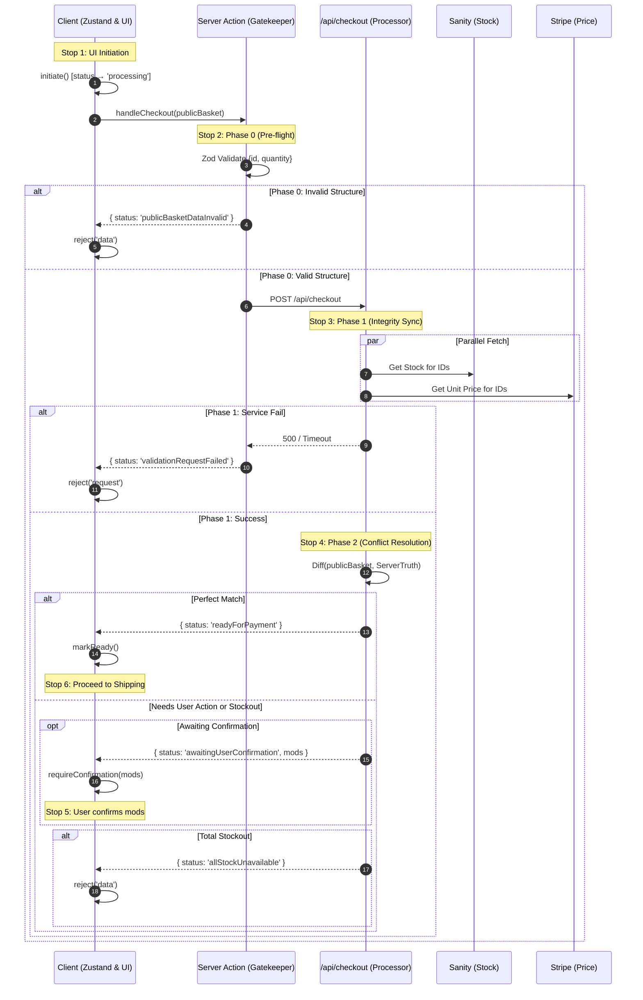

# Specification: Checkout Flow & State Machine Architecture

This document defines the high-integrity checkout orchestration for the Next.js 15 / Sanity v3 / Stripe stack, utilizing a multi-layered validation protocol and a formal state machine.

---

## 1. Architectural Strategy
The system separates **Persistent Data** (the basket items) from the **Transient Process** (the checkout flow).

* **`basketStore`**: Persists in `localStorage`. Manages the `BasketItem[]` array and CRUD operations.
* **`checkoutStore`**: Non-persistent (session-only). Manages the `CheckoutStatus` state machine transitions.
* **`Server Action`**: The orchestration layer. Handles Phase 0 (Pre-flight) and proxies to the internal API.
* **`/api/checkout`**: The processing layer. Executes high-speed parallel fetches and business logic diffing.

---

## 2. The Checkout "Bus Stops" (Flow Trace)

### Stop 1: UI Initiation
* **Trigger:** User clicks "Checkout" in `BasketSummary`.
* **Action:** `checkoutStore.initiate()` is called.
* **State Change:** `status` transitions from `idle` to `processing`.
* **UI:** Checkout button is disabled to prevent race conditions.

### Stop 2: Phase 0 — Structural Pre-flight (Server Action)
* **Logic:** Executes a Zod schema validation on the `publicBasket` payload (IDs and Quantities only).
* **Fail Case:** If schema is invalid, return `publicBasketDataInvalid`.
* **Outcome:** Execution stops before any network requests to CMS or Stripe are made.

### Stop 3: Phase 1 — Integrity Sync (Internal API)
* **Logic:** Server Action fetches `/api/checkout` which triggers `Promise.all()`:
    1.  **Request A:** Sanity CMS to verify `_id` existence and current `stock` levels.
    2.  **Request B:** Stripe API to resolve `price_id` to the current live `unit_amount`.
* **Fail Case:** If either service is unreachable, return `validationRequestFailed`.

### Stop 4: Phase 2 — Conflict Resolution & Diffing
The server compares the `publicBasket` data against the freshly fetched "Server Truth."

| Scenario | State Transition | UI Outcome |
| :--- | :--- | :--- |
| **Perfect Match** | `readyForPayment` | Automatically advance to Shipping/Address forms. |
| **Total Stockout** | `allStockUnavailable` | Replace button with "Items Sold Out" inline message. |
| **Price/Stock Change**| `awaitingUserConfirmation` | Display "Confirm Updated Price/Stock" UI with diff details. |

### Stop 5: The Confirmation Loop
* **Action:** If a user clicks "Confirm Changes," the `basketStore` is updated locally to match the server's truth.
* **Re-validation:** The cycle triggers again (`processing`) to ensure no new changes occurred during the user's decision window (preventing the "Stale Tab" exploit).

### Stop 6: Final Handover
* **Success:** Once a clean, validated contract is established, the user proceeds to final payment.

---

## 3. State Machine Specification (`checkoutStore.ts`)

```typescript
export type CheckoutStatus =
  | 'idle'
  | 'processing'
  | 'publicBasketDataInvalid'
  | 'validationRequestFailed'
  | 'inventoryConflict'
  | 'allStockUnavailable'
  | 'awaitingUserConfirmation'
  | 'readyForPayment'
  | 'success';

interface CheckoutState {
  status: CheckoutStatus;
  error: string | null;
  modifications: any | null;

  initiate: () => void;
  reject: (type: 'data' | 'request', msg: string) => void;
  requireConfirmation: (diffs: any) => void;
  markReady: () => void;
  reset: () => void;
}
```

