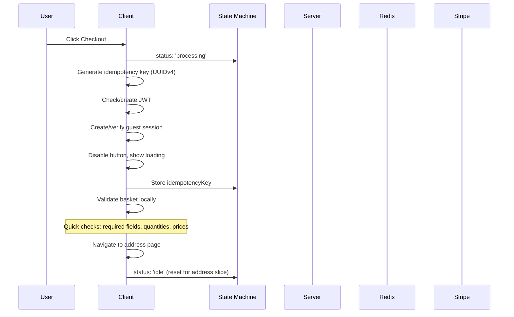
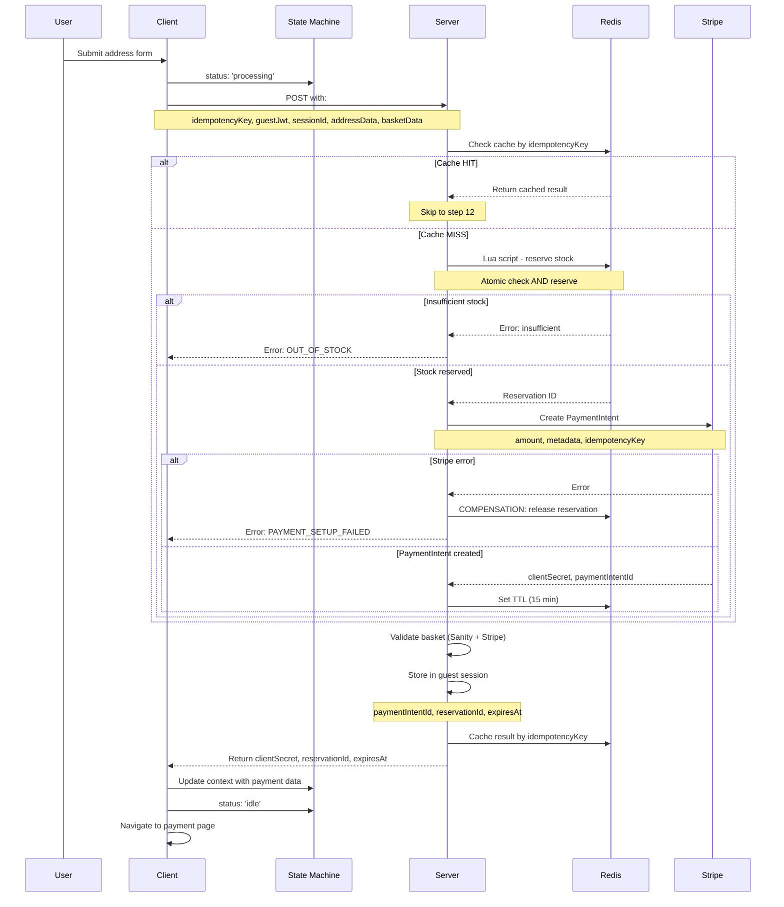
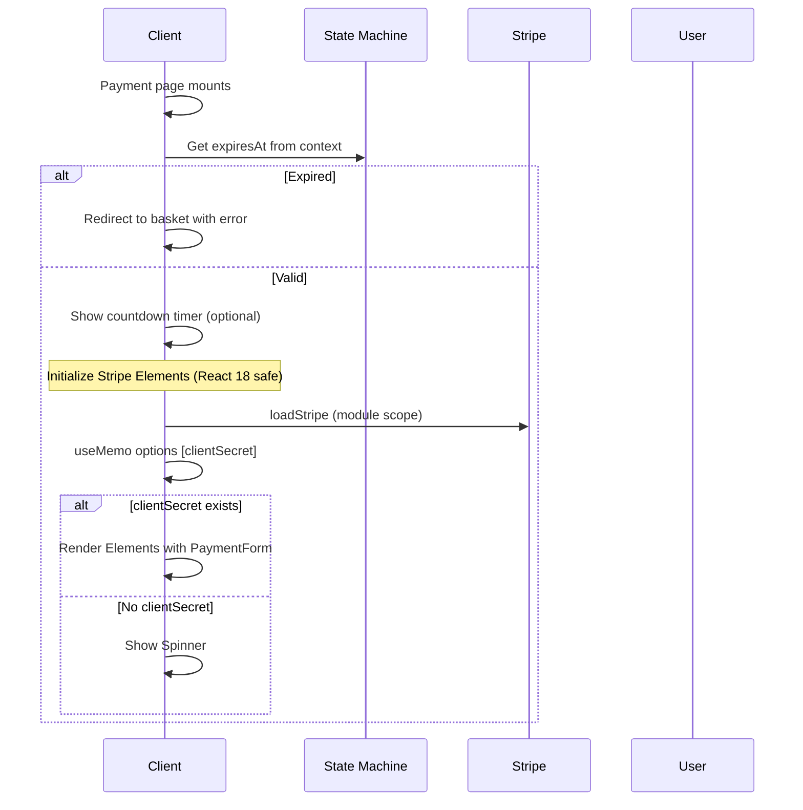
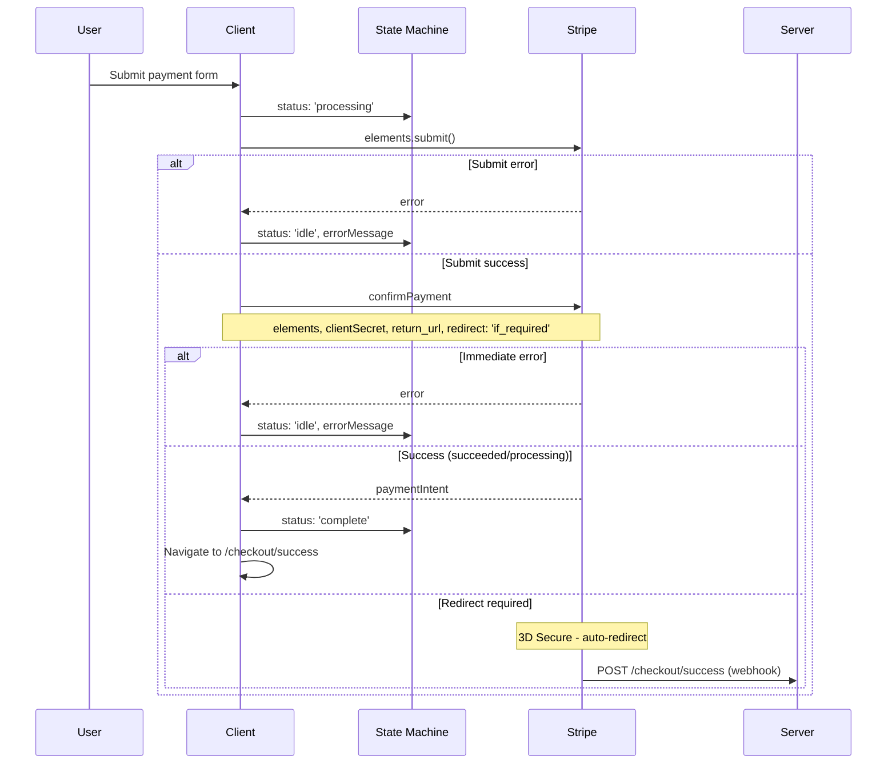
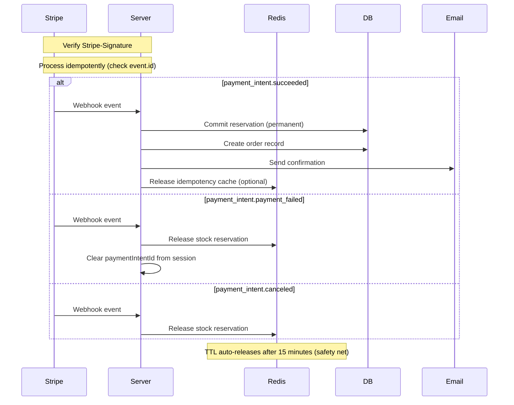
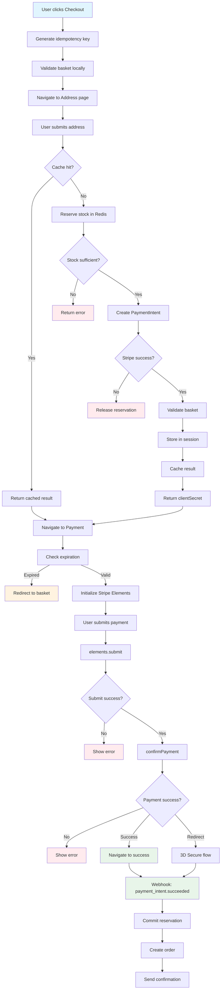
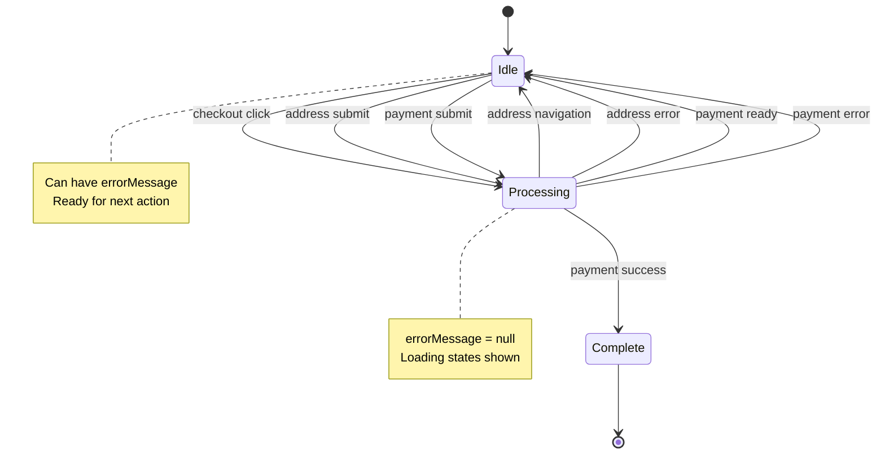
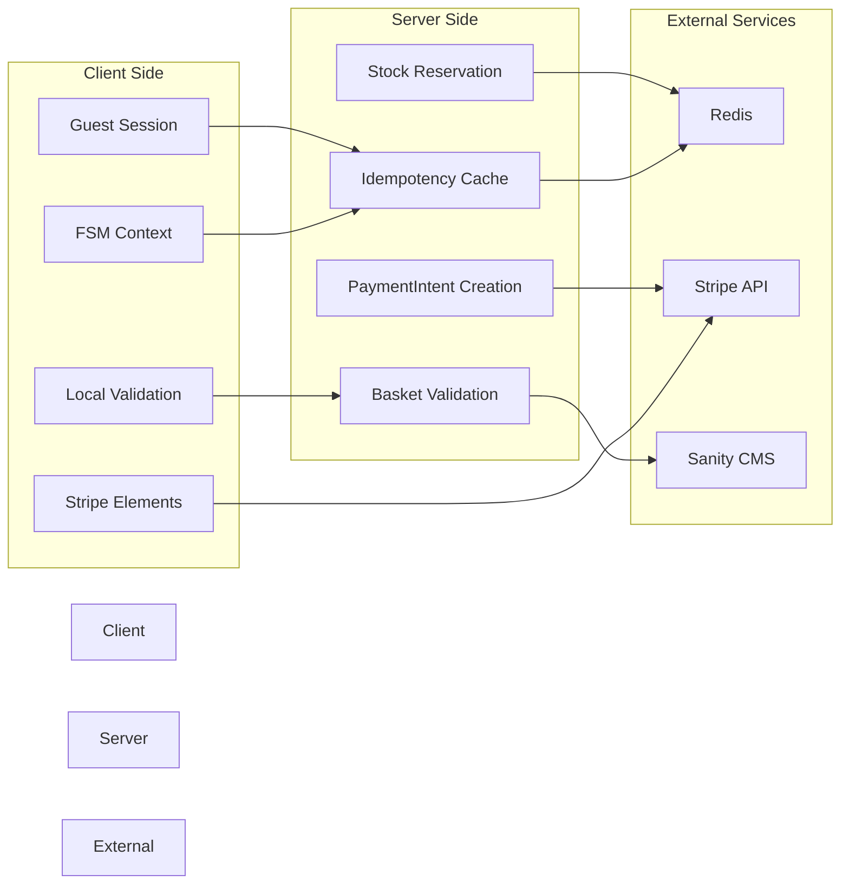
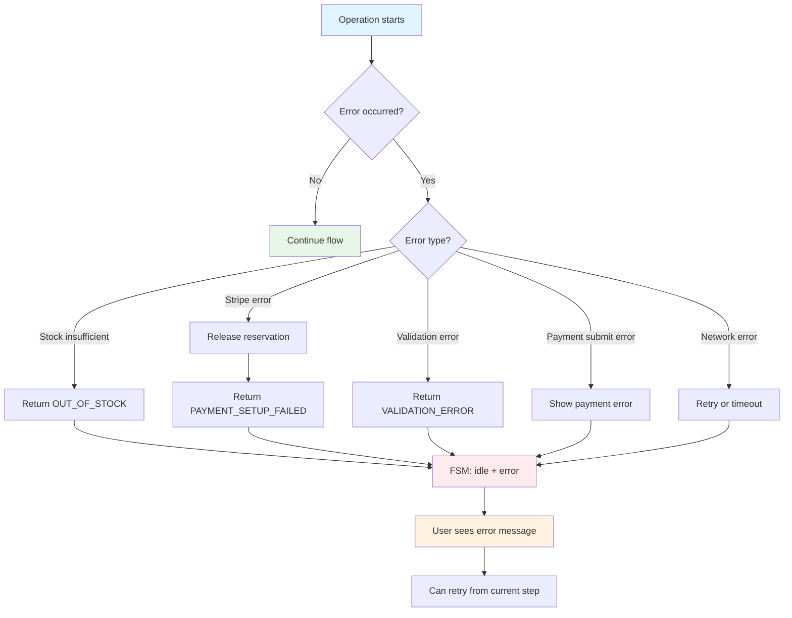

# Checkout Flow Diagrams per UX Slice

## Overview
Visual representation of the checkout flow broken down into UX slices with Mermaid diagrams.

---

## 1. Basket to Address Slice

---

## 2. Address Form Submission Slice

---

## 3. Payment Page Initialization Slice

---

## 4. Payment Submission Slice

---

## 5. Webhook Handlers Slice

---

## 6. Complete End-to-End Flow

---

## FSM State Transitions

---

## Data Flow Architecture

---

## Error Handling Flow

