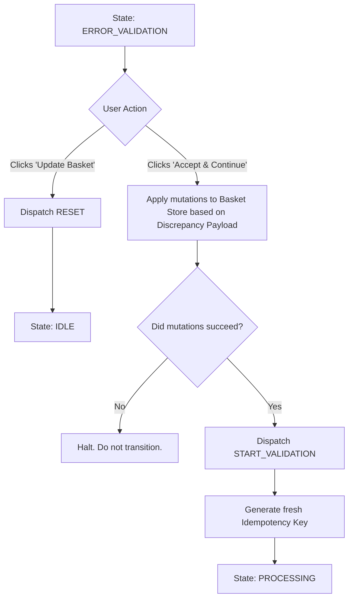

```mermaid
flowchart TD
    A[State: ERROR_VALIDATION] --> B{User Action}
    B -->|Clicks 'Update Basket'| C[Dispatch RESET]
    C --> D[State: IDLE]

    B -->|Clicks 'Accept & Continue'| E[Apply mutations to Basket Store based on Discrepancy Payload]
    E --> F{Did mutations succeed?}
    F -->|No| G[Halt. Do not transition.]
    F -->|Yes| H[Dispatch START_VALIDATION]
    H --> I[Generate fresh Idempotency Key]
    I --> J[State: PROCESSING]
```